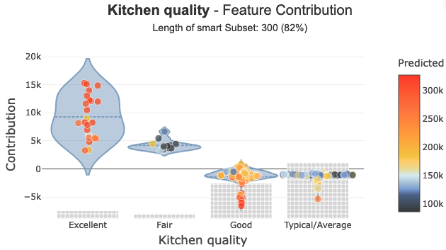
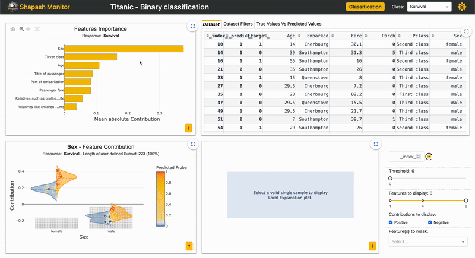

.. Shapash documentation master file, created by
   sphinx-quickstart on Mon Apr  2 15:29:28 2018.
   You can adapt this file completely to your liking, but it should at least
   contain the root `toctree` directive.

Welcome to Shapash's documentation !
=====================================

.. image:: ./_static/shapash-resize.png
   :width: 300px
   :align: center

**Shapash** is a Python library designed to make machine learning interpretable and accessible to everyone.
It offers various visualization types with clear and explicit labels that are easy to understand. This enables Data Scientists to better comprehend their models and share their findings, while end users can grasp the decisions made by a model through a summary of the most influential factors.
Shapash was developed by **MAIF** Data Scientists.

+---------------------------------+----------------------------------------------------------+-----------------------------------------+
| Company                         | GitHub Account                                           | Website                                 |
+=================================+==========================================================+=========================================+
| .. image:: ./_static/maif.png   | `MAIF GitHub <https://github.com/MAIF>`_                 | `MAIF <https://www.maif.fr/>`_          |
|   :align: center                |                                                          |                                         |
|   :scale: 5%                    |                                                          |                                         |
+---------------------------------+----------------------------------------------------------+-----------------------------------------+

**The objectives of Shapash:**
------------------------------

- Provide clear and understandable results: Plots and outputs use explicit labels for each feature and its modalities:

- Enable Data Scientists to quickly comprehend their models using a **web app** for seamless navigation between global and local explainability, and to understand how different features contribute: `Live Demo shapash-monitor <https://shapash-demo.ossbymaif.fr/>`__

- **Summarize and export** local explanations: **Shapash** offers concise and transparent local explanations, allowing users of any data background to understand a local prediction of a supervised model through a simplified and straightforward explanation.

.. image:: ./_static/shapash-local_plot-example.png
   :width: 600px
   :align: center

.. code:: ipython

    summary_df.head()

.. table::

    +--------------------+------+------------------------------+-------+--------------+------------------------------+--------------+--------------+----------------------------------------+-------+--------------+--------------------------+-------+--------------+------------------------------------------+-------------+--------------+----------------------------------------+----------------+--------------+-----------------------------+--------------------------+--------------+
    |        pred        |proba |          feature_1           |value_1|contribution_1|          feature_2           |   value_2    |contribution_2|               feature_3                |value_3|contribution_3|        feature_4         |value_4|contribution_4|                feature_5                 |   value_5   |contribution_5|               feature_6                |    value_6     |contribution_6|          feature_7          |         value_7          |contribution_7|
    +====================+======+==============================+=======+==============+==============================+==============+==============+========================================+=======+==============+==========================+=======+==============+==========================================+=============+==============+========================================+================+==============+=============================+==========================+==============+
    |Moderately Expensive|0.9949|Ground living area square feet|   1792|        0.3093|Interior finish of the garage?|Rough Finished|        0.2755|Size of garage in square feet           |    564|        0.2077|Full bathrooms above grade|      2|        0.1827|Physical locations within Ames city limits|College Creek|        0.1709|Overall material and finish of the house|               7|        0.1640|Height of the basement       |Good (90-99 inches)       |        0.1396|
    +--------------------+------+------------------------------+-------+--------------+------------------------------+--------------+--------------+----------------------------------------+-------+--------------+--------------------------+-------+--------------+------------------------------------------+-------------+--------------+----------------------------------------+----------------+--------------+-----------------------------+--------------------------+--------------+
    |Moderately Expensive|0.8769|Second floor square feet      |    720|        0.1833|Full bathrooms above grade    |             2|        0.1551|Ground living area square feet          |   2192|        0.1519|Remodel date              |   1997|        0.1431|Type 1 finished square feet               |          378|        0.1424|First Floor square feet                 |            1052|        0.1278|Half baths above grade       |                         1|        0.1277|
    +--------------------+------+------------------------------+-------+--------------+------------------------------+--------------+--------------+----------------------------------------+-------+--------------+--------------------------+-------+--------------+------------------------------------------+-------------+--------------+----------------------------------------+----------------+--------------+-----------------------------+--------------------------+--------------+
    |Cheap               |0.9973|Ground living area square feet|    900|        0.8189|Size of garage in square feet |           280|        0.5616|Total square feet of basement area      |    882|        0.4091|Remodel date              |   1967|        0.3490|Full bathrooms above grade                |            1|        0.3248|Overall material and finish of the house|               5|        0.3180|First Floor square feet      |                       900|        0.2478|
    +--------------------+------+------------------------------+-------+--------------+------------------------------+--------------+--------------+----------------------------------------+-------+--------------+--------------------------+-------+--------------+------------------------------------------+-------------+--------------+----------------------------------------+----------------+--------------+-----------------------------+--------------------------+--------------+
    |Cheap               |0.9987|Ground living area square feet|    630|        0.8164|Size of garage in square feet |             0|        0.5877|Total square feet of basement area      |    630|        0.4312|Remodel date              |   1970|        0.3557|Overall material and finish of the house  |            4|        0.3175|Full bathrooms above grade              |               1|        0.3130|General zoning classification|Residential Medium Density|        0.1784|
    +--------------------+------+------------------------------+-------+--------------+------------------------------+--------------+--------------+----------------------------------------+-------+--------------+--------------------------+-------+--------------+------------------------------------------+-------------+--------------+----------------------------------------+----------------+--------------+-----------------------------+--------------------------+--------------+
    |Cheap               |0.8524|Ground living area square feet|   1188|        0.9421|Remodel date                  |          1959|        0.4234|Overall material and finish of the house|      5|        0.3785|Full bathrooms above grade|      1|        0.3738|Number of fireplaces                      |            0|        0.1687|Rating of basement finished area        |Average Rec Room|        0.1302|Wood deck area in square feet|                         0|        0.1225|
    +--------------------+------+------------------------------+-------+--------------+------------------------------+--------------+--------------+----------------------------------------+-------+--------------+--------------------------+-------+--------------+------------------------------------------+-------------+--------------+----------------------------------------+----------------+--------------+-----------------------------+--------------------------+--------------+

- Establish a foundation for **audit reports** by freezing various aspects of a data science project.

- To discuss results: **Shapash** allows Data Scientists to easily share and discuss their results with non-Data users

**Shapash** features:
---------------------

- Compatibility with Shap & Lime
- Uses Shap backend to display results in a few lines of code
- Encoders objects and features dictionaries used for clear results
- Compatibility with category_encoders & Sklearn ColumnTransformer
- Global and local explainability visualizations
- Web app for easy navigation from global to local
- Subset selection for in-depth explainability analysis by filtering explanatory and additional features, as well as correct or wrong predictions
- Local explanation summarization
- Offers several parameters in order to sum up in the most suitable way for your use case
- Exports your local summaries to Pandas DataFrames
- Applicable for Regression, Binary Classification or Multiclass
- Compatible with most of sklearn, lightgbm, catboost, xgboost models
- Suitable for exploration and **also** deployment (through an API or in Batch mode) for operational use
- Freezes various aspects of a data science project as a basis for audit reports

**Shapash** is easy to install and use, offering a SmartExplainer class to understand your model and summarize explanations with simple syntax.

High adaptability:
Although only a few arguments are needed to display results, the more effort you put into cleaning and documenting the data, the clearer the results will be for the end user.

.. toctree::
   :maxdepth: 3

   overview
   installation-instructions/index
   tutorials
   autodocs/index

License is Apache Software License 2.0