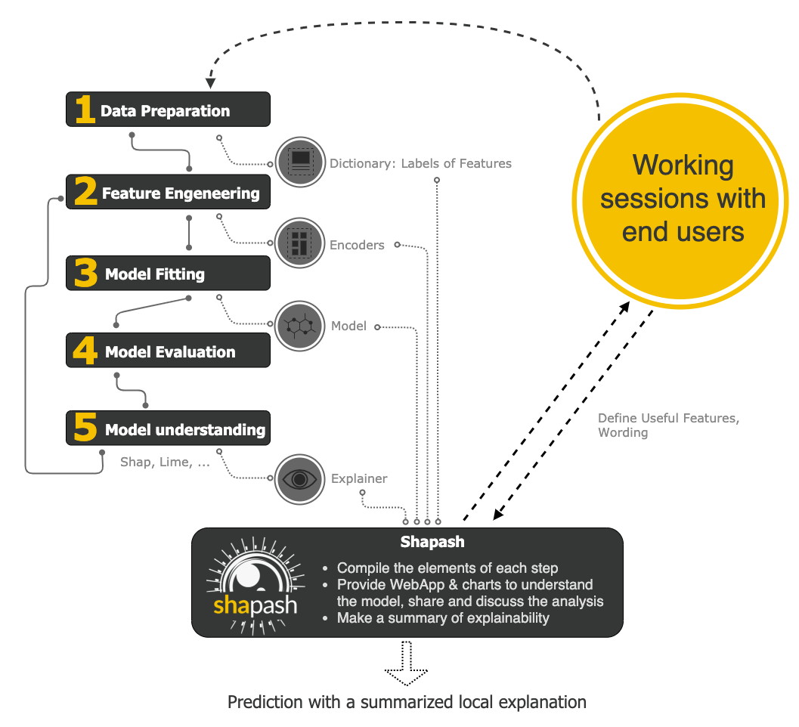

.. overview:

Overview
========

Installation
------------
You can install **Shapash** using pip:

.. code:: ipython

    pip install shapash

How does shapash work?
----------------------

Shapash is an overlay package for libraries dedicated to the interpretability of models. It uses Shap or Lime backend
to compute contributions.
Shapash relies on the different steps necessary to build a Machine Learning model to make the results understandable.

User Manual
-----------

Shapash works for Regression, Binary Classification or Multiclass problems.
It is compatible with many models: *Catboost*, *Xgboost*, *LightGBM*, *Sklearn Ensemble*, *Linear models* and *SVM*.

Shapash can use category-encoder object, sklearn ColumnTransformer or simply features dictionary.

- Category_encoder: *OneHotEncoder*, *OrdinalEncoder*, *BaseNEncoder*, *BinaryEncoder* or *TargetEncoder*
- Sklearn ColumnTransformer: *OneHotEncoder*, *OrdinalEncoder*, *StandardScaler*, *QuantileTransformer* or *PowerTransformer*

Compatible versions for those dependencies :

- scikit-learn==0.23.2
- catboost==0.22
- xgboost==1.0.0
- lightgbm==2.3.1
- shap==0.37.0
- category-encoders==2.1.0

Using **Shapash** is simple and requires only a few lines of code.
Most parameters are optional, you can easily display plots.

You can also tune plots and outputs, specifying labels dict, features dict, encoders, predictions, ... :
The more you specify parameters, options, dictionaries and more the outputs will be understandable

Getting Started : 3 minutes to Shapash
--------------------------------------

The 4 steps to display results:

- Step 1: Declare SmartExplainer Object
  > There 1 mandatory parameter in compile method: Model
  > You can declare features dict here to specify the labels Shapash will display

.. code:: ipython

    from shapash import SmartExplainer
    xpl = SmartExplainer(
      features_dict=house_dict,  # Optional parameter
      model=regressor,
      preprocessing=encoder, # Optional: compile step can use inverse_transform method
      postprocessing=postprocess # Optional: see tutorial postprocessing
    )

- Step 2: Compile Dataset, ...
  > There 1 mandatory parameter in compile method: *Dataset*

.. code:: ipython

    xpl.compile(
        x=Xtest,
        y_pred=y_pred, # Optional: for your own prediction (by default: model.predict)
        y_target=yTest, # Optional: allows to display True Values vs Predicted Values
        additional_data=X_additional, # Optional: additional dataset of features for Webapp
        additional_features_dict=features_dict_additional, # Optional: dict additional data
    )

- Step 3: Display output
  > There are several outputs and plots available. For example, you can launch the web app this way :

.. code:: ipython

    app = xpl.run_app()

- Step 4: Generate the Shapash Report
  > This step allows to generate a standalone html report of your project using the different splits
   of your dataset and also the metrics you used:

.. code:: ipython

    xpl.generate_report(
        output_file='path/to/output/report.html',
        project_info_file='path/to/project_info.yml',
        x_train=Xtrain,
        y_train=ytrain,
        y_test=ytest,
        title_story="House prices report",
        title_description="""This document is a data science report of the kaggle house prices tutorial project.
            It was generated using the Shapash library.""",
        metrics=[{'name': 'MSE', 'path': 'sklearn.metrics.mean_squared_error'}]
    )

- Step 5: From training to deployment : SmartPredictor Object

Shapash provides a SmartPredictor object to deploy the summary of local explanation for the operational needs.
It is an object dedicated to deployment, lighter than SmartExplainer with additional consistency checks.
SmartPredictor can be used with an API or in batch mode. It provides predictions, detailed or summarized local
explainability using appropriate wording.

.. code:: ipython

    predictor = xpl.to_smartpredictor()

From data mining to deployment
------------------------------

**Shapash** isn't just a tool used for data mining purposes. Thanks to different objects from Shapash
such as *SmartExplainer* and *SmartPredictor*, you can easily switch from data mining to deployment.
**Shapash SmartPredictor Object** can be used through an API or in batch mode.

It allows you to produce prediction, detailed and summarized explanations on new datasets.
In fact, **Shapash** summarize explainability that you configured to make it operational to your needs.

Watch the tutorial part of this documentation for more details.