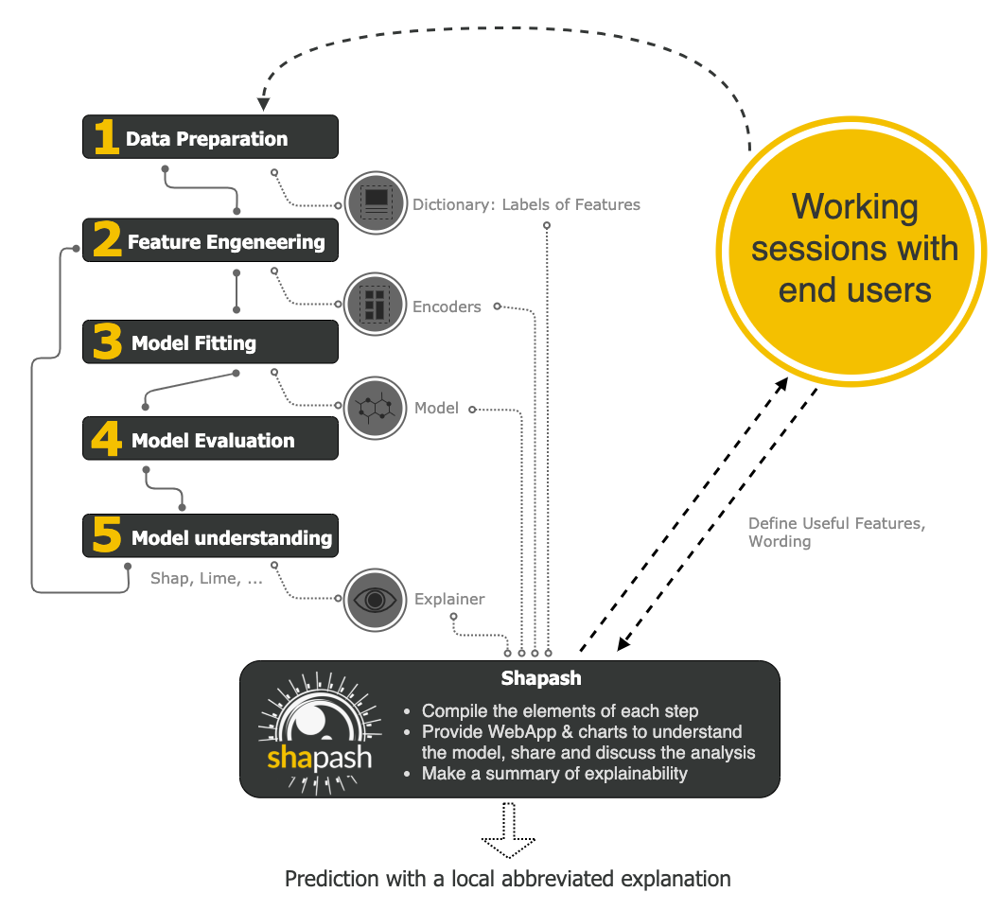

Overview
========

Installation
------------

Shapash works in Python 3.6.
You can install shapash using pip::

    pip install shapash

How does shapash work?
----------------------

Shapash is an overlay package for libraries dedicated to the interpretability of models. It uses Shap or Lime backend
to compute contributions.
Shapash relies on the different steps necessary to build a Machine Learning model to make the results understandable.

User Manual
-----------
Shapash works for Regression, Binary Classification or Multiclass problem.
It is compatible with many models: *Catboost*, *Xgboost*, *LightGBM*, *Sklearn Ensemble*, *Linear models*, SVM.
Shapash can use category-encoders object, sklearn ColumnTransformer or simply features dictionary.

You can use Shap or Lime, compute your own local contributions and use **Shapash** to display plot or summarize it.

Using **Shapash** is simple and requires only a few lines of code.
Most parameters are optional, you can displays plots effortlessly.

But you can also tune plots and outputs, specifying labels dict, features dict, encoders, predictions, ... :
The more you specify parameters, options, dictionaries and more the outputs will be understandable

Getting Start: 3 minutes to Shapash
-----------------------------------

The 3 steps to display results:

- Step 1: Declare SmartExplainer Object
  > You can declare features dict here to specify the labels to display

.. code:: ipython3

    from shapash.explainer.smart_explainer import SmartExplainer
    xpl = SmartExplainer(features_dict=house_dict) # optional parameter

- Step 2: Compile Model, Dataset, Encoders, ...
  > There are 2 mandatory parameters in compile method: Model and Dataset

.. code:: ipython3

    xpl.compile(
        x=Xtest,
        model=regressor,
        preprocessing=encoder, # Optional: compile step can use inverse_transform method
        y_pred=y_pred # Optional
    )

- Step 3: Display output
  > There are several outputs and plots available. for example, you can launch the web app:

.. code:: ipython3

    app = xpl.run_app()

Watch the tutorial part of this for more details