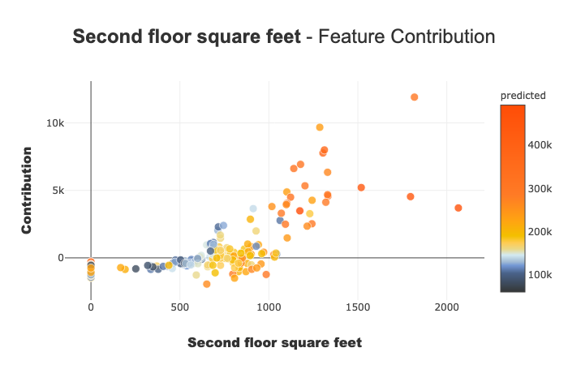

Shapash in Jupyter - Overview
=============================

With this tutorial you: Understand how Shapash works in Jupyter Notebook
with a simple use case

Contents: - Build a Regressor - Compile Shapash SmartExplainer - Display
global and local explanability - Export local summarized explainability
with to_pandas method - Save Shapash object in pickle file

Data from Kaggle `House
Prices <https://www.kaggle.com/c/house-prices-advanced-regression-techniques/data>`__

.. code:: ipython3

    import pandas as pd
    from category_encoders import OrdinalEncoder
    from lightgbm import LGBMRegressor
    from sklearn.model_selection import train_test_split

Building Supervized Model
-------------------------

.. code:: ipython3

    from shapash.data.data_loader import data_loading
    house_df, house_dict = data_loading('house_prices')

.. code:: ipython3

    y_df=house_df['SalePrice'].to_frame()
    X_df=house_df[house_df.columns.difference(['SalePrice'])]

.. code:: ipython3

    house_df.head()

.. raw:: html

    

    
    <table border="1" class="dataframe">
      <thead>
        <tr style="text-align: right;">
          <th></th>
          <th>MSSubClass</th>
          <th>MSZoning</th>
          <th>LotArea</th>
          <th>Street</th>
          <th>LotShape</th>
          <th>LandContour</th>
          <th>Utilities</th>
          <th>LotConfig</th>
          <th>LandSlope</th>
          <th>Neighborhood</th>
          <th>...</th>
          <th>EnclosedPorch</th>
          <th>3SsnPorch</th>
          <th>ScreenPorch</th>
          <th>PoolArea</th>
          <th>MiscVal</th>
          <th>MoSold</th>
          <th>YrSold</th>
          <th>SaleType</th>
          <th>SaleCondition</th>
          <th>SalePrice</th>
        </tr>
        <tr>
          <th>Id</th>
          <th></th>
          <th></th>
          <th></th>
          <th></th>
          <th></th>
          <th></th>
          <th></th>
          <th></th>
          <th></th>
          <th></th>
          <th></th>
          <th></th>
          <th></th>
          <th></th>
          <th></th>
          <th></th>
          <th></th>
          <th></th>
          <th></th>
          <th></th>
          <th></th>
        </tr>
      </thead>
      <tbody>
        <tr>
          <th>1</th>
          <td>2-Story 1946 &amp; Newer</td>
          <td>Residential Low Density</td>
          <td>8450</td>
          <td>Paved</td>
          <td>Regular</td>
          <td>Near Flat/Level</td>
          <td>All public Utilities (E,G,W,&amp; S)</td>
          <td>Inside lot</td>
          <td>Gentle slope</td>
          <td>College Creek</td>
          <td>...</td>
          <td>0</td>
          <td>0</td>
          <td>0</td>
          <td>0</td>
          <td>0</td>
          <td>2</td>
          <td>2008</td>
          <td>Warranty Deed - Conventional</td>
          <td>Normal Sale</td>
          <td>208500</td>
        </tr>
        <tr>
          <th>2</th>
          <td>1-Story 1946 &amp; Newer All Styles</td>
          <td>Residential Low Density</td>
          <td>9600</td>
          <td>Paved</td>
          <td>Regular</td>
          <td>Near Flat/Level</td>
          <td>All public Utilities (E,G,W,&amp; S)</td>
          <td>Frontage on 2 sides of property</td>
          <td>Gentle slope</td>
          <td>Veenker</td>
          <td>...</td>
          <td>0</td>
          <td>0</td>
          <td>0</td>
          <td>0</td>
          <td>0</td>
          <td>5</td>
          <td>2007</td>
          <td>Warranty Deed - Conventional</td>
          <td>Normal Sale</td>
          <td>181500</td>
        </tr>
        <tr>
          <th>3</th>
          <td>2-Story 1946 &amp; Newer</td>
          <td>Residential Low Density</td>
          <td>11250</td>
          <td>Paved</td>
          <td>Slightly irregular</td>
          <td>Near Flat/Level</td>
          <td>All public Utilities (E,G,W,&amp; S)</td>
          <td>Inside lot</td>
          <td>Gentle slope</td>
          <td>College Creek</td>
          <td>...</td>
          <td>0</td>
          <td>0</td>
          <td>0</td>
          <td>0</td>
          <td>0</td>
          <td>9</td>
          <td>2008</td>
          <td>Warranty Deed - Conventional</td>
          <td>Normal Sale</td>
          <td>223500</td>
        </tr>
        <tr>
          <th>4</th>
          <td>2-Story 1945 &amp; Older</td>
          <td>Residential Low Density</td>
          <td>9550</td>
          <td>Paved</td>
          <td>Slightly irregular</td>
          <td>Near Flat/Level</td>
          <td>All public Utilities (E,G,W,&amp; S)</td>
          <td>Corner lot</td>
          <td>Gentle slope</td>
          <td>Crawford</td>
          <td>...</td>
          <td>272</td>
          <td>0</td>
          <td>0</td>
          <td>0</td>
          <td>0</td>
          <td>2</td>
          <td>2006</td>
          <td>Warranty Deed - Conventional</td>
          <td>Abnormal Sale</td>
          <td>140000</td>
        </tr>
        <tr>
          <th>5</th>
          <td>2-Story 1946 &amp; Newer</td>
          <td>Residential Low Density</td>
          <td>14260</td>
          <td>Paved</td>
          <td>Slightly irregular</td>
          <td>Near Flat/Level</td>
          <td>All public Utilities (E,G,W,&amp; S)</td>
          <td>Frontage on 2 sides of property</td>
          <td>Gentle slope</td>
          <td>Northridge</td>
          <td>...</td>
          <td>0</td>
          <td>0</td>
          <td>0</td>
          <td>0</td>
          <td>0</td>
          <td>12</td>
          <td>2008</td>
          <td>Warranty Deed - Conventional</td>
          <td>Normal Sale</td>
          <td>250000</td>
        </tr>
      </tbody>
    </table>
    
5 rows × 73 columns

    

Encoding Categorical Features
^^^^^^^^^^^^^^^^^^^^^^^^^^^^^

.. code:: ipython3

    from category_encoders import OrdinalEncoder
    
    categorical_features = [col for col in X_df.columns if X_df[col].dtype == 'object']
    
    encoder = OrdinalEncoder(
        cols=categorical_features,
        handle_unknown='ignore',
        return_df=True).fit(X_df)
    
    X_df=encoder.transform(X_df)

Train / Test Split
^^^^^^^^^^^^^^^^^^

.. code:: ipython3

    Xtrain, Xtest, ytrain, ytest = train_test_split(X_df, y_df, train_size=0.75, random_state=1)

Model Fitting
^^^^^^^^^^^^^

.. code:: ipython3

    regressor = LGBMRegressor(n_estimators=200).fit(Xtrain,ytrain)

.. code:: ipython3

    y_pred = pd.DataFrame(regressor.predict(Xtest),columns=['pred'],index=Xtest.index)

Understand my model with shapash
--------------------------------

Declare and Compile SmartExplainer
^^^^^^^^^^^^^^^^^^^^^^^^^^^^^^^^^^

.. code:: ipython3

    from shapash.explainer.smart_explainer import SmartExplainer

.. code:: ipython3

    xpl = SmartExplainer(features_dict=house_dict) # Optional parameter, dict specifies label for features name 

.. code:: ipython3

    xpl.compile(
        x=Xtest,
        model=regressor,
        preprocessing=encoder, # Optional: compile step can use inverse_transform method
        y_pred=y_pred # Optional
    )

.. parsed-literal::

    Backend: Shap TreeExplainer

Display features importance
^^^^^^^^^^^^^^^^^^^^^^^^^^^

.. code:: ipython3

    xpl.plot.features_importance()

.. image:: tutorial02-Shapash-overview-in-Jupyter_files/tutorial02-Shapash-overview-in-Jupyter_19_0.png

Focus on a specific subset
^^^^^^^^^^^^^^^^^^^^^^^^^^

You can use the features_importance method to compare the contribution
of features of a subset to the global features importance

.. code:: ipython3

    subset = [ 168, 54, 995, 799, 310, 322, 1374,
              1106, 232, 645, 1170, 1229, 703, 66,  
              886, 160, 191, 1183, 1037, 991, 482,  
              725, 410, 59, 28, 719, 337, 36]
    xpl.plot.features_importance(selection=subset)

.. image:: tutorial02-Shapash-overview-in-Jupyter_files/tutorial02-Shapash-overview-in-Jupyter_21_0.png

Understand how a feature contributes
^^^^^^^^^^^^^^^^^^^^^^^^^^^^^^^^^^^^

-  The contribution_plot allows to analyse how one feature affects
   prediction
-  Type of plot depends on the type of features
-  You can use feature name, feature label or feature number to specify
   which feature you want to analyze

.. code:: ipython3

    xpl.plot.contribution_plot("OverallQual")

.. image:: tutorial02-Shapash-overview-in-Jupyter_files/tutorial02-Shapash-overview-in-Jupyter_23_0.png

.. code:: ipython3

    xpl.plot.contribution_plot("Second floor square feet")

Display a Synthetic but Explicit local explainability
-----------------------------------------------------

Filter method
^^^^^^^^^^^^^

Use the filter method to specify how to summarize local explainability
There are 4 parameters to customize the summary: - max_contrib : maximum
number of criteria to display - threshold : minimum value of the
contribution (in absolute value) necessary to display a criterion -
positive : display only positive contribution? Negative?(default None) -
features_to_hide : list of features you don’t want to display

.. code:: ipython3

    xpl.filter(max_contrib=8,threshold=100)

Display local plot, applying your filter
^^^^^^^^^^^^^^^^^^^^^^^^^^^^^^^^^^^^^^^^

you can use row_num, index or query parameter to specify which
prediction you want to explain

.. code:: ipython3

    xpl.plot.local_plot(index=560)

.. image:: tutorial02-Shapash-overview-in-Jupyter_files/tutorial02-Shapash-overview-in-Jupyter_29_0.png

Save your Explainer & Export results
------------------------------------

Export your local explanation to pandas DataFrame:
^^^^^^^^^^^^^^^^^^^^^^^^^^^^^^^^^^^^^^^^^^^^^^^^^^

to_pandas method has the same parameters as the filter method

.. code:: ipython3

    summary_df= xpl.to_pandas(
        max_contrib=3, # Number Max of features to show in summary
        threshold=5000,
    )

.. code:: ipython3

    summary_df.head()

.. raw:: html

    

    
    <table border="1" class="dataframe">
      <thead>
        <tr style="text-align: right;">
          <th></th>
          <th>pred</th>
          <th>feature_1</th>
          <th>value_1</th>
          <th>contribution_1</th>
          <th>feature_2</th>
          <th>value_2</th>
          <th>contribution_2</th>
          <th>feature_3</th>
          <th>value_3</th>
          <th>contribution_3</th>
        </tr>
      </thead>
      <tbody>
        <tr>
          <th>259</th>
          <td>209141.256921</td>
          <td>Ground living area square feet</td>
          <td>1792</td>
          <td>13710.4</td>
          <td>Overall material and finish of the house</td>
          <td>7</td>
          <td>12776.3</td>
          <td>Total square feet of basement area</td>
          <td>963</td>
          <td>-5103.03</td>
        </tr>
        <tr>
          <th>268</th>
          <td>178734.474531</td>
          <td>Ground living area square feet</td>
          <td>2192</td>
          <td>29747</td>
          <td>Overall material and finish of the house</td>
          <td>5</td>
          <td>-26151.3</td>
          <td>Overall condition of the house</td>
          <td>8</td>
          <td>9190.84</td>
        </tr>
        <tr>
          <th>289</th>
          <td>113950.844570</td>
          <td>Overall material and finish of the house</td>
          <td>5</td>
          <td>-24730</td>
          <td>Ground living area square feet</td>
          <td>900</td>
          <td>-16342.6</td>
          <td>Total square feet of basement area</td>
          <td>882</td>
          <td>-5922.64</td>
        </tr>
        <tr>
          <th>650</th>
          <td>74957.162142</td>
          <td>Overall material and finish of the house</td>
          <td>4</td>
          <td>-33927.7</td>
          <td>Ground living area square feet</td>
          <td>630</td>
          <td>-23234.4</td>
          <td>Total square feet of basement area</td>
          <td>630</td>
          <td>-11687.9</td>
        </tr>
        <tr>
          <th>1234</th>
          <td>135305.243500</td>
          <td>Overall material and finish of the house</td>
          <td>5</td>
          <td>-25445.7</td>
          <td>Ground living area square feet</td>
          <td>1188</td>
          <td>-11476.6</td>
          <td>Condition of sale</td>
          <td>Abnormal Sale</td>
          <td>-5071.82</td>
        </tr>
      </tbody>
    </table>
    

Save your explainer in Pickle File
^^^^^^^^^^^^^^^^^^^^^^^^^^^^^^^^^^

You can save the SmartExplainer Object in a pickle file to make new
plots later or launch the WebApp again

.. code:: ipython3

    xpl.save('./xpl.pkl')
