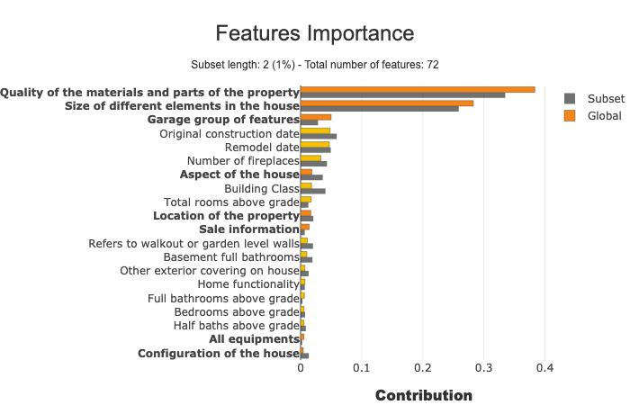
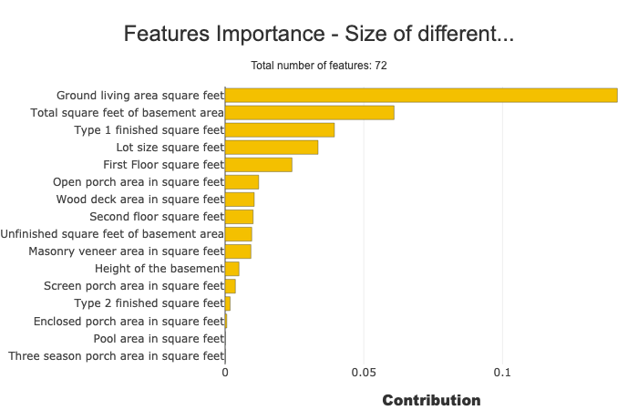
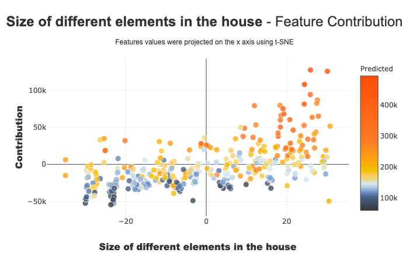
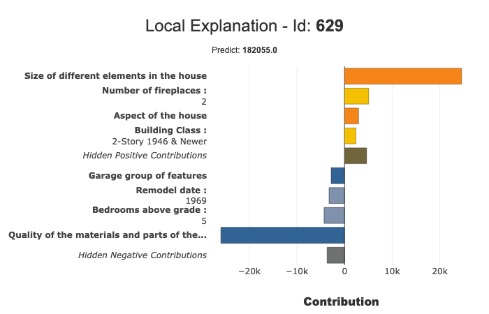
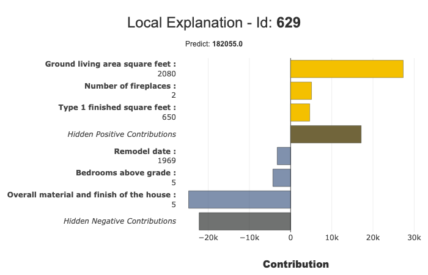

Groups of features
==================

| Shapash allows the use of groups of features.
| With groups of features you can regroup variables together and use the
  different functions of Shapash to analyze these groups.

| For example if your model uses a lot of features you may want to
  regroup features that share a common theme.
| This way **you can visualize and compare the importance of these
  themes and how they are used by your model.**

Contents of this tutorial:

- Build a model
- Contruct groups of features
- Compile Shapash SmartExplainer with the groups - Start Shapash WebApp
- Explore the functions of Shapash using groups

Data from Kaggle `House
Prices <https://www.kaggle.com/c/house-prices-advanced-regression-techniques/data>`__

Motivation
----------

In this use case, we have a lot of features that describe the house very
precisely.

| However, when analyzing our model, **you may want to get more general
  insights of the themes that are most important in setting the price of
  a property**.
| This way, rather than having to check the 6 features describing a
  garage, you can have a more general idea of how important the garage
  is by grouping these 6 features together. Shapash allows you to
  visualize the role of each group in the features importance plot.

Also, you may want to understand why your model predicted such an
important price for a specific house. If many features describing the
location of the house are contributing slightly more than usual to a
higher price, **it may not be visible directly that the price is due to
the location because of the number of features**. But grouping these
variables together allows to easily understand a specific prediction.
Shapash also allows you to group features together in local plots.

.. code:: ipython3

    import pandas as pd
    from category_encoders import OrdinalEncoder
    from lightgbm import LGBMRegressor
    from sklearn.model_selection import train_test_split

Building a supervized model
---------------------------

Load House Prices data
~~~~~~~~~~~~~~~~~~~~~~

.. code:: ipython3

    from shapash.data.data_loader import data_loading
    house_df, house_dict = data_loading('house_prices')

.. code:: ipython3

    house_df.head()

.. table::

    +-------------------------------+-----------------------+-------+------+------------------+---------------+--------------------------------+-------------------------------+------------+-------------+-------------------------+----------+----------------------+----------+-----------+-----------+---------+------------+---------+----------------------------+------------+-------------+----------+----------+---------------+---------------+---------------+----------------------+---------------------------------+-----------------------+-----------------------+----------+----------------------+----------+---------+-----------+---------------------------+---------+----------+---------------------------------+--------+--------+------------+---------+------------+------------+--------+--------+------------+------------+---------------+------------+---------------------+----------+------------------+-----------+--------------------+----------+---------------+---------------+----------+----------+-----------+-------------+---------+-----------+--------+-------+------+------+----------------------------+-------------+---------+
    |          MSSubClass           |       MSZoning        |LotArea|Street|     LotShape     |  LandContour  |           Utilities            |           LotConfig           | LandSlope  |Neighborhood |       Condition1        |Condition2|       BldgType       |HouseStyle|OverallQual|OverallCond|YearBuilt|YearRemodAdd|RoofStyle|          RoofMatl          |Exterior1st | Exterior2nd |MasVnrType|MasVnrArea|   ExterQual   |   ExterCond   |  Foundation   |       BsmtQual       |            BsmtCond             |     BsmtExposure      |     BsmtFinType1      |BsmtFinSF1|     BsmtFinType2     |BsmtFinSF2|BsmtUnfSF|TotalBsmtSF|          Heating          |HeatingQC|CentralAir|           Electrical            |1stFlrSF|2ndFlrSF|LowQualFinSF|GrLivArea|BsmtFullBath|BsmtHalfBath|FullBath|HalfBath|BedroomAbvGr|KitchenAbvGr|  KitchenQual  |TotRmsAbvGrd|     Functional      |Fireplaces|    GarageType    |GarageYrBlt|    GarageFinish    |GarageArea|  GarageQual   |  GarageCond   |PavedDrive|WoodDeckSF|OpenPorchSF|EnclosedPorch|3SsnPorch|ScreenPorch|PoolArea|MiscVal|MoSold|YrSold|          SaleType          |SaleCondition|SalePrice|
    +===============================+=======================+=======+======+==================+===============+================================+===============================+============+=============+=========================+==========+======================+==========+===========+===========+=========+============+=========+============================+============+=============+==========+==========+===============+===============+===============+======================+=================================+=======================+=======================+==========+======================+==========+=========+===========+===========================+=========+==========+=================================+========+========+============+=========+============+============+========+========+============+============+===============+============+=====================+==========+==================+===========+====================+==========+===============+===============+==========+==========+===========+=============+=========+===========+========+=======+======+======+============================+=============+=========+
    |2-Story 1946 & Newer           |Residential Low Density|   8450|Paved |Regular           |Near Flat/Level|All public Utilities (E,G,W,& S)|Inside lot                     |Gentle slope|College Creek|Normal                   |Normal    |Single-family Detached|Two story |          7|          5|     2003|        2003|Gable    |Standard (Composite) Shingle|Vinyl Siding|Vinyl Siding |Brick Face|       196|Good           |Average/Typical|Poured Contrete|Good (90-99 inches)   |Typical - slight dampness allowed|No Exposure/No Basement|Good Living Quarters   |       706|Unfinished/No Basement|         0|      150|        856|Gas forced warm air furnace|Excellent|Yes       |Standard Circuit Breakers & Romex|     856|     854|           0|     1710|           1|           0|       2|       1|           3|           1|Good           |           8|Typical Functionality|         0|Attached to home  |       2003|Rough Finished      |       548|Typical/Average|Typical/Average|Paved     |         0|         61|            0|        0|          0|       0|      0|     2|  2008|Warranty Deed - Conventional|Normal Sale  |   208500|
    +-------------------------------+-----------------------+-------+------+------------------+---------------+--------------------------------+-------------------------------+------------+-------------+-------------------------+----------+----------------------+----------+-----------+-----------+---------+------------+---------+----------------------------+------------+-------------+----------+----------+---------------+---------------+---------------+----------------------+---------------------------------+-----------------------+-----------------------+----------+----------------------+----------+---------+-----------+---------------------------+---------+----------+---------------------------------+--------+--------+------------+---------+------------+------------+--------+--------+------------+------------+---------------+------------+---------------------+----------+------------------+-----------+--------------------+----------+---------------+---------------+----------+----------+-----------+-------------+---------+-----------+--------+-------+------+------+----------------------------+-------------+---------+
    |1-Story 1946 & Newer All Styles|Residential Low Density|   9600|Paved |Regular           |Near Flat/Level|All public Utilities (E,G,W,& S)|Frontage on 2 sides of property|Gentle slope|Veenker      |Adjacent to feeder street|Normal    |Single-family Detached|One story |          6|          8|     1976|        1976|Gable    |Standard (Composite) Shingle|Metal Siding|Metal Siding |None      |         0|Average/Typical|Average/Typical|Cinder Block   |Good (90-99 inches)   |Typical - slight dampness allowed|Good Exposure          |Average Living Quarters|       978|Unfinished/No Basement|         0|      284|       1262|Gas forced warm air furnace|Excellent|Yes       |Standard Circuit Breakers & Romex|    1262|       0|           0|     1262|           0|           1|       2|       0|           3|           1|Typical/Average|           6|Typical Functionality|         1|Attached to home  |       1976|Rough Finished      |       460|Typical/Average|Typical/Average|Paved     |       298|          0|            0|        0|          0|       0|      0|     5|  2007|Warranty Deed - Conventional|Normal Sale  |   181500|
    +-------------------------------+-----------------------+-------+------+------------------+---------------+--------------------------------+-------------------------------+------------+-------------+-------------------------+----------+----------------------+----------+-----------+-----------+---------+------------+---------+----------------------------+------------+-------------+----------+----------+---------------+---------------+---------------+----------------------+---------------------------------+-----------------------+-----------------------+----------+----------------------+----------+---------+-----------+---------------------------+---------+----------+---------------------------------+--------+--------+------------+---------+------------+------------+--------+--------+------------+------------+---------------+------------+---------------------+----------+------------------+-----------+--------------------+----------+---------------+---------------+----------+----------+-----------+-------------+---------+-----------+--------+-------+------+------+----------------------------+-------------+---------+
    |2-Story 1946 & Newer           |Residential Low Density|  11250|Paved |Slightly irregular|Near Flat/Level|All public Utilities (E,G,W,& S)|Inside lot                     |Gentle slope|College Creek|Normal                   |Normal    |Single-family Detached|Two story |          7|          5|     2001|        2002|Gable    |Standard (Composite) Shingle|Vinyl Siding|Vinyl Siding |Brick Face|       162|Good           |Average/Typical|Poured Contrete|Good (90-99 inches)   |Typical - slight dampness allowed|Mimimum Exposure       |Good Living Quarters   |       486|Unfinished/No Basement|         0|      434|        920|Gas forced warm air furnace|Excellent|Yes       |Standard Circuit Breakers & Romex|     920|     866|           0|     1786|           1|           0|       2|       1|           3|           1|Good           |           6|Typical Functionality|         1|Attached to home  |       2001|Rough Finished      |       608|Typical/Average|Typical/Average|Paved     |         0|         42|            0|        0|          0|       0|      0|     9|  2008|Warranty Deed - Conventional|Normal Sale  |   223500|
    +-------------------------------+-----------------------+-------+------+------------------+---------------+--------------------------------+-------------------------------+------------+-------------+-------------------------+----------+----------------------+----------+-----------+-----------+---------+------------+---------+----------------------------+------------+-------------+----------+----------+---------------+---------------+---------------+----------------------+---------------------------------+-----------------------+-----------------------+----------+----------------------+----------+---------+-----------+---------------------------+---------+----------+---------------------------------+--------+--------+------------+---------+------------+------------+--------+--------+------------+------------+---------------+------------+---------------------+----------+------------------+-----------+--------------------+----------+---------------+---------------+----------+----------+-----------+-------------+---------+-----------+--------+-------+------+------+----------------------------+-------------+---------+
    |2-Story 1945 & Older           |Residential Low Density|   9550|Paved |Slightly irregular|Near Flat/Level|All public Utilities (E,G,W,& S)|Corner lot                     |Gentle slope|Crawford     |Normal                   |Normal    |Single-family Detached|Two story |          7|          5|     1915|        1970|Gable    |Standard (Composite) Shingle|Wood Siding |Wood Shingles|None      |         0|Average/Typical|Average/Typical|Brick & Tile   |Typical (80-89 inches)|Good                             |No Exposure/No Basement|Average Living Quarters|       216|Unfinished/No Basement|         0|      540|        756|Gas forced warm air furnace|Good     |Yes       |Standard Circuit Breakers & Romex|     961|     756|           0|     1717|           1|           0|       1|       0|           3|           1|Good           |           7|Typical Functionality|         1|Detached from home|       1998|Unfinished/No Garage|       642|Typical/Average|Typical/Average|Paved     |         0|         35|          272|        0|          0|       0|      0|     2|  2006|Warranty Deed - Conventional|Abnormal Sale|   140000|
    +-------------------------------+-----------------------+-------+------+------------------+---------------+--------------------------------+-------------------------------+------------+-------------+-------------------------+----------+----------------------+----------+-----------+-----------+---------+------------+---------+----------------------------+------------+-------------+----------+----------+---------------+---------------+---------------+----------------------+---------------------------------+-----------------------+-----------------------+----------+----------------------+----------+---------+-----------+---------------------------+---------+----------+---------------------------------+--------+--------+------------+---------+------------+------------+--------+--------+------------+------------+---------------+------------+---------------------+----------+------------------+-----------+--------------------+----------+---------------+---------------+----------+----------+-----------+-------------+---------+-----------+--------+-------+------+------+----------------------------+-------------+---------+
    |2-Story 1946 & Newer           |Residential Low Density|  14260|Paved |Slightly irregular|Near Flat/Level|All public Utilities (E,G,W,& S)|Frontage on 2 sides of property|Gentle slope|Northridge   |Normal                   |Normal    |Single-family Detached|Two story |          8|          5|     2000|        2000|Gable    |Standard (Composite) Shingle|Vinyl Siding|Vinyl Siding |Brick Face|       350|Good           |Average/Typical|Poured Contrete|Good (90-99 inches)   |Typical - slight dampness allowed|Average Exposure       |Good Living Quarters   |       655|Unfinished/No Basement|         0|      490|       1145|Gas forced warm air furnace|Excellent|Yes       |Standard Circuit Breakers & Romex|    1145|    1053|           0|     2198|           1|           0|       2|       1|           4|           1|Good           |           9|Typical Functionality|         1|Attached to home  |       2000|Rough Finished      |       836|Typical/Average|Typical/Average|Paved     |       192|         84|            0|        0|          0|       0|      0|    12|  2008|Warranty Deed - Conventional|Normal Sale  |   250000|
    +-------------------------------+-----------------------+-------+------+------------------+---------------+--------------------------------+-------------------------------+------------+-------------+-------------------------+----------+----------------------+----------+-----------+-----------+---------+------------+---------+----------------------------+------------+-------------+----------+----------+---------------+---------------+---------------+----------------------+---------------------------------+-----------------------+-----------------------+----------+----------------------+----------+---------+-----------+---------------------------+---------+----------+---------------------------------+--------+--------+------------+---------+------------+------------+--------+--------+------------+------------+---------------+------------+---------------------+----------+------------------+-----------+--------------------+----------+---------------+---------------+----------+----------+-----------+-------------+---------+-----------+--------+-------+------+------+----------------------------+-------------+---------+

.. code:: ipython3

    y = house_df['SalePrice']
    X = house_df.drop('SalePrice', axis=1)

Encoding Categorical Features
~~~~~~~~~~~~~~~~~~~~~~~~~~~~~

.. code:: ipython3

    categorical_features = [col for col in X.columns if X[col].dtype == 'object']
    
    encoder = OrdinalEncoder(
        cols=categorical_features,
        handle_unknown='ignore',
        return_df=True
    ).fit(X)
    
    X = encoder.transform(X)

Train / Test Split
~~~~~~~~~~~~~~~~~~

.. code:: ipython3

    X_train, X_test, y_train, y_test = train_test_split(X, y, train_size=0.75, random_state=1)

Model fitting
~~~~~~~~~~~~~

.. code:: ipython3

    regressor = LGBMRegressor(n_estimators=200).fit(X_train, y_train)

Construct groups of features
----------------------------

There are quite a lot of features used by the model and it can be hard
to compare them.

**We can regroup the features that share similarities in order to
identify which topic is important.**

In our example we constructed the following new groups :

- ``location``: features related to the location of the house
- ``size``: features that measure part of the house
- ``aspect``: features that evaluate the style of any part of the house
- ``condition``: features related to the quality of anything in the house
- ``configuration``: features about the general configuration / shape of the house
- ``equipment``: features that describe the equipment of the house (electricity, gas, heating…)
- ``garage``: features related to the garage (style, …)
- ``sale``: features related to the sale of the house

.. code:: ipython3

    # We construct the groups as a dictionary of string keys and list of string values
    # All the features inside the list will belong to the same group
    features_groups = {
        "location": ["MSZoning", "Neighborhood", "Condition1", "Condition2"],
        "size": [
            "LotArea",
            "MasVnrArea",
            "BsmtQual",
            "BsmtFinSF2",
            "BsmtUnfSF",
            "TotalBsmtSF",
            "1stFlrSF",
            "2ndFlrSF",
            "GrLivArea",
            "WoodDeckSF",
            "OpenPorchSF",
            "EnclosedPorch",
            "3SsnPorch",
            "ScreenPorch",
            "PoolArea",
            "BsmtFinSF1"
        ],
        "aspect": [
            "LotShape",
            "LandContour",
            "RoofStyle",
            "RoofMatl",
            "Exterior1st",
            "MasVnrType",
        ],
        "condition": [
            "OverallQual",
            "OverallCond",
            "ExterQual",
            "ExterCond",
            "BsmtCond",
            "BsmtFinType1",
            "BsmtFinType2",
            "HeatingQC",
            "KitchenQual"
        ],
        "configuration": ["LotConfig", "LandSlope", "BldgType", "HouseStyle"],
        "equipment": ["Heating", "CentralAir", "Electrical"],
        "garage": [
            "GarageType",
            "GarageYrBlt",
            "GarageFinish",
            "GarageArea",
            "GarageQual",
            "GarageCond",
        ],
        "sale": ["SaleType", "SaleCondition", "MoSold", "YrSold"]
    }

**Optional : we can also give labels to groups names**

.. code:: ipython3

    groups_labels = {
        'location': 'Location of the property',
        'size' : 'Size of different elements in the house',
        'aspect': 'Aspect of the house',
        'condition': 'Quality of the materials and parts of the property',
        'configuration': 'Configuration of the house',
        'equipment': 'All equipments',
        'garage': 'Garage group of features',
        'sale': 'Sale information'
    }
    house_dict.update(groups_labels)

Compile Shapash SmartExplainer object using groups
--------------------------------------------------

.. code:: ipython3

    from shapash.explainer.smart_explainer import SmartExplainer
    # optional parameter, specifies label for features and groups name
    xpl = SmartExplainer(features_dict=house_dict)  

.. code:: ipython3

    xpl.compile(
        x=X_test,
        model=regressor,
        preprocessing=encoder,
        features_groups=features_groups
    )

Start WebApp
------------

We can now start the webapp using the following cell.

| The groups of features are visible by default on the features
  importance plot.
| You can disable the groups using the ``groups`` switch button.

Also you can click on a group’s bar to display the features importance
of the features inside the group.

.. code:: ipython3

    app = xpl.run_app(title_story='House Prices')

**Stop the WebApp after using it**

.. code:: ipython3

    app.kill()

Explore the functions of Shapash using groups
---------------------------------------------

Features importance plot
~~~~~~~~~~~~~~~~~~~~~~~~

**Display the features importance plot that includes the groups and
excludes the features inside each group**

.. code:: ipython3

    xpl.plot.features_importance(selection=[259, 268])

**Display the features importance plot of the features inside one
group**

.. code:: ipython3

    xpl.plot.features_importance(group_name='size')

Contribution plot
~~~~~~~~~~~~~~~~~

| **Plot the shap values of each observation of a group of features**
| The features values were projected on the x axis using t-SNE.
| The values of the features (top 4 features only) can be visualized
  using the hover text.

.. code:: ipython3

    xpl.plot.contribution_plot('size')

Local plot
~~~~~~~~~~

By default, Shapash will display the groups in the local plot.

You can directly see the impact of the different groups of features for
the given observation.

.. code:: ipython3

    xpl.filter(max_contrib=8)

.. code:: ipython3

    xpl.plot.local_plot(index=629)

You can also display the features without the groups using the following
parameters :

.. code:: ipython3

    xpl.filter(max_contrib=6, display_groups=False)

.. code:: ipython3

    xpl.plot.local_plot(index=629, display_groups=False)

Use groups of features in production with SmartPredictor object
===============================================================

.. code:: ipython3

    predictor = xpl.to_smartpredictor()

**Create an imput and use add_input method of SmartPredictor object**

.. code:: ipython3

    sample_input = house_df.sample(4).drop('SalePrice', axis=1)
    sample_input

.. table::

    +------+---------------------------------+-------------------------+-----------+----------+--------------------+-----------------+----------------------------------+-------------+--------------+---------------------------------------+--------------+--------------+------------------------+--------------------------------------------+---------------+---------------+-------------+----------------+-------------+------------------------------+-------------------+-------------------+--------------+--------------+-----------------+-----------------+--------------+------------------------+-----------------------------------+-------------------------+-------------------------------+--------------+------------------------+--------------+-------------+---------------+-----------------------------+-----------------+--------------+-----------------------------------------------------+------------+------------+----------------+-------------+----------------+----------------+------------+------------+----------------+----------------+-----------------+----------------+-----------------------+--------------+--------------------+---------------+----------------------+--------------+-----------------+-----------------+--------------+--------------+---------------+-----------------+-------------+---------------+------------+-----------+----------+----------+------------------------------+-----------------+
    |   Id | MSSubClass                      | MSZoning                |   LotArea | Street   | LotShape           | LandContour     | Utilities                        | LotConfig   | LandSlope    | Neighborhood                          | Condition1   | Condition2   | BldgType               | HouseStyle                                 |   OverallQual |   OverallCond |   YearBuilt |   YearRemodAdd | RoofStyle   | RoofMatl                     | Exterior1st       | Exterior2nd       | MasVnrType   |   MasVnrArea | ExterQual       | ExterCond       | Foundation   | BsmtQual               | BsmtCond                          | BsmtExposure            | BsmtFinType1                  |   BsmtFinSF1 | BsmtFinType2           |   BsmtFinSF2 |   BsmtUnfSF |   TotalBsmtSF | Heating                     | HeatingQC       | CentralAir   | Electrical                                          |   1stFlrSF |   2ndFlrSF |   LowQualFinSF |   GrLivArea |   BsmtFullBath |   BsmtHalfBath |   FullBath |   HalfBath |   BedroomAbvGr |   KitchenAbvGr | KitchenQual     |   TotRmsAbvGrd | Functional            |   Fireplaces | GarageType         |   GarageYrBlt | GarageFinish         |   GarageArea | GarageQual      | GarageCond      | PavedDrive   |   WoodDeckSF |   OpenPorchSF |   EnclosedPorch |   3SsnPorch |   ScreenPorch |   PoolArea |   MiscVal |   MoSold |   YrSold | SaleType                     | SaleCondition   |
    +======+=================================+=========================+===========+==========+====================+=================+==================================+=============+==============+=======================================+==============+==============+========================+============================================+===============+===============+=============+================+=============+==============================+===================+===================+==============+==============+=================+=================+==============+========================+===================================+=========================+===============================+==============+========================+==============+=============+===============+=============================+=================+==============+=====================================================+============+============+================+=============+================+================+============+============+================+================+=================+================+=======================+==============+====================+===============+======================+==============+=================+=================+==============+==============+===============+=================+=============+===============+============+===========+==========+==========+==============================+=================+
    |  680 | 1-Story 1946 & Newer All Styles | Residential Low Density |      9945 | Paved    | Slightly irregular | Near Flat/Level | All public Utilities (E,G,W,& S) | Inside lot  | Gentle slope | Sawyer                                | Normal       | Normal       | Single-family Detached | One story                                  |             5 |             5 |        1961 |           1961 | Hip         | Standard (Composite) Shingle | Wood Siding       | Wood Siding       | Brick Face   |           57 | Average/Typical | Average/Typical | Cinder Block | Typical (80-89 inches) | Typical - slight dampness allowed | No Exposure/No Basement | Average Rec Room              |          827 | Unfinished/No Basement |            0 |         161 |           988 | Gas forced warm air furnace | Average/Typical | Yes          | Standard Circuit Breakers & Romex                   |        988 |          0 |              0 |         988 |              1 |              0 |          1 |          0 |              3 |              1 | Typical/Average |              5 | Typical Functionality |            0 | Detached from home |          1963 | Unfinished/No Garage |          572 | Typical/Average | Typical/Average | Paved        |            0 |             0 |               0 |           0 |             0 |          0 |         0 |       10 |     2007 | Warranty Deed - Conventional | Normal Sale     |
    +------+---------------------------------+-------------------------+-----------+----------+--------------------+-----------------+----------------------------------+-------------+--------------+---------------------------------------+--------------+--------------+------------------------+--------------------------------------------+---------------+---------------+-------------+----------------+-------------+------------------------------+-------------------+-------------------+--------------+--------------+-----------------+-----------------+--------------+------------------------+-----------------------------------+-------------------------+-------------------------------+--------------+------------------------+--------------+-------------+---------------+-----------------------------+-----------------+--------------+-----------------------------------------------------+------------+------------+----------------+-------------+----------------+----------------+------------+------------+----------------+----------------+-----------------+----------------+-----------------------+--------------+--------------------+---------------+----------------------+--------------+-----------------+-----------------+--------------+--------------+---------------+-----------------+-------------+---------------+------------+-----------+----------+----------+------------------------------+-----------------+
    |  917 | 1-Story 1946 & Newer All Styles | Commercial              |      9000 | Paved    | Regular            | Near Flat/Level | All public Utilities (E,G,W,& S) | Inside lot  | Gentle slope | Iowa DOT and Rail Road                | Normal       | Normal       | Single-family Detached | One story                                  |             2 |             3 |        1949 |           1950 | Gable       | Standard (Composite) Shingle | Asbestos Shingles | Asbestos Shingles | None         |            0 | Average/Typical | Average/Typical | Cinder Block | Typical (80-89 inches) | Typical - slight dampness allowed | Average Exposure        | Below Average Living Quarters |           50 | Unfinished/No Basement |            0 |         430 |           480 | Gas forced warm air furnace | Average/Typical | No           | Fuse Box over 60 AMP and all Romex wiring (Average) |        480 |          0 |              0 |         480 |              1 |              0 |          0 |          0 |              1 |              1 | Typical/Average |              4 | Typical Functionality |            0 | Detached from home |          1958 | Unfinished/No Garage |          308 | Typical/Average | Typical/Average | Paved        |            0 |             0 |               0 |           0 |             0 |          0 |         0 |       10 |     2006 | Warranty Deed - Conventional | Abnormal Sale   |
    +------+---------------------------------+-------------------------+-----------+----------+--------------------+-----------------+----------------------------------+-------------+--------------+---------------------------------------+--------------+--------------+------------------------+--------------------------------------------+---------------+---------------+-------------+----------------+-------------+------------------------------+-------------------+-------------------+--------------+--------------+-----------------+-----------------+--------------+------------------------+-----------------------------------+-------------------------+-------------------------------+--------------+------------------------+--------------+-------------+---------------+-----------------------------+-----------------+--------------+-----------------------------------------------------+------------+------------+----------------+-------------+----------------+----------------+------------+------------+----------------+----------------+-----------------+----------------+-----------------------+--------------+--------------------+---------------+----------------------+--------------+-----------------+-----------------+--------------+--------------+---------------+-----------------+-------------+---------------+------------+-----------+----------+----------+------------------------------+-----------------+
    |  407 | 1-1/2 Story Finished All Ages   | Residential Low Density |     10480 | Paved    | Regular            | Near Flat/Level | All public Utilities (E,G,W,& S) | Inside lot  | Gentle slope | South & West of Iowa State University | Normal       | Normal       | Single-family Detached | One and one-half story: 2nd level finished |             6 |             5 |        1936 |           1950 | Gable       | Standard (Composite) Shingle | Metal Siding      | Metal Siding      | None         |            0 | Average/Typical | Average/Typical | Brick & Tile | Typical (80-89 inches) | Typical - slight dampness allowed | No Exposure/No Basement | Unfinished/No Basement        |            0 | Unfinished/No Basement |            0 |        1064 |          1064 | Gas forced warm air furnace | Excellent       | Yes          | Fuse Box over 60 AMP and all Romex wiring (Average) |       1166 |          0 |            473 |        1639 |              0 |              0 |          1 |          0 |              3 |              1 | Typical/Average |              6 | Major Deductions 2    |            0 | Detached from home |          1936 | Unfinished/No Garage |          240 | Typical/Average | Typical/Average | Paved        |            0 |             0 |               0 |           0 |             0 |          0 |         0 |        3 |     2008 | Warranty Deed - Conventional | Normal Sale     |
    +------+---------------------------------+-------------------------+-----------+----------+--------------------+-----------------+----------------------------------+-------------+--------------+---------------------------------------+--------------+--------------+------------------------+--------------------------------------------+---------------+---------------+-------------+----------------+-------------+------------------------------+-------------------+-------------------+--------------+--------------+-----------------+-----------------+--------------+------------------------+-----------------------------------+-------------------------+-------------------------------+--------------+------------------------+--------------+-------------+---------------+-----------------------------+-----------------+--------------+-----------------------------------------------------+------------+------------+----------------+-------------+----------------+----------------+------------+------------+----------------+----------------+-----------------+----------------+-----------------------+--------------+--------------------+---------------+----------------------+--------------+-----------------+-----------------+--------------+--------------+---------------+-----------------+-------------+---------------+------------+-----------+----------+----------+------------------------------+-----------------+
    |  635 | Duplex - All Styles and Ages    | Residential Low Density |      6979 | Paved    | Regular            | Near Flat/Level | All public Utilities (E,G,W,& S) | Inside lot  | Gentle slope | Old Town                              | Normal       | Normal       | Duplex                 | Split Foyer                                |             6 |             5 |        1980 |           1980 | Gable       | Standard (Composite) Shingle | Plywood           | Plywood           | None         |            0 | Average/Typical | Average/Typical | Cinder Block | Typical (80-89 inches) | Typical - slight dampness allowed | No Exposure/No Basement | Good Living Quarters          |         1056 | Unfinished/No Basement |            0 |           0 |          1056 | Gas forced warm air furnace | Good            | Yes          | Standard Circuit Breakers & Romex                   |       1056 |          0 |              0 |        1056 |              2 |              0 |          0 |          0 |              0 |              2 | Typical/Average |              4 | Typical Functionality |            0 | Detached from home |          1980 | Unfinished/No Garage |          576 | Typical/Average | Typical/Average | Paved        |          264 |            56 |               0 |           0 |             0 |          0 |       600 |        6 |     2010 | Warranty Deed - Conventional | Normal Sale     |
    +------+---------------------------------+-------------------------+-----------+----------+--------------------+-----------------+----------------------------------+-------------+--------------+---------------------------------------+--------------+--------------+------------------------+--------------------------------------------+---------------+---------------+-------------+----------------+-------------+------------------------------+-------------------+-------------------+--------------+--------------+-----------------+-----------------+--------------+------------------------+-----------------------------------+-------------------------+-------------------------------+--------------+------------------------+--------------+-------------+---------------+-----------------------------+-----------------+--------------+-----------------------------------------------------+------------+------------+----------------+-------------+----------------+----------------+------------+------------+----------------+----------------+-----------------+----------------+-----------------------+--------------+--------------------+---------------+----------------------+--------------+-----------------+-----------------+--------------+--------------+---------------+-----------------+-------------+---------------+------------+-----------+----------+----------+------------------------------+-----------------+

.. code:: ipython3

    predictor.add_input(sample_input)

| **Get detailed explanability associated to the predictions on this
  input**
| The contributions will contain the groups we created by default but
  you can replace the groups by their corresponding features using the
  ``use_groups`` parameter

.. code:: ipython3

    predictor.detail_contributions()

.. table::

    +------+----------+--------------+----------+-------------+-------------+----------------+---------------+--------------+----------------+----------------+----------------+----------------+------------+------------+----------------+----------------+----------------+--------------+--------------+--------------+-----------+------------+----------+-----------+-------------+-----------------+-------------+----------+------------+
    |   Id |    ypred |   MSSubClass |   Street |   Utilities |   YearBuilt |   YearRemodAdd |   Exterior2nd |   Foundation |   BsmtExposure |   LowQualFinSF |   BsmtFullBath |   BsmtHalfBath |   FullBath |   HalfBath |   BedroomAbvGr |   KitchenAbvGr |   TotRmsAbvGrd |   Functional |   Fireplaces |   PavedDrive |   MiscVal |   location |     size |    aspect |   condition |   configuration |   equipment |   garage |       sale |
    +======+==========+==============+==========+=============+=============+================+===============+==============+================+================+================+================+============+============+================+================+================+==============+==============+==============+===========+============+==========+===========+=============+=================+=============+==========+============+
    |  680 | 128815   |      787.071 |        0 |           0 |   -1291.79  |       -3719.59 |     -556.536  |     -93.7311 |       -439.963 |              0 |       748.371  |      -21.81    |   -331.439 |   -243.153 |        303.859 |        62.2032 |       -892.505 |      293.525 |     -1631.26 |      94.7164 |  -22.2403 |  -113.166  | -20777.9 |   235.676 |    -28805.8 |        -83.1532 |     319.139 |  2017.96 |   656.335  |
    +------+----------+--------------+----------+-------------+-------------+----------------+---------------+--------------+----------------+----------------+----------------+----------------+------------+------------+----------------+----------------+----------------+--------------+--------------+--------------+-----------+------------+----------+-----------+-------------+-----------------+-------------+----------+------------+
    |  917 |  39710.4 |      205.847 |        0 |           0 |   -7098.54  |       -5896.28 |       95.0067 |    -106.729  |       -660.415 |              0 |       -12.3279 |      -16.8672  |   -363.431 |   -266.284 |      -3500.91  |        42.9738 |      -1448.94  |      167.515 |     -3595.23 |      77.5782 |  -16.0125 | -3083.63   | -51436.1 |  1928.19  |    -57782.2 |       -189.366  |   -3737.81  | -4885.93 | -1029.5    |
    +------+----------+--------------+----------+-------------+-------------+----------------+---------------+--------------+----------------+----------------+----------------+----------------+------------+------------+----------------+----------------+----------------+--------------+--------------+--------------+-----------+------------+----------+-----------+-------------+-----------------+-------------+----------+------------+
    |  407 | 114928   |    -2774.7   |        0 |           0 |   -3444.89  |       -7502.68 |     -402.96   |    -286.879  |      -1048.18  |              0 |      -481.312  |       -8.53366 |   -380.479 |   -665.203 |        204.36  |        98.0757 |       -309.886 |    -5876.61  |     -3380.61 |      83.5633 |  -17.6026 |  -725.017  | -10986.9 | -1987.77  |    -23378.1 |       -194.968  |    1043.17  | -4882.05 |   -85.4868 |
    +------+----------+--------------+----------+-------------+-------------+----------------+---------------+--------------+----------------+----------------+----------------+----------------+------------+------------+----------------+----------------+----------------+--------------+--------------+--------------+-----------+------------+----------+-----------+-------------+-----------------+-------------+----------+------------+
    |  635 | 138532   |    -1747.99  |        0 |           0 |    -159.747 |       -1990.18 |     -324.619  |     -51.9563 |       -562.529 |              0 |       913.745  |      -14.2152  |   -471.213 |   -235.171 |      -3610.13  |     -1679.84   |       -973.16  |      303.673 |     -1491.17 |      45.8992 |  580.9    |   -66.3616 | -14961.9 |   145.953 |    -19906.2 |        -10.4581 |     194.876 |  1999.88 |   284.385  |
    +------+----------+--------------+----------+-------------+-------------+----------------+---------------+--------------+----------------+----------------+----------------+----------------+------------+------------+----------------+----------------+----------------+--------------+--------------+--------------+-----------+------------+----------+-----------+-------------+-----------------+-------------+----------+------------+

.. code:: ipython3

    # Replace groups of features we created with their corresponding features contributions
    predictor.detail_contributions(use_groups=False)

.. table::

    +------+----------+--------------+------------+-----------+----------+------------+---------------+-------------+-------------+-------------+----------------+--------------+--------------+------------+--------------+---------------+---------------+-------------+----------------+-------------+------------+---------------+---------------+--------------+--------------+-------------+-------------+--------------+------------+------------+----------------+----------------+--------------+----------------+--------------+-------------+---------------+-----------+-------------+--------------+--------------+------------+------------+----------------+-------------+----------------+----------------+------------+------------+----------------+----------------+---------------+----------------+--------------+--------------+--------------+---------------+----------------+--------------+--------------+--------------+--------------+--------------+---------------+-----------------+-------------+---------------+------------+-----------+-----------+-----------+------------+-----------------+
    |   Id |    ypred |   MSSubClass |   MSZoning |   LotArea |   Street |   LotShape |   LandContour |   Utilities |   LotConfig |   LandSlope |   Neighborhood |   Condition1 |   Condition2 |   BldgType |   HouseStyle |   OverallQual |   OverallCond |   YearBuilt |   YearRemodAdd |   RoofStyle |   RoofMatl |   Exterior1st |   Exterior2nd |   MasVnrType |   MasVnrArea |   ExterQual |   ExterCond |   Foundation |   BsmtQual |   BsmtCond |   BsmtExposure |   BsmtFinType1 |   BsmtFinSF1 |   BsmtFinType2 |   BsmtFinSF2 |   BsmtUnfSF |   TotalBsmtSF |   Heating |   HeatingQC |   CentralAir |   Electrical |   1stFlrSF |   2ndFlrSF |   LowQualFinSF |   GrLivArea |   BsmtFullBath |   BsmtHalfBath |   FullBath |   HalfBath |   BedroomAbvGr |   KitchenAbvGr |   KitchenQual |   TotRmsAbvGrd |   Functional |   Fireplaces |   GarageType |   GarageYrBlt |   GarageFinish |   GarageArea |   GarageQual |   GarageCond |   PavedDrive |   WoodDeckSF |   OpenPorchSF |   EnclosedPorch |   3SsnPorch |   ScreenPorch |   PoolArea |   MiscVal |    MoSold |    YrSold |   SaleType |   SaleCondition |
    +======+==========+==============+============+===========+==========+============+===============+=============+=============+=============+================+==============+==============+============+==============+===============+===============+=============+================+=============+============+===============+===============+==============+==============+=============+=============+==============+============+============+================+================+==============+================+==============+=============+===============+===========+=============+==============+==============+============+============+================+=============+================+================+============+============+================+================+===============+================+==============+==============+==============+===============+================+==============+==============+==============+==============+==============+===============+=================+=============+===============+============+===========+===========+===========+============+=================+
    |  680 | 128815   |      787.071 |    308.622 |   724.478 |        0 |    625.095 |      93.3936  |           0 |  -71.5318   |           0 |       -761.099 |      339.311 |            0 |    3.99526 |     -15.6166 |      -25209.3 |      -938.557 |   -1291.79  |       -3719.59 |     4.92592 |          0 |      -500.973 |     -556.536  |      13.2343 |     -704.794 |    -616.582 |     53.4141 |     -93.7311 |   -191.211 |    264.321 |       -439.963 |       -1457.12 |      2588.76 |       -7.58538 |    -105.549  |    2975.08  |     -4640.3   |  -17.7341 |   -99.0018  |      442.413 |    -105.54   |   -830.066 |   -940.99  |              0 |   -17723.2  |       748.371  |      -21.81    |   -331.439 |   -243.153 |        303.859 |        62.2032 |      -795.422 |       -892.505 |      293.525 |     -1631.26 |    -162.311  |      -714.929 |      -210.588  |      2721.7  |      326.899 |      57.1924 |      94.7164 |     -1103.4  |      -575.356 |        -23.7208 |           0 |      -227.592 |          0 |  -22.2403 |  324.361  |  139.636  |   -112.495 |         304.833 |
    +------+----------+--------------+------------+-----------+----------+------------+---------------+-------------+-------------+-------------+----------------+--------------+--------------+------------+--------------+---------------+---------------+-------------+----------------+-------------+------------+---------------+---------------+--------------+--------------+-------------+-------------+--------------+------------+------------+----------------+----------------+--------------+----------------+--------------+-------------+---------------+-----------+-------------+--------------+--------------+------------+------------+----------------+-------------+----------------+----------------+------------+------------+----------------+----------------+---------------+----------------+--------------+--------------+--------------+---------------+----------------+--------------+--------------+--------------+--------------+--------------+---------------+-----------------+-------------+---------------+------------+-----------+-----------+-----------+------------+-----------------+
    |  917 |  39710.4 |      205.847 |  -1788.76  |  -385.659 |        0 |   -676.447 |     -53.72    |           0 | -185.525    |           0 |      -1424.66  |      129.786 |            0 |    9.61592 |     -13.4567 |      -39740.2 |    -15426     |   -7098.54  |       -5896.28 |   -10.5695  |          0 |      2721.65  |       95.0067 |     -52.7245 |     -301.736 |    -670.655 |     59.1753 |    -106.729  |   -204.354 |    104.616 |       -660.415 |       -1067.25 |     -2920.87 |      -11.971   |     -77.4068 |    -680.035 |    -10799.2   |  -19.3129 |  -230.931   |    -4345.93  |     627.432  |  -8033.6   |   -851.925 |              0 |   -25253.5  |       -12.3279 |      -16.8672  |   -363.431 |   -266.284 |      -3500.91  |        42.9738 |      -798.958 |      -1448.94  |      167.515 |     -3595.23 |    -202.962  |      -615.589 |      -152.95   |     -4189.71 |      225.496 |      49.7852 |      77.5782 |     -1001.09 |      -620.055 |        -28.1121 |           0 |      -278.569 |          0 |  -16.0125 |   61.6489 |  849.444  |   -137.525 |       -1803.07  |
    +------+----------+--------------+------------+-----------+----------+------------+---------------+-------------+-------------+-------------+----------------+--------------+--------------+------------+--------------+---------------+---------------+-------------+----------------+-------------+------------+---------------+---------------+--------------+--------------+-------------+-------------+--------------+------------+------------+----------------+----------------+--------------+----------------+--------------+-------------+---------------+-----------+-------------+--------------+--------------+------------+------------+----------------+-------------+----------------+----------------+------------+------------+----------------+----------------+---------------+----------------+--------------+--------------+--------------+---------------+----------------+--------------+--------------+--------------+--------------+--------------+---------------+-----------------+-------------+---------------+------------+-----------+-----------+-----------+------------+-----------------+
    |  407 | 114928   |    -2774.7   |    392.301 |  -401.906 |        0 |  -1701.49  |      68.465   |           0 | -136.012    |           0 |      -1577.41  |      460.09  |            0 |   10.1302  |     -69.0859 |      -17932.1 |     -2724.45  |   -3444.89  |       -7502.68 |    43.0225  |          0 |      -340.92  |     -402.96   |     -56.8514 |     -446.325 |    -852.421 |     72.7945 |    -286.879  |   -441.206 |    225.766 |      -1048.18  |       -2054.19 |     -4982.14 |      -10.9608  |    -129.568  |   -1412.94  |      -458.214 |  -14.8908 |   654.899   |      236.944 |     821.113  |  -1876.53  |  -1147.86  |              0 |     2320.46 |      -481.312  |       -8.53366 |   -380.479 |   -665.203 |        204.36  |        98.0757 |      -757.39  |       -309.886 |    -5876.61  |     -3380.61 |     -81.9962 |       282.19  |       -27.1705 |     -5306.71 |      201.237 |      50.3963 |      83.5633 |      -752.1  |      -908.989 |        -63.7283 |           0 |      -285.829 |          0 |  -17.6026 | -250.544  |   72.9742 |   -122.491 |         214.573 |
    +------+----------+--------------+------------+-----------+----------+------------+---------------+-------------+-------------+-------------+----------------+--------------+--------------+------------+--------------+---------------+---------------+-------------+----------------+-------------+------------+---------------+---------------+--------------+--------------+-------------+-------------+--------------+------------+------------+----------------+----------------+--------------+----------------+--------------+-------------+---------------+-----------+-------------+--------------+--------------+------------+------------+----------------+-------------+----------------+----------------+------------+------------+----------------+----------------+---------------+----------------+--------------+--------------+--------------+---------------+----------------+--------------+--------------+--------------+--------------+--------------+---------------+-----------------+-------------+---------------+------------+-----------+-----------+-----------+------------+-----------------+
    |  635 | 138532   |    -1747.99  |    466.54  | -2745.89  |        0 |   -602.853 |       3.69561 |           0 |   -0.908402 |           0 |       -874.124 |      341.222 |            0 | -109.11    |      99.56   |      -18496.1 |     -1635.05  |    -159.747 |       -1990.18 |    56.5921  |          0 |       732.424 |     -324.619  |     -43.906  |     -255.053 |    -767.347 |     55.7317 |     -51.9563 |   -348.302 |    166.934 |       -562.529 |        1743.62 |      3454.73 |      -16.8569  |    -121.986  |    1834.08  |      -192.257 |  -18.3733 |    -6.73151 |      251.836 |     -38.5865 |  -1307.89  |   -709.006 |              0 |   -17295.2  |       913.745  |      -14.2152  |   -471.213 |   -235.171 |      -3610.13  |     -1679.84   |      -950.326 |       -973.16  |      303.673 |     -1491.17 |    -229.777  |       -59.708 |      -101.639  |      2056.1  |      268.501 |      66.4092 |      45.8992 |      2485.25 |       445.755 |        -38.818  |           0 |      -167.34  |          0 |  580.9    |  505.019  | -369.031  |   -269.565 |         417.962 |
    +------+----------+--------------+------------+-----------+----------+------------+---------------+-------------+-------------+-------------+----------------+--------------+--------------+------------+--------------+---------------+---------------+-------------+----------------+-------------+------------+---------------+---------------+--------------+--------------+-------------+-------------+--------------+------------+------------+----------------+----------------+--------------+----------------+--------------+-------------+---------------+-----------+-------------+--------------+--------------+------------+------------+----------------+-------------+----------------+----------------+------------+------------+----------------+----------------+---------------+----------------+--------------+--------------+--------------+---------------+----------------+--------------+--------------+--------------+--------------+--------------+---------------+-----------------+-------------+---------------+------------+-----------+-----------+-----------+------------+-----------------+

| **Compute a summary of these contributions**
| Configure the summary using the ``modify_mask`` method :

.. code:: ipython3

    predictor.modify_mask(max_contrib=4)

The ``summarize`` method will contain the groups of features
contributions and the ``value_x`` columns will contain all the values of
the features of the corresponding group as a dict.

.. code:: ipython3

    predictor.summarize()

.. table::

    +-----+----------+----------------------------------------------------+-------------------------------------------------------------------------------------------------------------------------------------------------------------+------------------+-----------------------------------------+----------------------------------------------------------------------------------------------------------------------------------------------------------------------------------------------------------------------------------------------------------------------------------------------------------------------------+------------------+----------------------------+-----------+------------------+--------------------------+----------------------------------------------------------------------------------------------------------------------------+------------------+--------------------------+----------------------------------------------------------------------------------------------------------------------------+------------------+----------------------------+--------------------------------------------------+------------------+
    |     |    ypred | feature_1                                          | value_1                                                                                                                                                     |   contribution_1 | feature_2                               | value_2                                                                                                                                                                                                                                                                                                                    |   contribution_2 | feature_3                  |   value_3 |   contribution_3 | feature_4                | value_4                                                                                                                    |   contribution_4 | feature_5                | value_5                                                                                                                    |   contribution_5 | feature_6                  | value_6                                          |   contribution_6 |
    +=====+==========+====================================================+=============================================================================================================================================================+==================+=========================================+============================================================================================================================================================================================================================================================================================================================+==================+============================+===========+==================+==========================+============================================================================================================================+==================+==========================+============================================================================================================================+==================+============================+==================================================+==================+
    | 680 | 128815   | Quality of the materials and parts of the property | {'OverallQual': 5, 'OverallCond': 5, 'ExterQual': 2, 'ExterCond': 1, 'BsmtCond': 1, 'BsmtFinType1': 4, 'BsmtFinType2': 1, 'HeatingQC': 3, 'KitchenQual': 2} |         -28805.8 | Size of different elements in the house | {'LotArea': 9945.0, 'MasVnrArea': 57.0, 'BsmtQual': 2.0, 'BsmtFinSF2': 0.0, 'BsmtUnfSF': 161.0, 'TotalBsmtSF': 988.0, '1stFlrSF': 988.0, '2ndFlrSF': 0.0, 'GrLivArea': 988.0, 'WoodDeckSF': 0.0, 'OpenPorchSF': 0.0, 'EnclosedPorch': 0.0, '3SsnPorch': 0.0, 'ScreenPorch': 0.0, 'PoolArea': 0.0, 'BsmtFinSF1': 827.0}     |         -20777.9 | Remodel date               |      1961 |         -3719.59 | Garage group of features | {'GarageType': 2.0, 'GarageYrBlt': 1963.0, 'GarageFinish': 2.0, 'GarageArea': 572.0, 'GarageQual': 1.0, 'GarageCond': 1.0} |          2017.96 | Number of fireplaces     | 0                                                                                                                          |         -1631.26 | Original construction date | 1961                                             |         -1291.79 |
    +-----+----------+----------------------------------------------------+-------------------------------------------------------------------------------------------------------------------------------------------------------------+------------------+-----------------------------------------+----------------------------------------------------------------------------------------------------------------------------------------------------------------------------------------------------------------------------------------------------------------------------------------------------------------------------+------------------+----------------------------+-----------+------------------+--------------------------+----------------------------------------------------------------------------------------------------------------------------+------------------+--------------------------+----------------------------------------------------------------------------------------------------------------------------+------------------+----------------------------+--------------------------------------------------+------------------+
    | 917 |  39710.4 | Quality of the materials and parts of the property | {'OverallQual': 2, 'OverallCond': 3, 'ExterQual': 2, 'ExterCond': 1, 'BsmtCond': 1, 'BsmtFinType1': 5, 'BsmtFinType2': 1, 'HeatingQC': 3, 'KitchenQual': 2} |         -57782.2 | Size of different elements in the house | {'LotArea': 9000.0, 'MasVnrArea': 0.0, 'BsmtQual': 2.0, 'BsmtFinSF2': 0.0, 'BsmtUnfSF': 430.0, 'TotalBsmtSF': 480.0, '1stFlrSF': 480.0, '2ndFlrSF': 0.0, 'GrLivArea': 480.0, 'WoodDeckSF': 0.0, 'OpenPorchSF': 0.0, 'EnclosedPorch': 0.0, '3SsnPorch': 0.0, 'ScreenPorch': 0.0, 'PoolArea': 0.0, 'BsmtFinSF1': 50.0}       |         -51436.1 | Original construction date |      1949 |         -7098.54 | Remodel date             | 1950                                                                                                                       |         -5896.28 | Garage group of features | {'GarageType': 2.0, 'GarageYrBlt': 1958.0, 'GarageFinish': 2.0, 'GarageArea': 308.0, 'GarageQual': 1.0, 'GarageCond': 1.0} |         -4885.93 | All equipments             | {'Heating': 1, 'CentralAir': 2, 'Electrical': 3} |         -3737.81 |
    +-----+----------+----------------------------------------------------+-------------------------------------------------------------------------------------------------------------------------------------------------------------+------------------+-----------------------------------------+----------------------------------------------------------------------------------------------------------------------------------------------------------------------------------------------------------------------------------------------------------------------------------------------------------------------------+------------------+----------------------------+-----------+------------------+--------------------------+----------------------------------------------------------------------------------------------------------------------------+------------------+--------------------------+----------------------------------------------------------------------------------------------------------------------------+------------------+----------------------------+--------------------------------------------------+------------------+
    | 407 | 114928   | Quality of the materials and parts of the property | {'OverallQual': 6, 'OverallCond': 5, 'ExterQual': 2, 'ExterCond': 1, 'BsmtCond': 1, 'BsmtFinType1': 3, 'BsmtFinType2': 1, 'HeatingQC': 1, 'KitchenQual': 2} |         -23378.1 | Size of different elements in the house | {'LotArea': 10480.0, 'MasVnrArea': 0.0, 'BsmtQual': 2.0, 'BsmtFinSF2': 0.0, 'BsmtUnfSF': 1064.0, 'TotalBsmtSF': 1064.0, '1stFlrSF': 1166.0, '2ndFlrSF': 0.0, 'GrLivArea': 1639.0, 'WoodDeckSF': 0.0, 'OpenPorchSF': 0.0, 'EnclosedPorch': 0.0, '3SsnPorch': 0.0, 'ScreenPorch': 0.0, 'PoolArea': 0.0, 'BsmtFinSF1': 0.0}   |         -10986.9 | Remodel date               |      1950 |         -7502.68 | Home functionality       | Major Deductions 2                                                                                                         |         -5876.61 | Garage group of features | {'GarageType': 2.0, 'GarageYrBlt': 1936.0, 'GarageFinish': 2.0, 'GarageArea': 240.0, 'GarageQual': 1.0, 'GarageCond': 1.0} |         -4882.05 | Original construction date | 1936                                             |         -3444.89 |
    +-----+----------+----------------------------------------------------+-------------------------------------------------------------------------------------------------------------------------------------------------------------+------------------+-----------------------------------------+----------------------------------------------------------------------------------------------------------------------------------------------------------------------------------------------------------------------------------------------------------------------------------------------------------------------------+------------------+----------------------------+-----------+------------------+--------------------------+----------------------------------------------------------------------------------------------------------------------------+------------------+--------------------------+----------------------------------------------------------------------------------------------------------------------------+------------------+----------------------------+--------------------------------------------------+------------------+
    | 635 | 138532   | Quality of the materials and parts of the property | {'OverallQual': 6, 'OverallCond': 5, 'ExterQual': 2, 'ExterCond': 1, 'BsmtCond': 1, 'BsmtFinType1': 1, 'BsmtFinType2': 1, 'HeatingQC': 2, 'KitchenQual': 2} |         -19906.2 | Size of different elements in the house | {'LotArea': 6979.0, 'MasVnrArea': 0.0, 'BsmtQual': 2.0, 'BsmtFinSF2': 0.0, 'BsmtUnfSF': 0.0, 'TotalBsmtSF': 1056.0, '1stFlrSF': 1056.0, '2ndFlrSF': 0.0, 'GrLivArea': 1056.0, 'WoodDeckSF': 264.0, 'OpenPorchSF': 56.0, 'EnclosedPorch': 0.0, '3SsnPorch': 0.0, 'ScreenPorch': 0.0, 'PoolArea': 0.0, 'BsmtFinSF1': 1056.0} |         -14961.9 | Bedrooms above grade       |         0 |         -3610.13 | Garage group of features | {'GarageType': 2.0, 'GarageYrBlt': 1980.0, 'GarageFinish': 2.0, 'GarageArea': 576.0, 'GarageQual': 1.0, 'GarageCond': 1.0} |          1999.88 | Remodel date             | 1980                                                                                                                       |         -1990.18 | Building Class             | Duplex - All Styles and Ages                     |         -1747.99 |
    +-----+----------+----------------------------------------------------+-------------------------------------------------------------------------------------------------------------------------------------------------------------+------------------+-----------------------------------------+----------------------------------------------------------------------------------------------------------------------------------------------------------------------------------------------------------------------------------------------------------------------------------------------------------------------------+------------------+----------------------------+-----------+------------------+--------------------------+----------------------------------------------------------------------------------------------------------------------------+------------------+--------------------------+----------------------------------------------------------------------------------------------------------------------------+------------------+----------------------------+--------------------------------------------------+------------------+

.. code:: ipython3

    # Removes the groups of features in the summary and replace them with their corresponding features
    predictor.summarize(use_groups=False)

.. table::

    +-----+----------+------------------------------------------+-----------+------------------+--------------------------------+-----------+------------------+------------------------------------+--------------------+------------------+------------------------------------+-----------+------------------+-----------------------------------------+-----------+------------------+-------------------------------+-----------+------------------+
    |     |    ypred | feature_1                                |   value_1 |   contribution_1 | feature_2                      |   value_2 |   contribution_2 | feature_3                          | value_3            |   contribution_3 | feature_4                          |   value_4 |   contribution_4 | feature_5                               |   value_5 |   contribution_5 | feature_6                     |   value_6 |   contribution_6 |
    +=====+==========+==========================================+===========+==================+================================+===========+==================+====================================+====================+==================+====================================+===========+==================+=========================================+===========+==================+===============================+===========+==================+
    | 680 | 128815   | Overall material and finish of the house |         5 |         -25209.3 | Ground living area square feet |       988 |        -17723.2  | Total square feet of basement area | 988                |         -4640.3  | Remodel date                       |      1961 |         -3719.59 | Unfinished square feet of basement area |       161 |          2975.08 | Size of garage in square feet |       572 |          2721.7  |
    +-----+----------+------------------------------------------+-----------+------------------+--------------------------------+-----------+------------------+------------------------------------+--------------------+------------------+------------------------------------+-----------+------------------+-----------------------------------------+-----------+------------------+-------------------------------+-----------+------------------+
    | 917 |  39710.4 | Overall material and finish of the house |         2 |         -39740.2 | Ground living area square feet |       480 |        -25253.5  | Overall condition of the house     | 3                  |        -15426    | Total square feet of basement area |       480 |        -10799.2  | First Floor square feet                 |       480 |         -8033.6  | Original construction date    |      1949 |         -7098.54 |
    +-----+----------+------------------------------------------+-----------+------------------+--------------------------------+-----------+------------------+------------------------------------+--------------------+------------------+------------------------------------+-----------+------------------+-----------------------------------------+-----------+------------------+-------------------------------+-----------+------------------+
    | 407 | 114928   | Overall material and finish of the house |         6 |         -17932.1 | Remodel date                   |      1950 |         -7502.68 | Home functionality                 | Major Deductions 2 |         -5876.61 | Size of garage in square feet      |       240 |         -5306.71 | Type 1 finished square feet             |         0 |         -4982.14 | Original construction date    |      1936 |         -3444.89 |
    +-----+----------+------------------------------------------+-----------+------------------+--------------------------------+-----------+------------------+------------------------------------+--------------------+------------------+------------------------------------+-----------+------------------+-----------------------------------------+-----------+------------------+-------------------------------+-----------+------------------+
    | 635 | 138532   | Overall material and finish of the house |         6 |         -18496.1 | Ground living area square feet |      1056 |        -17295.2  | Bedrooms above grade               | 0                  |         -3610.13 | Type 1 finished square feet        |      1056 |          3454.73 | Lot size square feet                    |      6979 |         -2745.89 | Wood deck area in square feet |       264 |          2485.25 |
    +-----+----------+------------------------------------------+-----------+------------------+--------------------------------+-----------+------------------+------------------------------------+--------------------+------------------+------------------------------------+-----------+------------------+-----------------------------------------+-----------+------------------+-------------------------------+-----------+------------------+

