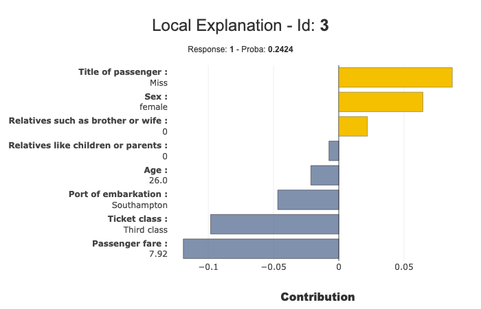

Compute Contributions with Shap - Summarize them With Shapash
===========================================================

Shapash uses Shap backend to compute the Shapley contributions in order
to satisfy the most hurry users who wish to display results with a
little lines of code.

But we recommend you to refer to the excellent `Shap
library <https://github.com/slundberg/shap>`__.

This tutorial shows how to use precalculated contributions with Shap in
Shapash.

Contents:

- Build a Binary Classifier
- Use Shap KernelExplainer
- Compile Shapash SmartExplainer
- Display local_plot
- to_pandas export

We used Kaggle's `Titanic <https://www.kaggle.com/c/titanic/data>`__ dataset.

.. code:: ipython

    import numpy as np
    import pandas as pd
    from category_encoders import OrdinalEncoder
    from sklearn.ensemble import RandomForestClassifier
    from sklearn.model_selection import train_test_split
    import shap

.. code:: ipython

    from shapash.data.data_loader import data_loading

.. code:: ipython

    titan_df, titan_dict = data_loading('titanic')
    del titan_df['Name']

.. code:: ipython

    titan_df.head()

.. table::

    +--------+-----------+------+---+-----+-----+-----+-----------+-----+
    |Survived|  Pclass   | Sex  |Age|SibSp|Parch|Fare | Embarked  |Title|
    +========+===========+======+===+=====+=====+=====+===========+=====+
    |       0|Third class|male  | 22|    1|    0| 7.25|Southampton|Mr   |
    +--------+-----------+------+---+-----+-----+-----+-----------+-----+
    |       1|First class|female| 38|    1|    0|71.28|Cherbourg  |Mrs  |
    +--------+-----------+------+---+-----+-----+-----+-----------+-----+
    |       1|Third class|female| 26|    0|    0| 7.92|Southampton|Miss |
    +--------+-----------+------+---+-----+-----+-----+-----------+-----+
    |       1|First class|female| 35|    1|    0|53.10|Southampton|Mrs  |
    +--------+-----------+------+---+-----+-----+-----+-----------+-----+
    |       0|Third class|male  | 35|    0|    0| 8.05|Southampton|Mr   |
    +--------+-----------+------+---+-----+-----+-----+-----------+-----+

Create the Classification Model
-------------------------------

.. code:: ipython

    y = titan_df['Survived']
    X = titan_df.drop('Survived', axis=1)

.. code:: ipython

    varcat=['Pclass','Sex','Embarked','Title']

.. code:: ipython

    categ_encoding = OrdinalEncoder(cols=varcat, \
                                    handle_unknown='ignore', \
                                    return_df=True).fit(X)
    X = categ_encoding.transform(X)

Train Test split + Random Forest fit :

.. code:: ipython

    Xtrain, Xtest, ytrain, ytest = train_test_split(X, y, train_size=0.75, random_state=1)
    
    rf = RandomForestClassifier(n_estimators=100,min_samples_leaf=3)
    rf.fit(Xtrain, ytrain)

.. parsed-literal::

    RandomForestClassifier(bootstrap=True, ccp_alpha=0.0, class_weight=None,
                           criterion='gini', max_depth=None, max_features='auto',
                           max_leaf_nodes=None, max_samples=None,
                           min_impurity_decrease=0.0, min_impurity_split=None,
                           min_samples_leaf=3, min_samples_split=2,
                           min_weight_fraction_leaf=0.0, n_estimators=100,
                           n_jobs=None, oob_score=False, random_state=None,
                           verbose=0, warm_start=False)

.. code:: ipython

    ypred=pd.DataFrame(rf.predict(Xtest),columns=['pred'],index=Xtest.index)

Compute Shapley Contributions with Shap
---------------------------------------

.. code:: ipython

    explainer = shap.KernelExplainer(rf.predict_proba, Xtest)
    shap_contrib = explainer.shap_values(Xtest)

.. parsed-literal::

    Using 223 background data samples could cause slower run times. Consider using shap.sample(data, K) or shap.kmeans(data, K) to summarize the background as K samples.

.. parsed-literal::

    HBox(children=(IntProgress(value=0, max=223), HTML(value='')))

    

Use Shapash With Shapley Contributions
--------------------------------------

.. code:: ipython

    from shapash.explainer.smart_explainer import SmartExplainer

.. code:: ipython

    xpl = SmartExplainer(features_dict=titan_dict)

Use contributions parameter of compile method to declare Shapley contributions
~~~~~~~~~~~~~~~~~~~~~~~~~~~~~~~~~~~~~~~~~~~~~~~~~~~~~~~~~~~~~~~~~~~~~~~~~~~~~~

.. code:: ipython

    xpl.compile(contributions=shap_contrib, # Shap Contributions pd.DataFrame
                y_pred=ypred,
                x=Xtest,
                model=rf,
                preprocessing=categ_encoding)

.. code:: ipython

    xpl.plot.local_plot(index=3)

.. code:: ipython

    summary_df = xpl.to_pandas(max_contrib=3,positive=True,proba=True)
    summary_df.head()

.. table::

    +----+------+---------+-------+--------------+------------------+-------+--------------+---------------------------------+-----------+--------------+
    |pred|proba |feature_1|value_1|contribution_1|    feature_2     |value_2|contribution_2|            feature_3            |  value_3  |contribution_3|
    +====+======+=========+=======+==============+==================+=======+==============+=================================+===========+==============+
    |   1|0.8280|Sex      |female |        0.2594|Title of passenger|Mrs    |        0.1965|Ticket class                     |First class|       0.08635|
    +----+------+---------+-------+--------------+------------------+-------+--------------+---------------------------------+-----------+--------------+
    |   0|0.9800|Sex      |male   |        0.2461|Title of passenger|Mr     |        0.2173|Ticket class                     |Third class|       0.08621|
    +----+------+---------+-------+--------------+------------------+-------+--------------+---------------------------------+-----------+--------------+
    |   1|0.7948|Sex      |female |        0.2535|Title of passenger|Miss   |        0.2010|Age                              |         17|       0.08298|
    +----+------+---------+-------+--------------+------------------+-------+--------------+---------------------------------+-----------+--------------+
    |   1|0.7185|Sex      |female |        0.2419|Title of passenger|Miss   |        0.1974|Relatives such as brother or wife|          0|       0.04138|
    +----+------+---------+-------+--------------+------------------+-------+--------------+---------------------------------+-----------+--------------+
    |   1|0.9510|Sex      |female |        0.2508|Title of passenger|Miss   |        0.2076|Age                              |          7|       0.08026|
    +----+------+---------+-------+--------------+------------------+-------+--------------+---------------------------------+-----------+--------------+

