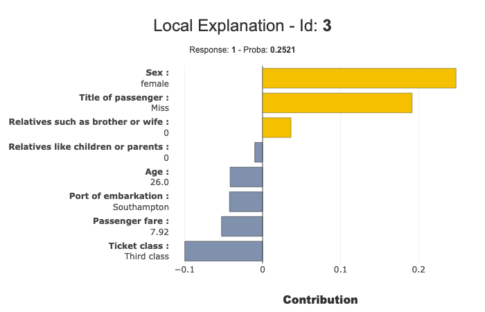

Using Shapash with Lime explainer - Titanic
===========================================

You can compute your local contributions with the
`Lime <https://github.com/marcotcr/lime>`__ library and summarize it
with Shapash

This Tutorial: - Build a Binary Classifier (Random Forest) - Create
Explainer using Lime - Use Shapash to plot Local Explanation, and
summarize it

Contents: - Build a Binary Classifier - Compile Shapash SmartExplainer -
Display local_plot - to_pandas export

Data from Kaggle `Titanic <https://www.kaggle.com/c/titanic>`__

.. code:: ipython

    import numpy as np
    import pandas as pd
    from category_encoders import OrdinalEncoder
    from sklearn.ensemble import RandomForestClassifier
    from sklearn.model_selection import train_test_split
    import lime.lime_tabular

.. code:: ipython

    from shapash.data.data_loader import data_loading

.. code:: ipython

    titan_df, titan_dict = data_loading('titanic')
    del titan_df['Name']

.. code:: ipython

    titan_df.head()

.. table::

    +--------+-----------+------+---+-----+-----+-----+-----------+-----+
    |Survived|  Pclass   | Sex  |Age|SibSp|Parch|Fare | Embarked  |Title|
    +========+===========+======+===+=====+=====+=====+===========+=====+
    |       0|Third class|male  | 22|    1|    0| 7.25|Southampton|Mr   |
    +--------+-----------+------+---+-----+-----+-----+-----------+-----+
    |       1|First class|female| 38|    1|    0|71.28|Cherbourg  |Mrs  |
    +--------+-----------+------+---+-----+-----+-----+-----------+-----+
    |       1|Third class|female| 26|    0|    0| 7.92|Southampton|Miss |
    +--------+-----------+------+---+-----+-----+-----+-----------+-----+
    |       1|First class|female| 35|    1|    0|53.10|Southampton|Mrs  |
    +--------+-----------+------+---+-----+-----+-----+-----------+-----+
    |       0|Third class|male  | 35|    0|    0| 8.05|Southampton|Mr   |
    +--------+-----------+------+---+-----+-----+-----+-----------+-----+

Create Classification Model
---------------------------

.. code:: ipython

    y = titan_df['Survived']
    X = titan_df.drop('Survived', axis=1)

.. code:: ipython

    varcat=['Pclass','Sex','Embarked','Title']

.. code:: ipython

    categ_encoding = OrdinalEncoder(cols=varcat, \
                                    handle_unknown='ignore', \
                                    return_df=True).fit(X)
    X = categ_encoding.transform(X)

Train Test split + Random Forest fit

.. code:: ipython

    Xtrain, Xtest, ytrain, ytest = train_test_split(X, y, train_size=0.75, random_state=1)
    
    rf = RandomForestClassifier(n_estimators=100,min_samples_leaf=3)
    rf.fit(Xtrain, ytrain)

.. parsed-literal::

    RandomForestClassifier(bootstrap=True, ccp_alpha=0.0, class_weight=None,
                           criterion='gini', max_depth=None, max_features='auto',
                           max_leaf_nodes=None, max_samples=None,
                           min_impurity_decrease=0.0, min_impurity_split=None,
                           min_samples_leaf=3, min_samples_split=2,
                           min_weight_fraction_leaf=0.0, n_estimators=100,
                           n_jobs=None, oob_score=False, random_state=None,
                           verbose=0, warm_start=False)

Create Lime Explainer
---------------------

.. code:: ipython

    #Training Tabular Explainer
    explainer = lime.lime_tabular.LimeTabularExplainer(Xtrain.values, 
                                                       mode='classification',
                                                       feature_names=Xtrain.columns,
                                                       class_names=ytrain)

Apply Explainer to Test Sample And Preprocessing
------------------------------------------------

.. code:: ipython

    # Function features_check Extract feature names from Lime Output to be used by shapash
    def features_check(s):
        for w in list(Xtest.columns):
            if f' {w} ' in f' {s} ' :
                feat = w
        return feat

.. code:: ipython

    %%time
    # Compute local Lime Explanation for each row in Test Sample
    contrib_l=[]
    for ind in Xtest.index:
        exp = explainer.explain_instance(Xtest.loc[ind].values, rf.predict_proba, num_features=Xtest.shape[1])
        contrib_l.append(dict([[features_check(elem[0]),elem[1]] for elem in exp.as_list()]))

.. parsed-literal::

    CPU times: user 57.8 s, sys: 7.34 s, total: 1min 5s
    Wall time: 10.9 s

.. code:: ipython

    contribution_df =pd.DataFrame(contrib_l,index=Xtest.index)
    # sorting the columns as in the original dataset
    contribution_df = contribution_df[list(Xtest.columns)]

.. code:: ipython

    ypred=pd.DataFrame(rf.predict(Xtest),columns=['pred'],index=Xtest.index)

Use Shapash With Lime Contributions
-----------------------------------

.. code:: ipython

    from shapash.explainer.smart_explainer import SmartExplainer

.. code:: ipython

    xpl = SmartExplainer(features_dict=titan_dict)

Use contributions parameter of compile method to declare Lime contributions
~~~~~~~~~~~~~~~~~~~~~~~~~~~~~~~~~~~~~~~~~~~~~~~~~~~~~~~~~~~~~~~~~~~~~~~~~~~

.. code:: ipython

    xpl.compile(contributions=contribution_df, # Lime Contribution pd.DataFrame
                y_pred=ypred,
                x=Xtest,
                model=rf,
                preprocessing=categ_encoding)

.. code:: ipython

    xpl.plot.local_plot(index=3)

.. code:: ipython

    summary_df = xpl.to_pandas(max_contrib=3,positive=True,proba=True)
    summary_df.head()

.. table::

    +----+------+------------------+-------+--------------+-------------------+------------+--------------+------------------+------------+--------------+
    |pred|proba |    feature_1     |value_1|contribution_1|     feature_2     |  value_2   |contribution_2|    feature_3     |  value_3   |contribution_3|
    +====+======+==================+=======+==============+===================+============+==============+==================+============+==============+
    |   1|0.8444|Sex               |female |       0.22468|Title of passenger |Mrs         |       0.14245|Ticket class      |First class |       0.12911|
    +----+------+------------------+-------+--------------+-------------------+------------+--------------+------------------+------------+--------------+
    |   0|0.9781|Sex               |male   |       0.08425|Title of passenger |Mr          |       0.08304|Passenger fare    |         7.9|       0.06555|
    +----+------+------------------+-------+--------------+-------------------+------------+--------------+------------------+------------+--------------+
    |   1|0.8249|Sex               |female |       0.20914|Title of passenger |Miss        |       0.14421|Ticket class      |Second class|       0.10001|
    +----+------+------------------+-------+--------------+-------------------+------------+--------------+------------------+------------+--------------+
    |   1|0.7653|Sex               |female |       0.17878|Port of embarkation|Queenstown  |       0.16792|Title of passenger|Miss        |       0.13360|
    +----+------+------------------+-------+--------------+-------------------+------------+--------------+------------------+------------+--------------+
    |   1|0.9240|Title of passenger|Miss   |       0.15922|Ticket class       |Second class|       0.14618|Sex               |female      |       0.12907|
    +----+------+------------------+-------+--------------+-------------------+------------+--------------+------------------+------------+--------------+

