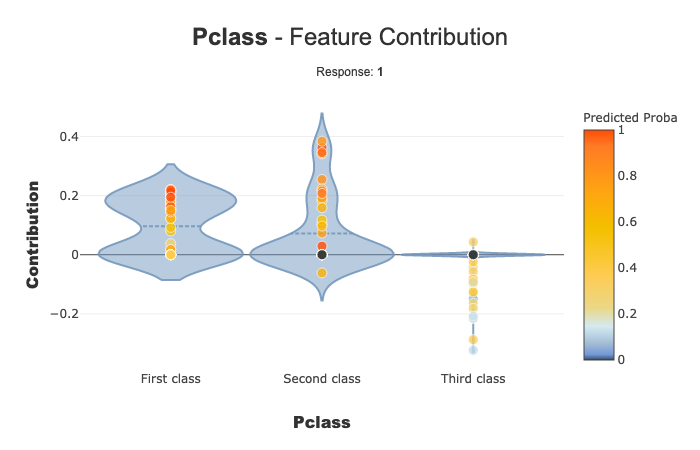

ACV tutorial
============

This tutorial shows how to use ACV backend as a alternative to SHAP.

More information about ACV can be found here :
https://github.com/salimamoukou/acv00

We used Kaggle’s `Titanic <https://www.kaggle.com/c/titanic>`__ dataset.

In this Tutorial:

- We encode data using category_encoders
- Build a Binary Classifier (Random Forest)
- Use Shapash with ACV backend
- Basic plots
- WebApp

.. code:: ipython3

    import numpy as np
    import pandas as pd
    from category_encoders import OrdinalEncoder, OneHotEncoder, TargetEncoder
    from sklearn.ensemble import RandomForestClassifier
    from sklearn.model_selection import train_test_split

Load titanic Data
-----------------

.. code:: ipython3

    from shapash.data.data_loader import data_loading
    titan_df, titan_dict = data_loading('titanic')
    del titan_df['Name']

.. code:: ipython3

    titan_df.head()

.. table::

    +--------+-----------+------+---+-----+-----+-----+-----------+-----+
    |Survived|  Pclass   | Sex  |Age|SibSp|Parch|Fare | Embarked  |Title|
    +========+===========+======+===+=====+=====+=====+===========+=====+
    |       0|Third class|male  | 22|    1|    0| 7.25|Southampton|Mr   |
    +--------+-----------+------+---+-----+-----+-----+-----------+-----+
    |       1|First class|female| 38|    1|    0|71.28|Cherbourg  |Mrs  |
    +--------+-----------+------+---+-----+-----+-----+-----------+-----+
    |       1|Third class|female| 26|    0|    0| 7.92|Southampton|Miss |
    +--------+-----------+------+---+-----+-----+-----+-----------+-----+
    |       1|First class|female| 35|    1|    0|53.10|Southampton|Mrs  |
    +--------+-----------+------+---+-----+-----+-----+-----------+-----+
    |       0|Third class|male  | 35|    0|    0| 8.05|Southampton|Mr   |
    +--------+-----------+------+---+-----+-----+-----+-----------+-----+

.. code:: ipython3

    y = titan_df['Survived']
    X = titan_df.drop('Survived', axis=1)

Encode data with Category Encoder
---------------------------------

.. code:: ipython3

    onehot = OneHotEncoder(cols=['Pclass']).fit(X)
    result_1 = onehot.transform(X)
    ordinal = OrdinalEncoder(cols=['Embarked','Title']).fit(result_1)
    result_2 = ordinal.transform(result_1)
    target = TargetEncoder(cols=['Sex']).fit(result_2,y)
    result_3 =target.transform(result_2)

.. code:: ipython3

    encoder = [onehot, ordinal, target]

Fit a model
-----------

.. code:: ipython3

    Xtrain, Xtest, ytrain, ytest = train_test_split(result_3, y, train_size=0.75, random_state=1)
    
    clf = RandomForestClassifier(n_estimators=10, min_samples_leaf=2, random_state=0)
    clf.fit(Xtrain, ytrain)

.. parsed-literal::

    RandomForestClassifier(min_samples_leaf=2, n_estimators=10, random_state=0)

Shapash with ACV backend
------------------------

It is recommended to use the training dataset when compiling Shapash
with acv backend.

.. code:: ipython3

    from shapash.explainer.smart_explainer import SmartExplainer

.. code:: ipython3

    xpl = SmartExplainer()

.. code:: ipython3

    xpl.compile(
        x=Xtest,
        x_train=Xtrain,  # Here we pass this optional parameter that is used in ACV 
        preprocessing=encoder,
        model=clf,
        backend='acv'
    )

Basic plots
-----------

.. code:: ipython3

    xpl.plot.features_importance()

.. image:: tuto-expl03-Shapash-acv-backend_files/tuto-expl03-Shapash-acv-backend_16_0.png

.. code:: ipython3

    xpl.plot.contribution_plot(col='Pclass')

WebApp
------

.. code:: ipython3

    app = xpl.run_app(title_story='ACV backend')

.. code:: ipython3

    app.kill()

