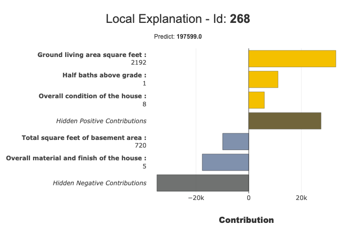
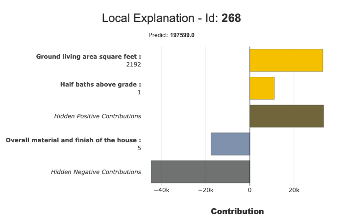
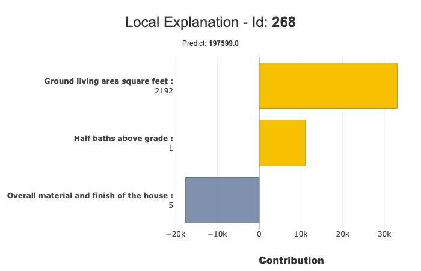
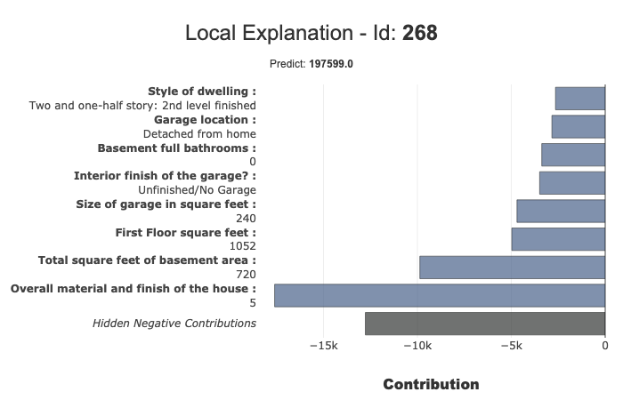
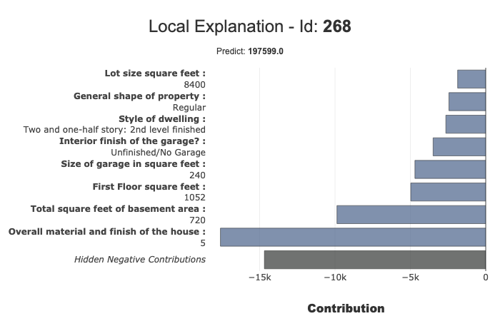
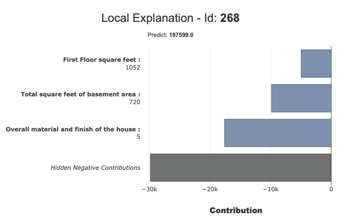
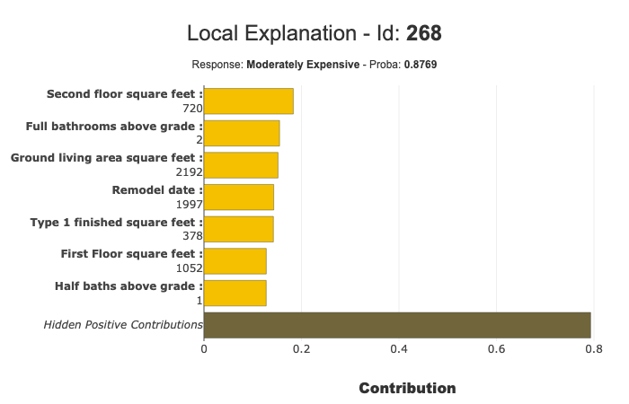

How to use filter and local_plot methods
========================================

This tutorial presents the different parameters you can use to summarize
and display local explanations. It also shows how to export this summary
into pandas DataFrame

Contents:
- Work with filter and local_plot method to tune output
- display Positive or Negative contributions
- mask hidden contrib or prediction
- hide some specific features
- Use query parameter to select without index or row number
- Classification: How can you select the label value to display?
- print the summary params
- export local explanation with to_pandas

Data from Kaggle `House
Prices <https://www.kaggle.com/c/house-prices-advanced-regression-techniques/data>`__

.. code:: ipython

    import pandas as pd
    from category_encoders import OrdinalEncoder
    from catboost import CatBoostRegressor, CatBoostClassifier
    from sklearn.model_selection import train_test_split

Building Supervized Model
-------------------------

.. code:: ipython

    from shapash.data.data_loader import data_loading
    house_df, house_dict = data_loading('house_prices')
    y_df=house_df['SalePrice'].to_frame()
    X_df=house_df[house_df.columns.difference(['SalePrice'])]

.. code:: ipython

    house_df.head()

.. table::

    +-------------------------------+-----------------------+-------+------+------------------+---------------+--------------------------------+-------------------------------+------------+-------------+-------------------------+----------+----------------------+----------+-----------+-----------+---------+------------+---------+----------------------------+------------+-------------+----------+----------+---------------+---------------+---------------+----------------------+---------------------------------+-----------------------+-----------------------+----------+----------------------+----------+---------+-----------+---------------------------+---------+----------+---------------------------------+--------+--------+------------+---------+------------+------------+--------+--------+------------+------------+---------------+------------+---------------------+----------+------------------+-----------+--------------------+----------+---------------+---------------+----------+----------+-----------+-------------+---------+-----------+--------+-------+------+------+----------------------------+-------------+---------+
    |          MSSubClass           |       MSZoning        |LotArea|Street|     LotShape     |  LandContour  |           Utilities            |           LotConfig           | LandSlope  |Neighborhood |       Condition1        |Condition2|       BldgType       |HouseStyle|OverallQual|OverallCond|YearBuilt|YearRemodAdd|RoofStyle|          RoofMatl          |Exterior1st | Exterior2nd |MasVnrType|MasVnrArea|   ExterQual   |   ExterCond   |  Foundation   |       BsmtQual       |            BsmtCond             |     BsmtExposure      |     BsmtFinType1      |BsmtFinSF1|     BsmtFinType2     |BsmtFinSF2|BsmtUnfSF|TotalBsmtSF|          Heating          |HeatingQC|CentralAir|           Electrical            |1stFlrSF|2ndFlrSF|LowQualFinSF|GrLivArea|BsmtFullBath|BsmtHalfBath|FullBath|HalfBath|BedroomAbvGr|KitchenAbvGr|  KitchenQual  |TotRmsAbvGrd|     Functional      |Fireplaces|    GarageType    |GarageYrBlt|    GarageFinish    |GarageArea|  GarageQual   |  GarageCond   |PavedDrive|WoodDeckSF|OpenPorchSF|EnclosedPorch|3SsnPorch|ScreenPorch|PoolArea|MiscVal|MoSold|YrSold|          SaleType          |SaleCondition|SalePrice|
    +===============================+=======================+=======+======+==================+===============+================================+===============================+============+=============+=========================+==========+======================+==========+===========+===========+=========+============+=========+============================+============+=============+==========+==========+===============+===============+===============+======================+=================================+=======================+=======================+==========+======================+==========+=========+===========+===========================+=========+==========+=================================+========+========+============+=========+============+============+========+========+============+============+===============+============+=====================+==========+==================+===========+====================+==========+===============+===============+==========+==========+===========+=============+=========+===========+========+=======+======+======+============================+=============+=========+
    |2-Story 1946 & Newer           |Residential Low Density|   8450|Paved |Regular           |Near Flat/Level|All public Utilities (E,G,W,& S)|Inside lot                     |Gentle slope|College Creek|Normal                   |Normal    |Single-family Detached|Two story |          7|          5|     2003|        2003|Gable    |Standard (Composite) Shingle|Vinyl Siding|Vinyl Siding |Brick Face|       196|Good           |Average/Typical|Poured Contrete|Good (90-99 inches)   |Typical - slight dampness allowed|No Exposure/No Basement|Good Living Quarters   |       706|Unfinished/No Basement|         0|      150|        856|Gas forced warm air furnace|Excellent|Yes       |Standard Circuit Breakers & Romex|     856|     854|           0|     1710|           1|           0|       2|       1|           3|           1|Good           |           8|Typical Functionality|         0|Attached to home  |       2003|Rough Finished      |       548|Typical/Average|Typical/Average|Paved     |         0|         61|            0|        0|          0|       0|      0|     2|  2008|Warranty Deed - Conventional|Normal Sale  |   208500|
    +-------------------------------+-----------------------+-------+------+------------------+---------------+--------------------------------+-------------------------------+------------+-------------+-------------------------+----------+----------------------+----------+-----------+-----------+---------+------------+---------+----------------------------+------------+-------------+----------+----------+---------------+---------------+---------------+----------------------+---------------------------------+-----------------------+-----------------------+----------+----------------------+----------+---------+-----------+---------------------------+---------+----------+---------------------------------+--------+--------+------------+---------+------------+------------+--------+--------+------------+------------+---------------+------------+---------------------+----------+------------------+-----------+--------------------+----------+---------------+---------------+----------+----------+-----------+-------------+---------+-----------+--------+-------+------+------+----------------------------+-------------+---------+
    |1-Story 1946 & Newer All Styles|Residential Low Density|   9600|Paved |Regular           |Near Flat/Level|All public Utilities (E,G,W,& S)|Frontage on 2 sides of property|Gentle slope|Veenker      |Adjacent to feeder street|Normal    |Single-family Detached|One story |          6|          8|     1976|        1976|Gable    |Standard (Composite) Shingle|Metal Siding|Metal Siding |None      |         0|Average/Typical|Average/Typical|Cinder Block   |Good (90-99 inches)   |Typical - slight dampness allowed|Good Exposure          |Average Living Quarters|       978|Unfinished/No Basement|         0|      284|       1262|Gas forced warm air furnace|Excellent|Yes       |Standard Circuit Breakers & Romex|    1262|       0|           0|     1262|           0|           1|       2|       0|           3|           1|Typical/Average|           6|Typical Functionality|         1|Attached to home  |       1976|Rough Finished      |       460|Typical/Average|Typical/Average|Paved     |       298|          0|            0|        0|          0|       0|      0|     5|  2007|Warranty Deed - Conventional|Normal Sale  |   181500|
    +-------------------------------+-----------------------+-------+------+------------------+---------------+--------------------------------+-------------------------------+------------+-------------+-------------------------+----------+----------------------+----------+-----------+-----------+---------+------------+---------+----------------------------+------------+-------------+----------+----------+---------------+---------------+---------------+----------------------+---------------------------------+-----------------------+-----------------------+----------+----------------------+----------+---------+-----------+---------------------------+---------+----------+---------------------------------+--------+--------+------------+---------+------------+------------+--------+--------+------------+------------+---------------+------------+---------------------+----------+------------------+-----------+--------------------+----------+---------------+---------------+----------+----------+-----------+-------------+---------+-----------+--------+-------+------+------+----------------------------+-------------+---------+
    |2-Story 1946 & Newer           |Residential Low Density|  11250|Paved |Slightly irregular|Near Flat/Level|All public Utilities (E,G,W,& S)|Inside lot                     |Gentle slope|College Creek|Normal                   |Normal    |Single-family Detached|Two story |          7|          5|     2001|        2002|Gable    |Standard (Composite) Shingle|Vinyl Siding|Vinyl Siding |Brick Face|       162|Good           |Average/Typical|Poured Contrete|Good (90-99 inches)   |Typical - slight dampness allowed|Mimimum Exposure       |Good Living Quarters   |       486|Unfinished/No Basement|         0|      434|        920|Gas forced warm air furnace|Excellent|Yes       |Standard Circuit Breakers & Romex|     920|     866|           0|     1786|           1|           0|       2|       1|           3|           1|Good           |           6|Typical Functionality|         1|Attached to home  |       2001|Rough Finished      |       608|Typical/Average|Typical/Average|Paved     |         0|         42|            0|        0|          0|       0|      0|     9|  2008|Warranty Deed - Conventional|Normal Sale  |   223500|
    +-------------------------------+-----------------------+-------+------+------------------+---------------+--------------------------------+-------------------------------+------------+-------------+-------------------------+----------+----------------------+----------+-----------+-----------+---------+------------+---------+----------------------------+------------+-------------+----------+----------+---------------+---------------+---------------+----------------------+---------------------------------+-----------------------+-----------------------+----------+----------------------+----------+---------+-----------+---------------------------+---------+----------+---------------------------------+--------+--------+------------+---------+------------+------------+--------+--------+------------+------------+---------------+------------+---------------------+----------+------------------+-----------+--------------------+----------+---------------+---------------+----------+----------+-----------+-------------+---------+-----------+--------+-------+------+------+----------------------------+-------------+---------+
    |2-Story 1945 & Older           |Residential Low Density|   9550|Paved |Slightly irregular|Near Flat/Level|All public Utilities (E,G,W,& S)|Corner lot                     |Gentle slope|Crawford     |Normal                   |Normal    |Single-family Detached|Two story |          7|          5|     1915|        1970|Gable    |Standard (Composite) Shingle|Wood Siding |Wood Shingles|None      |         0|Average/Typical|Average/Typical|Brick & Tile   |Typical (80-89 inches)|Good                             |No Exposure/No Basement|Average Living Quarters|       216|Unfinished/No Basement|         0|      540|        756|Gas forced warm air furnace|Good     |Yes       |Standard Circuit Breakers & Romex|     961|     756|           0|     1717|           1|           0|       1|       0|           3|           1|Good           |           7|Typical Functionality|         1|Detached from home|       1998|Unfinished/No Garage|       642|Typical/Average|Typical/Average|Paved     |         0|         35|          272|        0|          0|       0|      0|     2|  2006|Warranty Deed - Conventional|Abnormal Sale|   140000|
    +-------------------------------+-----------------------+-------+------+------------------+---------------+--------------------------------+-------------------------------+------------+-------------+-------------------------+----------+----------------------+----------+-----------+-----------+---------+------------+---------+----------------------------+------------+-------------+----------+----------+---------------+---------------+---------------+----------------------+---------------------------------+-----------------------+-----------------------+----------+----------------------+----------+---------+-----------+---------------------------+---------+----------+---------------------------------+--------+--------+------------+---------+------------+------------+--------+--------+------------+------------+---------------+------------+---------------------+----------+------------------+-----------+--------------------+----------+---------------+---------------+----------+----------+-----------+-------------+---------+-----------+--------+-------+------+------+----------------------------+-------------+---------+
    |2-Story 1946 & Newer           |Residential Low Density|  14260|Paved |Slightly irregular|Near Flat/Level|All public Utilities (E,G,W,& S)|Frontage on 2 sides of property|Gentle slope|Northridge   |Normal                   |Normal    |Single-family Detached|Two story |          8|          5|     2000|        2000|Gable    |Standard (Composite) Shingle|Vinyl Siding|Vinyl Siding |Brick Face|       350|Good           |Average/Typical|Poured Contrete|Good (90-99 inches)   |Typical - slight dampness allowed|Average Exposure       |Good Living Quarters   |       655|Unfinished/No Basement|         0|      490|       1145|Gas forced warm air furnace|Excellent|Yes       |Standard Circuit Breakers & Romex|    1145|    1053|           0|     2198|           1|           0|       2|       1|           4|           1|Good           |           9|Typical Functionality|         1|Attached to home  |       2000|Rough Finished      |       836|Typical/Average|Typical/Average|Paved     |       192|         84|            0|        0|          0|       0|      0|    12|  2008|Warranty Deed - Conventional|Normal Sale  |   250000|
    +-------------------------------+-----------------------+-------+------+------------------+---------------+--------------------------------+-------------------------------+------------+-------------+-------------------------+----------+----------------------+----------+-----------+-----------+---------+------------+---------+----------------------------+------------+-------------+----------+----------+---------------+---------------+---------------+----------------------+---------------------------------+-----------------------+-----------------------+----------+----------------------+----------+---------+-----------+---------------------------+---------+----------+---------------------------------+--------+--------+------------+---------+------------+------------+--------+--------+------------+------------+---------------+------------+---------------------+----------+------------------+-----------+--------------------+----------+---------------+---------------+----------+----------+-----------+-------------+---------+-----------+--------+-------+------+------+----------------------------+-------------+---------+

.. code:: ipython

    from category_encoders import OrdinalEncoder
    
    categorical_features = [col for col in X_df.columns if X_df[col].dtype == 'object']
    
    encoder = OrdinalEncoder(
        cols=categorical_features,
        handle_unknown='ignore',
        return_df=True).fit(X_df)
    
    X_df=encoder.transform(X_df)

.. code:: ipython

    Xtrain, Xtest, ytrain, ytest = train_test_split(X_df, y_df, train_size=0.75, random_state=1)

.. code:: ipython

    regressor = CatBoostRegressor(n_estimators=50).fit(Xtrain,ytrain,verbose=False)

.. code:: ipython

    y_pred = pd.DataFrame(regressor.predict(Xtest),columns=['pred'],index=Xtest.index)

Work With filter and local_plot methods
---------------------------------------

First step: You need to Declare and Compile SmartExplainer
^^^^^^^^^^^^^^^^^^^^^^^^^^^^^^^^^^^^^^^^^^^^^^^^^^^^^^^^^^

.. code:: ipython

    from shapash.explainer.smart_explainer import SmartExplainer

.. code:: ipython

    xpl = SmartExplainer(features_dict=house_dict) # Optional parameter, dict specifies label for features name 

.. code:: ipython

    xpl.compile(
        x=Xtest,
        model=regressor,
        preprocessing=encoder, # Optional: compile step can use inverse_transform method
        y_pred=y_pred # Optional
    )

.. parsed-literal::

    Backend: Shap TreeExplainer

Filter method
^^^^^^^^^^^^^

Use the filter method to specify how to synthesize local explainability
you have 4 parameters to customize your summary:
- max_contrib : maximum number of criteria to display
- threshold : minimum value of the contribution (in absolute value) necessary to display a criterion
- positive : display only positive contribution? Negative?(default None)
- features_to_hide : list of features you don’t want to display

.. code:: ipython

    xpl.filter(max_contrib=5)

Local_plot
^^^^^^^^^^

.. code:: ipython

    xpl.plot.local_plot(index=268)

Threshold parameter to focus on significant contributions
^^^^^^^^^^^^^^^^^^^^^^^^^^^^^^^^^^^^^^^^^^^^^^^^^^^^^^^^^

.. code:: ipython

    xpl.filter(max_contrib=5,threshold=10000)
    xpl.plot.local_plot(index=268)

Don’t display hidden contributions
^^^^^^^^^^^^^^^^^^^^^^^^^^^^^^^^^^

.. code:: ipython

    xpl.plot.local_plot(index=268,show_masked=False)

You can also hide the predict value with parameter show_predict=False

Focus on Negative contribution
^^^^^^^^^^^^^^^^^^^^^^^^^^^^^^

.. code:: ipython

    xpl.filter(max_contrib=8,positive=False)
    xpl.plot.local_plot(index=268)

You can also focus positive contribution using positive=True

Hide specific features:
^^^^^^^^^^^^^^^^^^^^^^^

Because:
- some features can be too complex
- end user don’t want know unnecessary information

You can use features_to_hide parameter in filter method

.. code:: ipython

    xpl.filter(max_contrib=8,positive=False,features_to_hide=['BsmtFullBath','GarageType'])
    xpl.plot.local_plot(index=268)

Select a row with a query
^^^^^^^^^^^^^^^^^^^^^^^^^

You can select with an index or a row number. You can also use a query:

.. code:: ipython

    xpl.filter(max_contrib=3,positive=False)
    xpl.plot.local_plot(query="LotArea == 8400 and LotShape == 'Regular' and TotalBsmtSF == 720")

Classification Case
-------------------

transform our use case into classification:

.. code:: ipython

    ytrain['PriceClass'] = ytrain['SalePrice'].apply(lambda x: 1 if x < 150000 else (3 if x > 300000 else 2))
    label_dict = { 1 : 'Cheap', 2 : 'Moderately Expensive', 3 : 'Expensive' }

.. code:: ipython

    clf = CatBoostClassifier(n_estimators=50).fit(Xtrain,ytrain['PriceClass'],verbose=False)
    y_pred_clf = pd.DataFrame(clf.predict(Xtest),columns=['pred'],index=Xtest.index)

Declare new SmartExplainer dedicated to classification problem
^^^^^^^^^^^^^^^^^^^^^^^^^^^^^^^^^^^^^^^^^^^^^^^^^^^^^^^^^^^^^^

.. code:: ipython

    xplclf = SmartExplainer(features_dict=house_dict,label_dict=label_dict) # Optional parameters: display explicit output

.. code:: ipython

    xplclf.compile(
        x=Xtest,
        model=clf,
        preprocessing=encoder,
        y_pred=y_pred_clf
    )

.. parsed-literal::

    Backend: Shap TreeExplainer

Use label parameter of local_plot parameter to select the explanation you want
^^^^^^^^^^^^^^^^^^^^^^^^^^^^^^^^^^^^^^^^^^^^^^^^^^^^^^^^^^^^^^^^^^^^^^^^^^^^^^

with label parameter, you can specify explicit label or label number

.. code:: ipython

    xplclf.filter(max_contrib=7,positive=True)
    xplclf.plot.local_plot(index=268,label='Moderately Expensive')

See the summary parameters
^^^^^^^^^^^^^^^^^^^^^^^^^^

.. code:: ipython

    xplclf.mask_params

.. parsed-literal::

    {'features_to_hide': None,
     'threshold': None,
     'positive': True,
     'max_contrib': 7}

Export explanations
-------------------

Export your local explanation in pd.DataFrame with to_pandas method :
^^^^^^^^^^^^^^^^^^^^^^^^^^^^^^^^^^^^^^^^^^^^^^^^^^^^^^^^^^^^^^^^^^^^^

-  The to_pandas method has the same parameters as the filter method
-  if you don’t specify any parameter, to_pandas use the same params you
   specified when you call filter method
-  When you work on classification problem, parameter proba=True output
   predict probability

.. code:: ipython

    summary_df= xplclf.to_pandas(proba=True)

.. parsed-literal::

    to_pandas params: {'features_to_hide': None, 'threshold': None, 'positive': True, 'max_contrib': 7}

.. code:: ipython

    summary_df.head()

.. table::

    +--------------------+------+------------------------------+-------+--------------+------------------------------+--------------+--------------+----------------------------------------+-------+--------------+--------------------------+-------+--------------+------------------------------------------+-------------+--------------+----------------------------------------+----------------+--------------+-----------------------------+--------------------------+--------------+
    |        pred        |proba |          feature_1           |value_1|contribution_1|          feature_2           |   value_2    |contribution_2|               feature_3                |value_3|contribution_3|        feature_4         |value_4|contribution_4|                feature_5                 |   value_5   |contribution_5|               feature_6                |    value_6     |contribution_6|          feature_7          |         value_7          |contribution_7|
    +====================+======+==============================+=======+==============+==============================+==============+==============+========================================+=======+==============+==========================+=======+==============+==========================================+=============+==============+========================================+================+==============+=============================+==========================+==============+
    |Moderately Expensive|0.9949|Ground living area square feet|   1792|        0.3093|Interior finish of the garage?|Rough Finished|        0.2755|Size of garage in square feet           |    564|        0.2077|Full bathrooms above grade|      2|        0.1827|Physical locations within Ames city limits|College Creek|        0.1709|Overall material and finish of the house|               7|        0.1640|Height of the basement       |Good (90-99 inches)       |        0.1396|
    +--------------------+------+------------------------------+-------+--------------+------------------------------+--------------+--------------+----------------------------------------+-------+--------------+--------------------------+-------+--------------+------------------------------------------+-------------+--------------+----------------------------------------+----------------+--------------+-----------------------------+--------------------------+--------------+
    |Moderately Expensive|0.8769|Second floor square feet      |    720|        0.1833|Full bathrooms above grade    |             2|        0.1551|Ground living area square feet          |   2192|        0.1519|Remodel date              |   1997|        0.1431|Type 1 finished square feet               |          378|        0.1424|First Floor square feet                 |            1052|        0.1278|Half baths above grade       |                         1|        0.1277|
    +--------------------+------+------------------------------+-------+--------------+------------------------------+--------------+--------------+----------------------------------------+-------+--------------+--------------------------+-------+--------------+------------------------------------------+-------------+--------------+----------------------------------------+----------------+--------------+-----------------------------+--------------------------+--------------+
    |Cheap               |0.9973|Ground living area square feet|    900|        0.8189|Size of garage in square feet |           280|        0.5616|Total square feet of basement area      |    882|        0.4091|Remodel date              |   1967|        0.3490|Full bathrooms above grade                |            1|        0.3248|Overall material and finish of the house|               5|        0.3180|First Floor square feet      |                       900|        0.2478|
    +--------------------+------+------------------------------+-------+--------------+------------------------------+--------------+--------------+----------------------------------------+-------+--------------+--------------------------+-------+--------------+------------------------------------------+-------------+--------------+----------------------------------------+----------------+--------------+-----------------------------+--------------------------+--------------+
    |Cheap               |0.9987|Ground living area square feet|    630|        0.8164|Size of garage in square feet |             0|        0.5877|Total square feet of basement area      |    630|        0.4312|Remodel date              |   1970|        0.3557|Overall material and finish of the house  |            4|        0.3175|Full bathrooms above grade              |               1|        0.3130|General zoning classification|Residential Medium Density|        0.1784|
    +--------------------+------+------------------------------+-------+--------------+------------------------------+--------------+--------------+----------------------------------------+-------+--------------+--------------------------+-------+--------------+------------------------------------------+-------------+--------------+----------------------------------------+----------------+--------------+-----------------------------+--------------------------+--------------+
    |Cheap               |0.8524|Ground living area square feet|   1188|        0.9421|Remodel date                  |          1959|        0.4234|Overall material and finish of the house|      5|        0.3785|Full bathrooms above grade|      1|        0.3738|Number of fireplaces                      |            0|        0.1687|Rating of basement finished area        |Average Rec Room|        0.1302|Wood deck area in square feet|                         0|        0.1225|
    +--------------------+------+------------------------------+-------+--------------+------------------------------+--------------+--------------+----------------------------------------+-------+--------------+--------------------------+-------+--------------+------------------------------------------+-------------+--------------+----------------------------------------+----------------+--------------+-----------------------------+--------------------------+--------------+

It is also possible to calculate the probability relating to one of the
target modality for all the dataset, and to display the elements of
explainability associated with this target modality

.. code:: ipython

    #Create One column pd.DataFrame with constant value
    constantpred=pd.DataFrame([3 for x in range(Xtest.shape[0])],columns=['pred'],index=Xtest.index)
    xplclf.add(y_pred=constantpred)
    summary_df = xplclf.to_pandas(proba=True,max_contrib=3,threshold=0.1,positive=True)

.. code:: ipython

    summary_df.head()

.. table::

    +---------+--------+------------------------------+-------------------------+--------------+----------------------------------------+-------+--------------+--------------------------------+--------------------+--------------+
    |  pred   | proba  |          feature_1           |         value_1         |contribution_1|               feature_2                |value_2|contribution_2|           feature_3            |      value_3       |contribution_3|
    +=========+========+==============================+=========================+==============+========================================+=======+==============+================================+====================+==============+
    |Expensive|0.003081|Ground living area square feet|                     1792|        0.3280|Overall material and finish of the house|      7|        0.1975|Rating of basement finished area|Good Living Quarters|        0.1820|
    +---------+--------+------------------------------+-------------------------+--------------+----------------------------------------+-------+--------------+--------------------------------+--------------------+--------------+
    |Expensive|0.007627|Ground living area square feet|                     2192|        0.8256|Wood deck area in square feet           |    262|        0.2515|Remodel date                    |                1997|        0.1571|
    +---------+--------+------------------------------+-------------------------+--------------+----------------------------------------+-------+--------------+--------------------------------+--------------------+--------------+
    |Expensive|0.000024|NaN                           |NaN                      |           NaN|NaN                                     |    NaN|           NaN|NaN                             |NaN                 |           NaN|
    +---------+--------+------------------------------+-------------------------+--------------+----------------------------------------+-------+--------------+--------------------------------+--------------------+--------------+
    |Expensive|0.000056|NaN                           |NaN                      |           NaN|NaN                                     |    NaN|           NaN|NaN                             |NaN                 |           NaN|
    +---------+--------+------------------------------+-------------------------+--------------+----------------------------------------+-------+--------------+--------------------------------+--------------------+--------------+
    |Expensive|0.000623|Type of sale                  |Court Officer Deed/Estate|        0.1145|NaN                                     |    NaN|           NaN|NaN                             |NaN                 |           NaN|
    +---------+--------+------------------------------+-------------------------+--------------+----------------------------------------+-------+--------------+--------------------------------+--------------------+--------------+

NB: The to_pandas method returns Nan for lines that do not meet your
conditions
