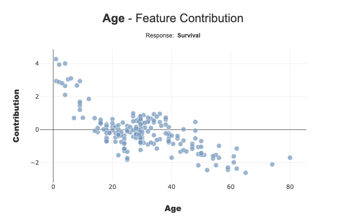
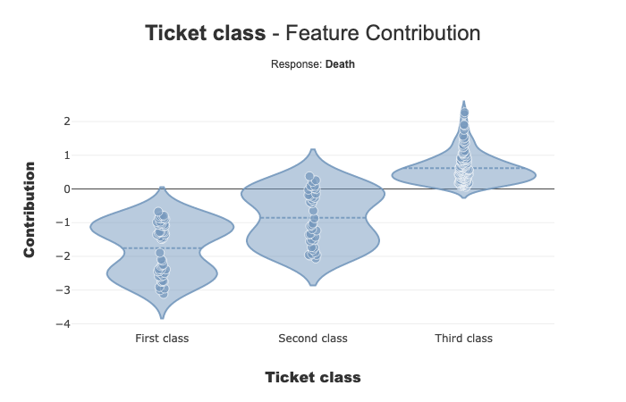
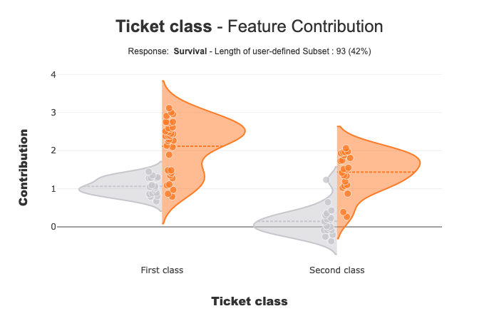

Contributions plot
==================

contribution_plot is a method that displays violin or scatter plot. the
purpose of these representations is to understand how a feature affects
a prediction.

This tutorial presents the different parameters you can use in
contribution_plot to tune output.

Contents: - Classification case: Specify the target modality to display.
- Sampling parameter - Focus on a subset - Violin or Scatter? Make your
own choice

Data from Kaggle `Titanic <https://www.kaggle.com/c/titanic/data>`__

.. code:: ipython3

    import pandas as pd
    from category_encoders import OrdinalEncoder
    from xgboost import XGBClassifier
    from sklearn.model_selection import train_test_split

Building Supervized Model
-------------------------

Load Titanic data

.. code:: ipython3

    from shapash.data.data_loader import data_loading
    titanic_df, titanic_dict = data_loading('titanic')
    y_df=titanic_df['Survived'].to_frame()
    X_df=titanic_df[titanic_df.columns.difference(['Survived'])]

.. code:: ipython3

    titanic_df.head()

.. table::

    +--------+-----------+------+---+-----+-----+-----+-----------+-----+
    |Survived|  Pclass   | Sex  |Age|SibSp|Parch|Fare | Embarked  |Title|
    +========+===========+======+===+=====+=====+=====+===========+=====+
    |       0|Third class|male  | 22|    1|    0| 7.25|Southampton|Mr   |
    +--------+-----------+------+---+-----+-----+-----+-----------+-----+
    |       1|First class|female| 38|    1|    0|71.28|Cherbourg  |Mrs  |
    +--------+-----------+------+---+-----+-----+-----+-----------+-----+
    |       1|Third class|female| 26|    0|    0| 7.92|Southampton|Miss |
    +--------+-----------+------+---+-----+-----+-----+-----------+-----+
    |       1|First class|female| 35|    1|    0|53.10|Southampton|Mrs  |
    +--------+-----------+------+---+-----+-----+-----+-----------+-----+
    |       0|Third class|male  | 35|    0|    0| 8.05|Southampton|Mr   |
    +--------+-----------+------+---+-----+-----+-----+-----------+-----+

Load Titanic data

.. code:: ipython3

    from category_encoders import OrdinalEncoder
    
    categorical_features = [col for col in X_df.columns if X_df[col].dtype == 'object']
    
    encoder = OrdinalEncoder(
        cols=categorical_features,
        handle_unknown='ignore',
        return_df=True).fit(X_df)
    
    X_df=encoder.transform(X_df)

Train / Test Split + model fitting

.. code:: ipython3

    Xtrain, Xtest, ytrain, ytest = train_test_split(X_df, y_df, train_size=0.75, random_state=7)

.. code:: ipython3

    clf = XGBClassifier(n_estimators=200,min_child_weight=2).fit(Xtrain,ytrain)

First step: You need to Declare and Compile SmartExplainer
^^^^^^^^^^^^^^^^^^^^^^^^^^^^^^^^^^^^^^^^^^^^^^^^^^^^^^^^^^

.. code:: ipython3

    from shapash.explainer.smart_explainer import SmartExplainer

.. code:: ipython3

    response_dict = {0: 'Death', 1:' Survival'}

.. code:: ipython3

    xpl = SmartExplainer(features_dict=titanic_dict, # Optional parameters
                         label_dict=response_dict) # Optional parameters, dicts specify labels 

.. code:: ipython3

    xpl.compile(
        x=Xtest,
        model=clf,
        preprocessing=encoder, # Optional: compile step can use inverse_transform method
    )

.. parsed-literal::

    Backend: Shap TreeExplainer

You can now display contribution plot :
^^^^^^^^^^^^^^^^^^^^^^^^^^^^^^^^^^^^^^^

you have to specify the feature you want to analyse. You can use column
name, label or column number

.. code:: ipython3

    xpl.plot.contribution_plot(col='Age')

.. code:: ipython3

    xpl.plot.contribution_plot(col='Pclass')

Ticket Class seems to affect the prediction of the mode: Third class
negatively contributes to Survival.

Classification Case: Use label parameter to select the target modality you want to focus
^^^^^^^^^^^^^^^^^^^^^^^^^^^^^^^^^^^^^^^^^^^^^^^^^^^^^^^^^^^^^^^^^^^^^^^^^^^^^^^^^^^^^^^^

with label parameter, you can specify explicit label or label number

.. code:: ipython3

    xpl.plot.contribution_plot(col='Pclass',label='Death')

Add a prediction to better understand your model
------------------------------------------------

You can add your prediction with add or compile method

.. code:: ipython3

    y_pred = pd.DataFrame(clf.predict(Xtest),columns=['pred'],index=Xtest.index)
    xpl.add(y_pred=y_pred)
    xpl.plot.contribution_plot(col='Pclass')

.. image:: tuto-plot02-contribution_plot_files/tuto-plot02-contribution_plot_23_0.png

When you add predict information, you can see that the contribution of
Ticket class for First and Second class seems to be different for people
with Survive prediction(orange points), compared to others (grey
points). The contributions for these two ticket classes can be
correlated to the value of another characteristic

Shapash Webapp can help you refine your understanding of the model. You
can indeed navigate between the local and the global contribution

For Third class, the 2 distributions seem close

NB: Multiclass Case - This plot displays One Vs All plot

Focus on a subset
-----------------

With selection params you can specify a list of index of people you wand
to focus

.. code:: ipython3

    index = list(Xtest[xpl.x_pred['Pclass'].isin(['First class','Second class'])].index.values)
    xpl.plot.contribution_plot(col='Pclass',selection=index)

Size of Random Sample
---------------------

Method contribution_plot use random sample to limit the number of points
displayed. Default size of this sample is 2000, but you can change it
with the parameter max_points:

.. code:: ipython3

    xpl.plot.contribution_plot(col='Pclass',max_points=50)

Violin or Scatter plot?
-----------------------

contribution_plot displays a scatter point if the number of distinct
values of the feature is greater than 10. You can change this parameter
violin_maxf:

.. code:: ipython3

    xpl.plot.contribution_plot(col='Pclass',violin_maxf=2)

