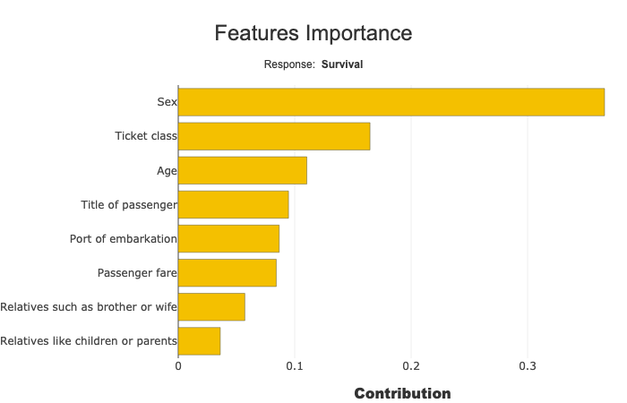
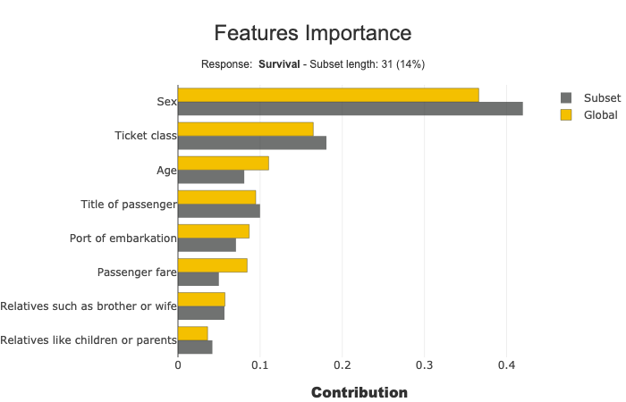
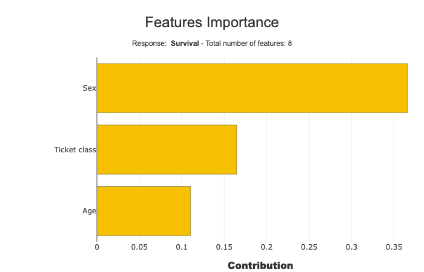

Features importance
===================

The methode Feature importance displays bar chart represent the sum of
absolute contribution values of each feature.

this method also makes it possible to represent this sum calculated on a
subset and to compare it with the total population

This short tutorial presents the different parameters you can use.

Contents: - Classification case: Specify the target modality to display.
- selection parameter to display a subset - max_features parameter
limits the number of features

Data from Kaggle `Titanic <https://www.kaggle.com/c/titanic/data>`__

.. code:: ipython

    import pandas as pd
    from category_encoders import OrdinalEncoder
    from sklearn.ensemble import ExtraTreesClassifier
    from sklearn.model_selection import train_test_split

Building Supervized Model
-------------------------

Load Titanic data

.. code:: ipython

    from shapash.data.data_loader import data_loading
    titanic_df, titanic_dict = data_loading('titanic')
    del titanic_df['Name']
    y_df=titanic_df['Survived'].to_frame()
    X_df=titanic_df[titanic_df.columns.difference(['Survived'])]

.. code:: ipython

    titanic_df.head()

.. table::

    +--------+-----------+------+---+-----+-----+-----+-----------+-----+
    |Survived|  Pclass   | Sex  |Age|SibSp|Parch|Fare | Embarked  |Title|
    +========+===========+======+===+=====+=====+=====+===========+=====+
    |       0|Third class|male  | 22|    1|    0| 7.25|Southampton|Mr   |
    +--------+-----------+------+---+-----+-----+-----+-----------+-----+
    |       1|First class|female| 38|    1|    0|71.28|Cherbourg  |Mrs  |
    +--------+-----------+------+---+-----+-----+-----+-----------+-----+
    |       1|Third class|female| 26|    0|    0| 7.92|Southampton|Miss |
    +--------+-----------+------+---+-----+-----+-----+-----------+-----+
    |       1|First class|female| 35|    1|    0|53.10|Southampton|Mrs  |
    +--------+-----------+------+---+-----+-----+-----+-----------+-----+
    |       0|Third class|male  | 35|    0|    0| 8.05|Southampton|Mr   |
    +--------+-----------+------+---+-----+-----+-----+-----------+-----+

Load Titanic data

.. code:: ipython

    from category_encoders import OrdinalEncoder
    
    categorical_features = [col for col in X_df.columns if X_df[col].dtype == 'object']
    
    encoder = OrdinalEncoder(
        cols=categorical_features,
        handle_unknown='ignore',
        return_df=True).fit(X_df)
    
    X_df=encoder.transform(X_df)

Train / Test Split + model fitting

.. code:: ipython

    Xtrain, Xtest, ytrain, ytest = train_test_split(X_df, y_df, train_size=0.75, random_state=7)

.. code:: ipython

    clf = ExtraTreesClassifier(n_estimators=200).fit(Xtrain,ytrain)

First step: You need to Declare and Compile SmartExplainer
^^^^^^^^^^^^^^^^^^^^^^^^^^^^^^^^^^^^^^^^^^^^^^^^^^^^^^^^^^

.. code:: ipython

    from shapash.explainer.smart_explainer import SmartExplainer

.. code:: ipython

    response_dict = {0: 'Death', 1:' Survival'}

.. code:: ipython

    xpl = SmartExplainer(features_dict=titanic_dict, # Optional parameters
                         label_dict=response_dict) # Optional parameters, dicts specify labels 

.. code:: ipython

    xpl.compile(
        x=Xtest,
        model=clf,
        preprocessing=encoder, # Optional: compile step can use inverse_transform method
    )

.. parsed-literal::

    Backend: Shap TreeExplainer

Display Feature Importance
--------------------------

.. code:: ipython

    xpl.plot.features_importance()

Multiclass: Select the target modality
--------------------------------------

Features importances sum and display the absolute contribution for one
target modality. you can change this modality, selectig with label
parameter:

xpl.plot.features_importance(label=‘Death’)

with label parameter you can specify target value, label or number

Focus and compare a subset
--------------------------

selection parameter specify the subset:

.. code:: ipython

    sel = [581, 610, 524, 636, 298, 420, 568, 817, 363, 557,
           486, 252, 390, 505, 16, 290, 611, 148, 438, 23, 810,
           875, 206, 836, 143, 843, 436, 701, 681, 67, 10]

.. code:: ipython

    xpl.plot.features_importance(selection=sel)

Tune the number of features to display
--------------------------------------

Use max_features parameter (default value: 20)

.. code:: ipython

    xpl.plot.features_importance(max_features=3)

