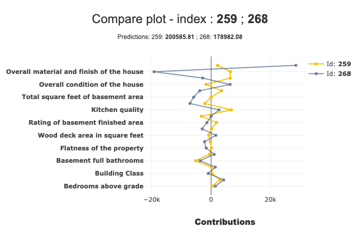
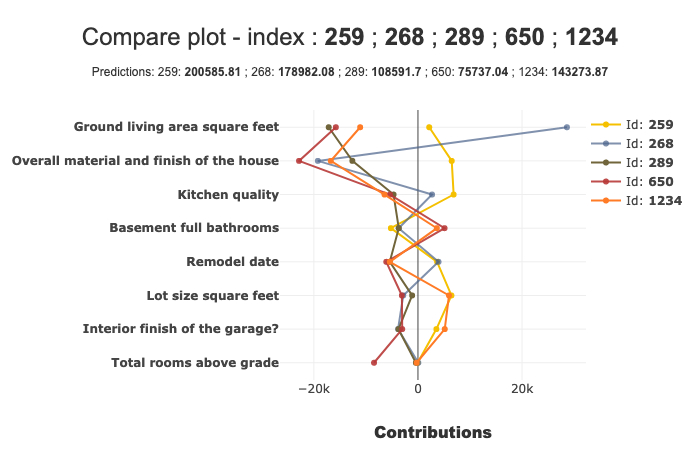
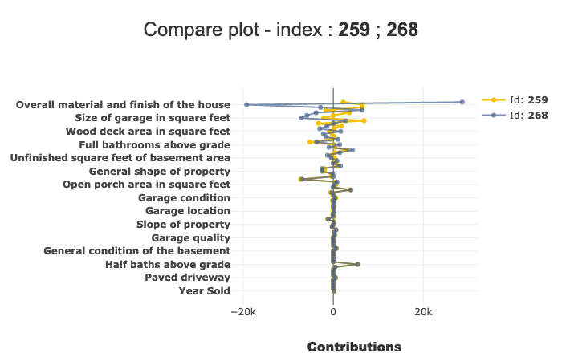
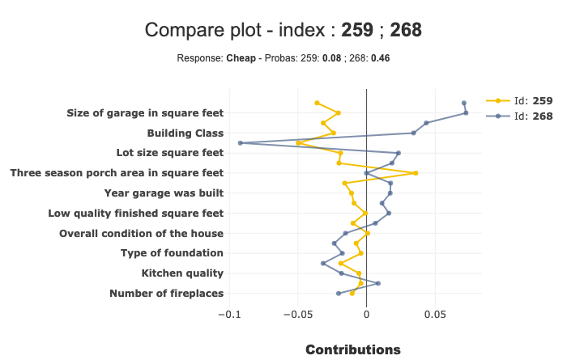
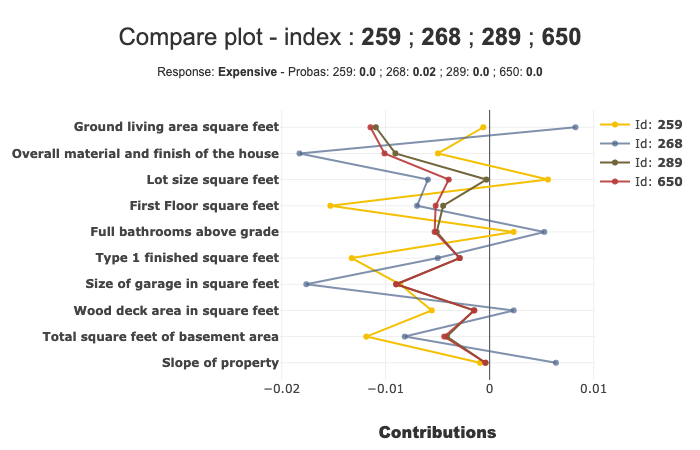

Contributions comparing plot
============================

compare_plot is a method that displays scatter plot of contributions of
several individuals. The purpose of these representations is to
understand where the difference of predictions of several indivuals
stems from.

This tutorial presents the different parameters you can use in
compare_plot to tune output.

Contents: - Loading dataset and fitting a model.

-  Regression case: Specify the target modality to display.

-  Input parameters

-  Classification case

Data from Kaggle: `House
Prices <https://www.kaggle.com/c/house-prices-advanced-regression-techniques/data>`__

.. code:: ipython3

    import pandas as pd
    from catboost import CatBoostRegressor
    from sklearn.model_selection import train_test_split

Building Supervized Model
-------------------------

First Step : Load house prices data
^^^^^^^^^^^^^^^^^^^^^^^^^^^^^^^^^^^

.. code:: ipython3

    from shapash.data.data_loader import data_loading
    house_df, house_dict = data_loading('house_prices')
    y_df = house_df['SalePrice'].to_frame()
    X_df = house_df[house_df.columns.difference(['SalePrice'])]

.. code:: ipython3

    X_df.head()

.. table::

    +--+--------+---------+------------+--------+-------------+----------+-----+------------+
    |Id|1stFlrSF|2ndFlrSF |BedroomAbvGr|BldgType|BsmtExposure |BsmtFinSF1| ... | SaleType   |
    +==+========+=========+============+========+=============+==========+=====+============+
    |1 |     856|   854   |     3      |Single- | No          |    706   | ... |Warranty    |
    |  |        |         |            |family  | Exposure/No |          |     |Deed -      |
    |  |        |         |            |Detached| Basement    |          |     |Conventional|
    +--+--------+---------+------------+--------+-------------+----------+-----+------------+
    |2 |    1262|    0    |     3      |Single- |  Good       |    978   | ... |Warranty    |
    |  |        |         |            |family  |  Exposure   |          |     |Deed -      |
    |  |        |         |            |Detached|             |          |     |Conventional|
    +--+--------+---------+------------+--------+-------------+----------+-----+------------+
    |3 |     920|   866   |     3      |Single- |  Mimimum    |    486   | ... |Warranty    |
    |  |        |         |            |family  |  Exposure   |          |     |Deed -      |
    |  |        |         |            |Detached|             |          |     |Conventional|
    +--+--------+---------+------------+--------+-------------+----------+-----+------------+
    |4 |     961|   756   |     3      |Single- | No          |    216   | ... |Warranty    |
    |  |        |         |            |family  | Exposure/No |          |     |Deed -      |
    |  |        |         |            |Detached| Basement    |          |     |Conventional|
    +--+--------+---------+------------+--------+-------------+----------+-----+------------+
    |5 |    1145|  1053   |     4      |Single- |  Average    |    655   | ... |Warranty    |
    |  |        |         |            |family  |  Exposure   |          |     |Deed -      |
    |  |        |         |            |Detached|             |          |     |Conventional|
    +--+--------+---------+------------+--------+-------------+----------+-----+------------+

Second step : Encode the categorical variables
^^^^^^^^^^^^^^^^^^^^^^^^^^^^^^^^^^^^^^^^^^^^^^

.. code:: ipython3

    from category_encoders import OrdinalEncoder
    
    categorical_features = [col for col in X_df.columns if X_df[col].dtype == 'object']
    
    encoder = OrdinalEncoder(
        cols=categorical_features,
        handle_unknown='ignore',
        return_df=True).fit(X_df)
    
    X_df = encoder.transform(X_df)

Regression case
---------------

Third step : Get your dataset ready and fit your model
^^^^^^^^^^^^^^^^^^^^^^^^^^^^^^^^^^^^^^^^^^^^^^^^^^^^^^

.. code:: ipython3

    Xtrain, Xtest, ytrain, ytest = train_test_split(X_df, y_df, train_size=0.75, random_state=1)

.. code:: ipython3

    regressor = CatBoostRegressor(n_estimators=50).fit(Xtrain, ytrain, verbose=False)

.. code:: ipython3

    y_pred = pd.DataFrame(regressor.predict(Xtest), columns=['pred'], index=Xtest.index)

Declare and compile your SmartExplainer explainer
^^^^^^^^^^^^^^^^^^^^^^^^^^^^^^^^^^^^^^^^^^^^^^^^^

.. code:: ipython3

    from shapash.explainer.smart_explainer import SmartExplainer

.. code:: ipython3

    xpl = SmartExplainer(features_dict=house_dict) # Optional parameter, dict specifies label for features name 

.. code:: ipython3

    house_dict['MSZoning']

.. parsed-literal::

    'General zoning classification'

.. code:: ipython3

    xpl.compile(
        x=Xtest,
        model=regressor,
        preprocessing=encoder, # Optional: compile step can use inverse_transform method
        y_pred=y_pred # Optional
    )

.. parsed-literal::

    Backend: Shap TreeExplainer

Compare_plot
~~~~~~~~~~~~

Now that your explainer is ready, you can use the compare_plot to
understand how two (or more) individuals are different.

For example, if you want to compare the first two individuals of the
``Xtest`` dataset, you have several ways to do it :

-  you can use the ``row_num`` parameter by using ``row_num = [0, 1]``

-  You can also directly use the indexes, by
   ``index = [Xtest.index[0], Xtest.index[1]]``

-  You can also use directly the index numbers : ``index = [259, 268]``

The result of each the methods above is the same :

.. code:: ipython3

    xpl.plot.compare_plot(index=[Xtest.index[0], Xtest.index[1]])

In this example, we can see that the ‘Ground living area square feet’
contributes a lot more for Id 268 than Id 259.

We can see more details of a specific point on hover.

Number of features displayed
^^^^^^^^^^^^^^^^^^^^^^^^^^^^

By default, the number of features displayed by the compare_plot is 20.
You can modify it with the ``max_features`` parameter. You can also
compare more than 2 individuals:

.. code:: ipython3

    xpl.plot.compare_plot(row_num=[0, 1, 2, 3, 4], max_features=8)

You can also decide whether or not showing the prediction in subtitle,
with the ``show_predict`` parameter.

.. code:: ipython3

    xpl.plot.compare_plot(row_num=[0, 1], show_predict=False, max_features=100)

Classification case
-------------------

Transform our use case into classification:

.. code:: ipython3

    from sklearn.ensemble.forest import RandomForestClassifier

.. code:: ipython3

    ytrain['PriceClass'] = ytrain['SalePrice'].apply(lambda x: 1 if x < 150000 else (3 if x > 300000 else 2))
    label_dict = { 1 : 'Cheap', 2 : 'Moderately Expensive', 3 : 'Expensive' }

.. code:: ipython3

    clf = RandomForestClassifier(n_estimators=50).fit(Xtrain,ytrain['PriceClass'])
    y_pred_clf = pd.DataFrame(clf.predict(Xtest), columns=['pred'], index=Xtest.index)

Declare new SmartExplainer dedicated to classification problem
^^^^^^^^^^^^^^^^^^^^^^^^^^^^^^^^^^^^^^^^^^^^^^^^^^^^^^^^^^^^^^

.. code:: ipython3

    xplclf = SmartExplainer(features_dict=house_dict, label_dict=label_dict) # Optional parameters: display explicit output

.. code:: ipython3

    xplclf.compile(
        x=Xtest,
        model=clf,
        preprocessing=encoder,
        y_pred=y_pred_clf
    )

.. parsed-literal::

    Backend: Shap TreeExplainer

Use label parameter of compare_plot parameter to select the explanation you want
^^^^^^^^^^^^^^^^^^^^^^^^^^^^^^^^^^^^^^^^^^^^^^^^^^^^^^^^^^^^^^^^^^^^^^^^^^^^^^^^

with ``label`` parameter, you can specify explicit label or label
number.

.. code:: ipython3

    xplclf.plot.compare_plot(row_num=[0, 1], label=1) # Equivalent to label = 'Cheap'

By default, if ``label`` parameter isn’t mentioned, the last label will
be used.

.. code:: ipython3

    xplclf.plot.compare_plot(row_num=[0, 1, 2, 3], max_features=10)

