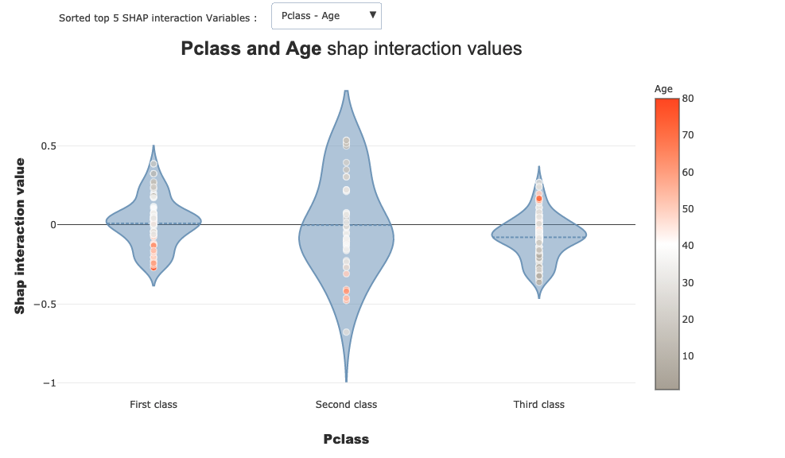
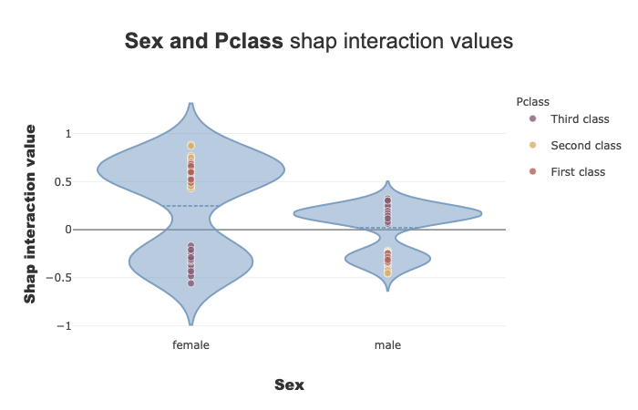

Interactions plot
=================

Most explainability plots only allow the user to analyze one variable at
a time.

**Interactions plots are an interesting way to visualize a couple of
variables and their corresponding contribution to the model output.**

Shapash integrates two methods that allow to display such interactions
for several individuals : ``interactions_plot`` and
``top_interactions_plot``.

This tutorial presents how to use both methods to get more insights
about your model and how two variables interact with it.

Content :

- Loading dataset and fitting a model
- Declare and compile Shapash smart explainer
- Plot top interaction values
- Plot a chosen couple of variables

We used Kaggle’s `Titanic <https://www.kaggle.com/c/titanic/data>`__
dataset

.. code:: ipython3

    import pandas as pd
    from category_encoders import OrdinalEncoder
    from xgboost import XGBClassifier
    from sklearn.model_selection import train_test_split

Building Supervized Model
-------------------------

Load Titanic data

.. code:: ipython3

    from shapash.data.data_loader import data_loading
    titanic_df, titanic_dict = data_loading('titanic')
    del titanic_df['Name']
    y_df=titanic_df['Survived']
    X_df=titanic_df[titanic_df.columns.difference(['Survived'])]

.. code:: ipython3

    titanic_df.head()

.. raw:: html

    

    
    <table border="1" class="dataframe">
      <thead>
        <tr style="text-align: right;">
          <th></th>
          <th>Survived</th>
          <th>Pclass</th>
          <th>Sex</th>
          <th>Age</th>
          <th>SibSp</th>
          <th>Parch</th>
          <th>Fare</th>
          <th>Embarked</th>
          <th>Title</th>
        </tr>
        <tr>
          <th>PassengerId</th>
          <th></th>
          <th></th>
          <th></th>
          <th></th>
          <th></th>
          <th></th>
          <th></th>
          <th></th>
          <th></th>
        </tr>
      </thead>
      <tbody>
        <tr>
          <th>1</th>
          <td>0</td>
          <td>Third class</td>
          <td>male</td>
          <td>22.0</td>
          <td>1</td>
          <td>0</td>
          <td>7.25</td>
          <td>Southampton</td>
          <td>Mr</td>
        </tr>
        <tr>
          <th>2</th>
          <td>1</td>
          <td>First class</td>
          <td>female</td>
          <td>38.0</td>
          <td>1</td>
          <td>0</td>
          <td>71.28</td>
          <td>Cherbourg</td>
          <td>Mrs</td>
        </tr>
        <tr>
          <th>3</th>
          <td>1</td>
          <td>Third class</td>
          <td>female</td>
          <td>26.0</td>
          <td>0</td>
          <td>0</td>
          <td>7.92</td>
          <td>Southampton</td>
          <td>Miss</td>
        </tr>
        <tr>
          <th>4</th>
          <td>1</td>
          <td>First class</td>
          <td>female</td>
          <td>35.0</td>
          <td>1</td>
          <td>0</td>
          <td>53.10</td>
          <td>Southampton</td>
          <td>Mrs</td>
        </tr>
        <tr>
          <th>5</th>
          <td>0</td>
          <td>Third class</td>
          <td>male</td>
          <td>35.0</td>
          <td>0</td>
          <td>0</td>
          <td>8.05</td>
          <td>Southampton</td>
          <td>Mr</td>
        </tr>
      </tbody>
    </table>
    

.. code:: ipython3

    from category_encoders import OrdinalEncoder
    
    categorical_features = [col for col in X_df.columns if X_df[col].dtype == 'object']
    
    encoder = OrdinalEncoder(
        cols=categorical_features,
        handle_unknown='ignore',
        return_df=True).fit(X_df)
    
    X_df=encoder.transform(X_df)

Train / Test Split + model fitting

.. code:: ipython3

    Xtrain, Xtest, ytrain, ytest = train_test_split(X_df, y_df, train_size=0.75, random_state=7)

.. code:: ipython3

    clf = XGBClassifier(n_estimators=200,min_child_weight=2).fit(Xtrain,ytrain)

Declare and Compile SmartExplainer
----------------------------------

.. code:: ipython3

    from shapash.explainer.smart_explainer import SmartExplainer

.. code:: ipython3

    response_dict = {0: 'Death', 1:' Survival'}

.. code:: ipython3

    xpl = SmartExplainer(features_dict=titanic_dict, # Optional parameters
                         label_dict=response_dict) # Optional parameters, dicts specify labels 

.. code:: ipython3

    xpl.compile(
        x=Xtest,
        model=clf,
        preprocessing=encoder, # Optional: compile step can use inverse_transform method
    )

.. parsed-literal::

    Backend: Shap TreeExplainer

Plot top interactions
---------------------

Now we may want to analyze our model and in particular how some
variables combinations influence the output.

**Shapash allows to quickly inspect your model by showing the variables
for which there is the highest chance to get interesting interactions.**

To do so you can use the following method (use the button to see the
different variables interactions) :

.. code:: ipython3

    xpl.plot.top_interactions_plot(nb_top_interactions=5)

Plot interactions between two selected variables
------------------------------------------------

If you want to display a particular couple of interactions just use the
following method with the chosen features (here ‘Sex’ and ‘Pclass’):

.. code:: ipython3

    xpl.plot.interactions_plot('Sex', 'Pclass')

As a quick analysis we can see on the plot that **the model learned the
following points** :

* Female passengers have :

  * Highest chance of surviving when belonging to first or second class

  * Less chance of surviving when belonging to third class

* On the contrary, male passengers have :

  * Highest chance of surviving when belonging to the third class

  * Less chance of surviving when belonging to first or second class
