Building confidence on explainability methods
=============================================

Local explainability methods are recent, they keep being improved and
research is very active in the field. Thus, one needs to be careful when
interpreting those methods’ outputs.

Depending on the tasks and data, explainability methods may give
different results. The purpose of the metrics presented below is to
assess the degree of confidence in these cases. We will answer the
following questions:

-  Do different explainability methods give similar explanations on
   average ? (**Consistency**)

-  Is the explanation similar for similar instances ? (**Local
   stability**)

-  Do a few features drive the model ? (**Approximation**)

This short tutorial presents an example of how those 3 metrics could be
used on a classification case.

We used Kaggle’s `Titanic <https://www.kaggle.com/c/titanic/data>`__
dataset

.. code:: ipython3

    import pandas as pd
    from category_encoders import OrdinalEncoder
    from sklearn.ensemble import ExtraTreesClassifier
    from sklearn.model_selection import train_test_split

Building Supervized Model
-------------------------

Let’s start by loading a dataset and building a model that we will try
to explain right after.

Load Titanic data

.. code:: ipython3

    from shapash.data.data_loader import data_loading
    titanic_df, titanic_dict = data_loading('titanic')
    del titanic_df['Name']
    y_df=titanic_df['Survived'].to_frame()
    X_df=titanic_df[titanic_df.columns.difference(['Survived'])]

.. code:: ipython3

    titanic_df.head()

.. raw:: html

    

    
    <table border="1" class="dataframe">
      <thead>
        <tr style="text-align: right;">
          <th></th>
          <th>Survived</th>
          <th>Pclass</th>
          <th>Sex</th>
          <th>Age</th>
          <th>SibSp</th>
          <th>Parch</th>
          <th>Fare</th>
          <th>Embarked</th>
          <th>Title</th>
        </tr>
        <tr>
          <th>PassengerId</th>
          <th></th>
          <th></th>
          <th></th>
          <th></th>
          <th></th>
          <th></th>
          <th></th>
          <th></th>
          <th></th>
        </tr>
      </thead>
      <tbody>
        <tr>
          <th>1</th>
          <td>0</td>
          <td>Third class</td>
          <td>male</td>
          <td>22.0</td>
          <td>1</td>
          <td>0</td>
          <td>7.25</td>
          <td>Southampton</td>
          <td>Mr</td>
        </tr>
        <tr>
          <th>2</th>
          <td>1</td>
          <td>First class</td>
          <td>female</td>
          <td>38.0</td>
          <td>1</td>
          <td>0</td>
          <td>71.28</td>
          <td>Cherbourg</td>
          <td>Mrs</td>
        </tr>
        <tr>
          <th>3</th>
          <td>1</td>
          <td>Third class</td>
          <td>female</td>
          <td>26.0</td>
          <td>0</td>
          <td>0</td>
          <td>7.92</td>
          <td>Southampton</td>
          <td>Miss</td>
        </tr>
        <tr>
          <th>4</th>
          <td>1</td>
          <td>First class</td>
          <td>female</td>
          <td>35.0</td>
          <td>1</td>
          <td>0</td>
          <td>53.10</td>
          <td>Southampton</td>
          <td>Mrs</td>
        </tr>
        <tr>
          <th>5</th>
          <td>0</td>
          <td>Third class</td>
          <td>male</td>
          <td>35.0</td>
          <td>0</td>
          <td>0</td>
          <td>8.05</td>
          <td>Southampton</td>
          <td>Mr</td>
        </tr>
      </tbody>
    </table>
    

Load Titanic data

.. code:: ipython3

    from category_encoders import OrdinalEncoder
    
    categorical_features = [col for col in X_df.columns if X_df[col].dtype == 'object']
    
    encoder = OrdinalEncoder(
        cols=categorical_features,
        handle_unknown='ignore',
        return_df=True).fit(X_df)
    
    X_df=encoder.transform(X_df)

Train / Test Split + model fitting

.. code:: ipython3

    Xtrain, Xtest, ytrain, ytest = train_test_split(X_df, y_df, train_size=0.75, random_state=7)
    
    # Subsample
    Xtrain = Xtrain[:50].reset_index(drop=True)
    ytrain = ytrain[:50].reset_index(drop=True)

.. code:: ipython3

    clf = ExtraTreesClassifier(n_estimators=200).fit(Xtrain, ytrain)

Select an explainability method
-------------------------------

Now that the model is ready, we need to pick an explainability method.
As mentioned earlier, many of them exist, with different theoretical
foundation, underlying assumptions, and levels of maturity. Thus,
results might differ significantly among methods. Can we trust them?

The **Consistency metric** compares methods between them and evaluates
how close the explanations are from each other: if underlying
assumptions lead to similar results, we would be more confident in using
those methods. If not, careful consideration should be taken in the
interpretation of the explanations

First, we need to instantiate and compile the Consistency object
^^^^^^^^^^^^^^^^^^^^^^^^^^^^^^^^^^^^^^^^^^^^^^^^^^^^^^^^^^^^^^^^

.. code:: ipython3

    from shapash.explainer.consistency import Consistency

.. code:: ipython3

    cns = Consistency()
    cns.compile(x=Xtrain, # Dataset for which we need explanations
                model=clf, # Model to explain
                preprocessing=encoder, # Optional
                )

.. parsed-literal::

    WARNING:root:No train set passed. We recommend to pass the x_train parameter in order to avoid errors.
     27%|██▋       | 54/200 [00:00<00:00, 266.79it/s]

.. parsed-literal::

    Backend: Shap TreeExplainer

.. parsed-literal::

    100%|██████████| 200/200 [00:00<00:00, 277.31it/s]
      0%|          | 0/8 [00:00<?, ?it/s]

.. parsed-literal::

    Backend: ACV

.. parsed-literal::

     38%|███▊      | 3/8 [00:05<00:09,  1.95s/it]
    WARNING:root:No train set passed. We recommend to pass the x_train parameter in order to avoid errors.

.. parsed-literal::

    Backend: LIME

We can now display the consistency plot:
^^^^^^^^^^^^^^^^^^^^^^^^^^^^^^^^^^^^^^^^

.. code:: ipython3

    cns.consistency_plot()

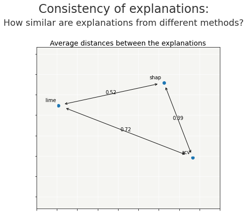

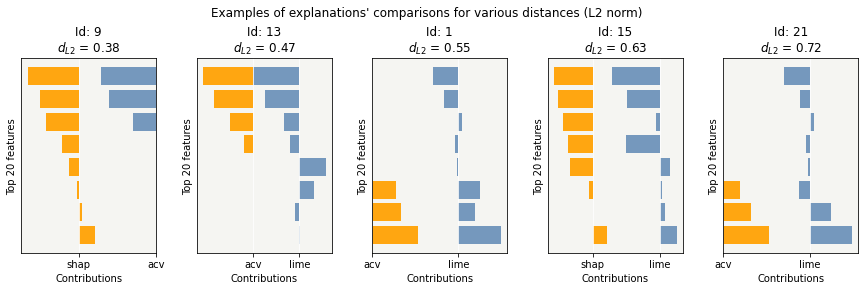

For each pair of explainability methods, the metric compares the
explanations across the dataset (or a sample if specified) and
calculates an average distance between the explainability methods. Two
plots are proposed:

-  the first graph shows the aforementioned distances between methods on
   a 2D plan.

   -  As we can see here, “shap” and “acv” are more similar than “lime”.

-  the second graph serves as a support for the first one: it gives a
   better sense of what the distances mean (what is 0.73? is it
   acceptable or not?). To do so, the metric extracts 5 real comparisons
   from the dataset (examples are represented by their Id in the
   dataframe) with distances similar to those in the first plot.

Depending on the selected methods, examples above show how different the
contributions could be. Interpreting them must be done carefully.

Two parameters can be chosen in those graphs: \* *selection:* a sample
of the dataset on which to evaluate the metric expressed as a list of
indices (by default take the whole dataset if not too big)

-  *max_features*: the number of features displayed in the graph (the
   most significant ones are selected)

.. code:: ipython3

    index = [45, 36, 12, 17, 29]
    cns.consistency_plot(selection=index, max_features=5)

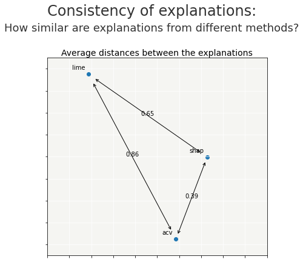

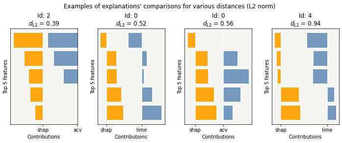

Using pre-computed contributions
^^^^^^^^^^^^^^^^^^^^^^^^^^^^^^^^

Instead of providing a dataset with a model, we can also calculate
contributions beforehand and use those ones in the metric using the
*contributions* argument. This allows, for example, to use
explainability methods that are not supported in Shapash.

The provided contributions must be given in a dictionary format, where
the key is the method name, and the value is a pandas DataFrame with the
contributions.

Let’s for example calculate contributions separately:

.. code:: ipython3

    import shap
    
    treeSHAP = shap.TreeExplainer(clf).shap_values(Xtrain[:50], check_additivity=False)[1]
    samplingSHAP = shap.SamplingExplainer(clf.predict_proba, shap.kmeans(Xtrain, 10)).shap_values(Xtrain[:50], check_additivity=False)[1]
    kernelSHAP = shap.KernelExplainer(clf.predict_proba, shap.kmeans(Xtrain, 10)).shap_values(Xtrain[:50], check_additivity=False)[1]
    
    treeSHAP = pd.DataFrame(treeSHAP, columns=Xtrain[:50].columns)
    samplingSHAP = pd.DataFrame(samplingSHAP, columns=Xtrain[:50].columns)
    kernelSHAP = pd.DataFrame(kernelSHAP, columns=Xtrain[:50].columns)

.. code:: ipython3

    # The format must be a dictionary where keys are methods names and values are pandas DataFrames: be careful to have dataframes with same shape, index and column names
    contributions = {"tree\nSHAP": treeSHAP, "sampling\nSHAP": samplingSHAP, "kernel\nSHAP":kernelSHAP}
    
    cns.compile(contributions=contributions)
    cns.consistency_plot(selection=index, max_features=5)

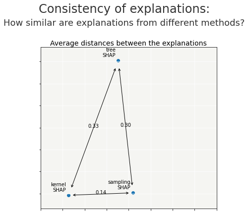

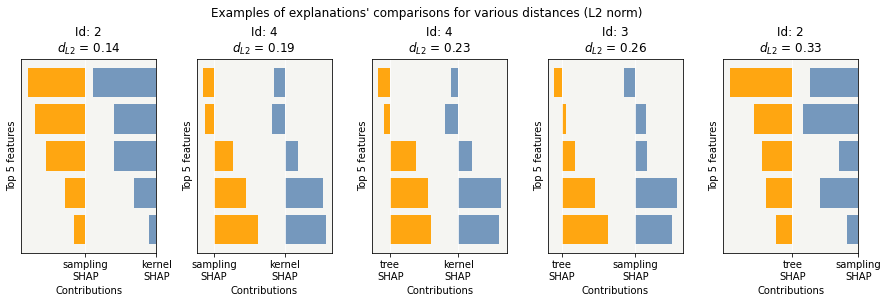

Evaluate the compacity of the explanations
------------------------------------------

What if the model uses tens or hundreds of features? Is it still going
to be easy to understand how it works? Probably not. Indeed, the number
of features greatly affects explainability

The **Compacity metric** measures how well each decision can be
explained by relying on relatively few features, which may however be
different from one instance to another

The idea is the following: *for each instace, we select the features
with the highest contributions and we look at how well they approximate
the model. Results are then aggregated across the whole dataset (or a
sample of it) and displayed*

First, we need to instantiate and compile a SmartExplainer
^^^^^^^^^^^^^^^^^^^^^^^^^^^^^^^^^^^^^^^^^^^^^^^^^^^^^^^^^^

.. code:: ipython3

    from shapash.explainer.smart_explainer import SmartExplainer

.. code:: ipython3

    response_dict = {0: 'Death', 1:' Survival'}

.. code:: ipython3

    xpl = SmartExplainer(features_dict=titanic_dict, # Optional parameters
                         label_dict=response_dict) # Optional parameters, dicts specify labels 

.. code:: ipython3

    xpl.compile(
        x=Xtrain, # Dataset for which we need explanations
        model=clf, # Model to explain
        preprocessing=encoder, # Optional
    )

.. parsed-literal::

    Backend: Shap TreeExplainer

We can now display the consistency plot:
^^^^^^^^^^^^^^^^^^^^^^^^^^^^^^^^^^^^^^^^

.. code:: ipython3

    xpl.plot.compacity_plot()

.. parsed-literal::

    Computed values from previous call are used

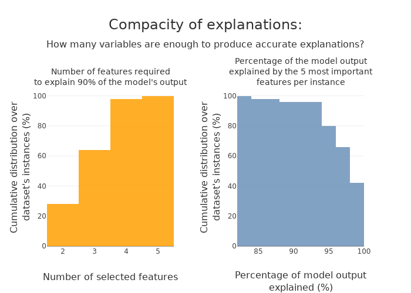

We want to measure how well the sum of the most important contributions
approximates the global decision of the model. The two graphs show the
link between the level of approximation, the number of required features
to reach it and the proportion of the dataset on which it works.

-  In the left graph, for example, we can read that top 4 features reach
   the default approximation for 94% of the instances. Thus, if we
   needed to provide accurate explanations about the model, a small
   subset of features will provide a reliable explanation for a vast
   majority of instances

-  In the right graph, for example, we can read that top 5 features
   reach 89% of the reference model for 98% of the instances. Thus, if
   we needed something extremely precise, we would probably need to
   consider all features in the explanations

Multiple parameters can be modified, such as:

-  *selection*: a sample of the dataset on which to evaluate the metric
   expressed as a list of indices (by default take the whole dataset if
   not too big)

-  *approx*: how close we want to be the reference model with all
   features (default 90%) – Left graph

-  *nb_features*: how many features are selected to evaluate the
   approximation (default 5) – Right graph

.. code:: ipython3

    index = [0, 1, 2, 3, 4, 5, 6, 7, 8, 9, 10, 11, 12, 13, 14, 15, 16, 17, 18, 19]
    
    xpl.plot.compacity_plot(selection=index, approx=.85, nb_features=3)

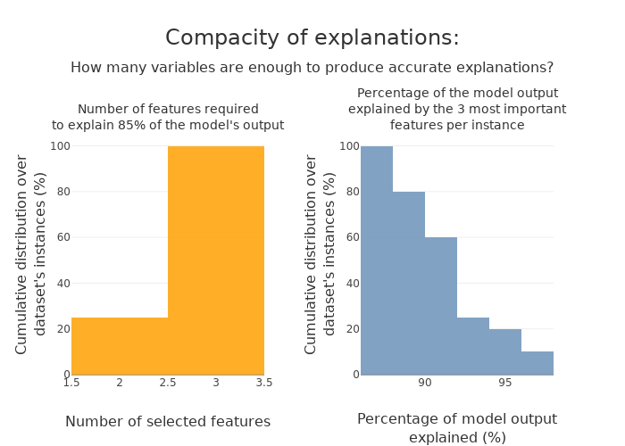

Evaluate the stability of the explanations
------------------------------------------

To increase confidence in the explanation, measuring their stability is
important.

We define stability as follows: *if instances are very similar, then one
would expect the explanations to be similar as well. Therefore, locally
stable explanations are an important factor that help build trust around
a particular explanation.*

The similarity between instances is evaluated under two criteria: (1)
the instances must be close in the feature space and (2) have similar
model outputs.

We can now display the stability plot:
^^^^^^^^^^^^^^^^^^^^^^^^^^^^^^^^^^^^^^

.. code:: ipython3

    xpl.plot.stability_plot()

.. parsed-literal::

    Computed values from previous call are used

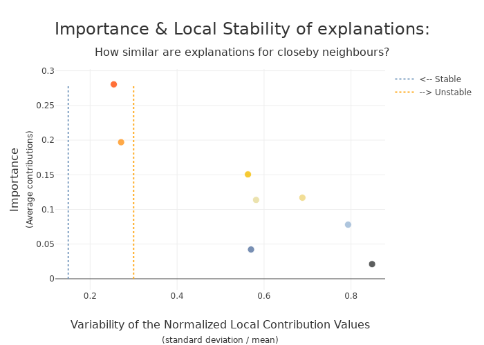

The above plot looks at the neighborhood around each provided instance
(reminder: neighborhood in terms of features and model output) and
shows:

-  the average importance of the feature across the dataset based on its
   contributions (y-axis)

-  the average variability of the feature across the instances’
   neighborhood (x-axis)

Left features are stable in the neighborhood, unlike those on the right.
Top features are important, unlike bottom ones

-  Here, features like “Sex”, “Title” and “Class” in the left-hand side
   seem to have strong and relatively stable contributions, so one might
   be more confident in using them for explanations.
-  On the other hand, features like “Fare” and “Port of embarcation” are
   much more unstable, and we might want to be careful before
   interpreting explanations around those features

Multiple parameters can be modified, such as:

-  *selection*: a sample of the dataset on which to evaluate the metric
   expressed as a list of indices (by default take the whole dataset if
   not too big)

-  *max_features*: the number of features displayed in the graph (the
   most significant ones are selected)

-  *distribution*: changes the type of displayed graph

**Note:** Means are not always representative of the individual
behaviors. Thus, we might look at the distribution of variability as
well:

.. code:: ipython3

    index = [45, 36, 12, 17, 29]
    
    # Using distribution = "boxplot" or "violin" displays distributions of variability instead of means
    xpl.plot.stability_plot(selection=index, max_features=5, distribution="boxplot")

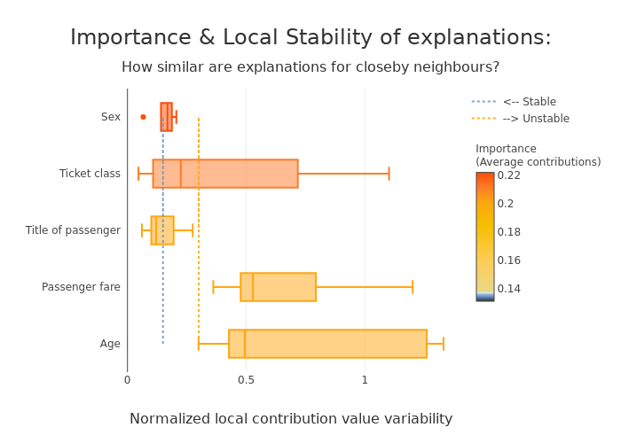

Stability can also be evaluated for a single instance. In that case,
contributions are directly compared against neighbors and displayed:

.. code:: ipython3

    xpl.plot.local_neighbors_plot(index=13)

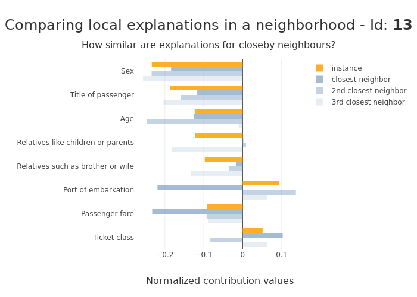

We can see here how difficult it is to interpret contributions
sometimes: the feature *Port of embarkation* gives completely opposite
suggestions in the same neighborhood.

