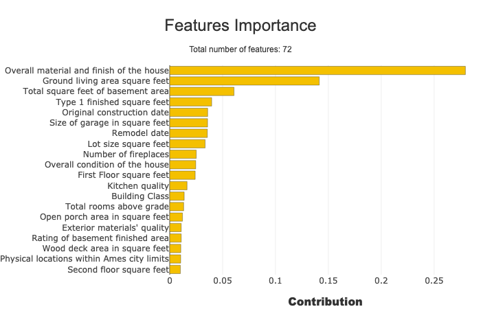
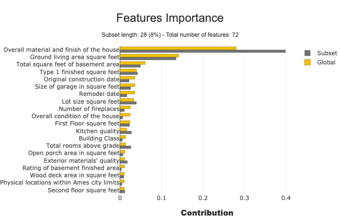
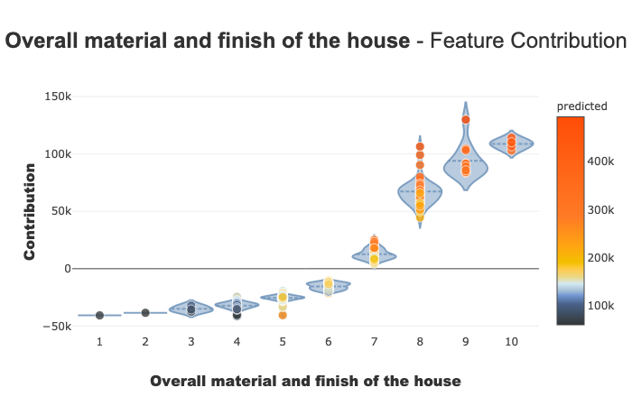
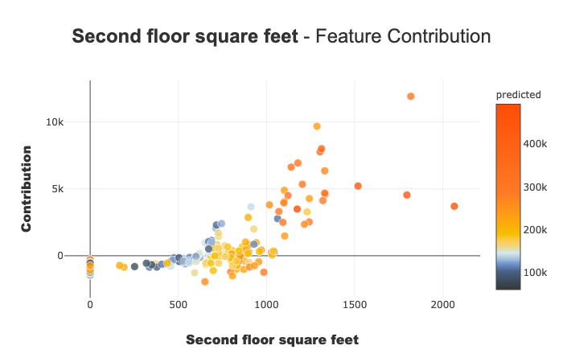
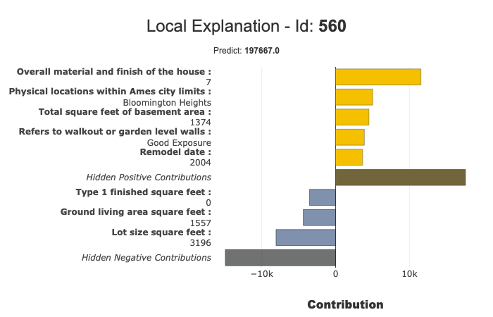

Shapash in Jupyter - Overview
=============================

With this tutorial, you will understand how Shapash works in Jupyter Notebook
with a simple use case.

Content :

- Build a Regressor
- Compile Shapash SmartExplainer
- Display global and local explanability
- Export local summarized explainability with *to_pandas* method
- Save Shapash object in pickle file

We used Kaggle's `House
Prices <https://www.kaggle.com/c/house-prices-advanced-regression-techniques/data>`__ dataset.

.. code:: ipython

    import pandas as pd
    from category_encoders import OrdinalEncoder
    from lightgbm import LGBMRegressor
    from sklearn.model_selection import train_test_split

Building Supervized Model
-------------------------

.. code:: ipython

    from shapash.data.data_loader import data_loading
    house_df, house_dict = data_loading('house_prices')

.. code:: ipython

    y_df=house_df['SalePrice'].to_frame()
    X_df=house_df[house_df.columns.difference(['SalePrice'])]

.. code:: ipython

    house_df.head()

.. table::

    +-------------------------------+-----------------------+-------+------+------------------+---------------+--------------------------------+-------------------------------+------------+-------------+-------------------------+----------+----------------------+----------+-----------+-----------+---------+------------+---------+----------------------------+------------+-------------+----------+----------+---------------+---------------+---------------+----------------------+---------------------------------+-----------------------+-----------------------+----------+----------------------+----------+---------+-----------+---------------------------+---------+----------+---------------------------------+--------+--------+------------+---------+------------+------------+--------+--------+------------+------------+---------------+------------+---------------------+----------+------------------+-----------+--------------------+----------+---------------+---------------+----------+----------+-----------+-------------+---------+-----------+--------+-------+------+------+----------------------------+-------------+---------+
    |          MSSubClass           |       MSZoning        |LotArea|Street|     LotShape     |  LandContour  |           Utilities            |           LotConfig           | LandSlope  |Neighborhood |       Condition1        |Condition2|       BldgType       |HouseStyle|OverallQual|OverallCond|YearBuilt|YearRemodAdd|RoofStyle|          RoofMatl          |Exterior1st | Exterior2nd |MasVnrType|MasVnrArea|   ExterQual   |   ExterCond   |  Foundation   |       BsmtQual       |            BsmtCond             |     BsmtExposure      |     BsmtFinType1      |BsmtFinSF1|     BsmtFinType2     |BsmtFinSF2|BsmtUnfSF|TotalBsmtSF|          Heating          |HeatingQC|CentralAir|           Electrical            |1stFlrSF|2ndFlrSF|LowQualFinSF|GrLivArea|BsmtFullBath|BsmtHalfBath|FullBath|HalfBath|BedroomAbvGr|KitchenAbvGr|  KitchenQual  |TotRmsAbvGrd|     Functional      |Fireplaces|    GarageType    |GarageYrBlt|    GarageFinish    |GarageArea|  GarageQual   |  GarageCond   |PavedDrive|WoodDeckSF|OpenPorchSF|EnclosedPorch|3SsnPorch|ScreenPorch|PoolArea|MiscVal|MoSold|YrSold|          SaleType          |SaleCondition|SalePrice|
    +===============================+=======================+=======+======+==================+===============+================================+===============================+============+=============+=========================+==========+======================+==========+===========+===========+=========+============+=========+============================+============+=============+==========+==========+===============+===============+===============+======================+=================================+=======================+=======================+==========+======================+==========+=========+===========+===========================+=========+==========+=================================+========+========+============+=========+============+============+========+========+============+============+===============+============+=====================+==========+==================+===========+====================+==========+===============+===============+==========+==========+===========+=============+=========+===========+========+=======+======+======+============================+=============+=========+
    |2-Story 1946 & Newer           |Residential Low Density|   8450|Paved |Regular           |Near Flat/Level|All public Utilities (E,G,W,& S)|Inside lot                     |Gentle slope|College Creek|Normal                   |Normal    |Single-family Detached|Two story |          7|          5|     2003|        2003|Gable    |Standard (Composite) Shingle|Vinyl Siding|Vinyl Siding |Brick Face|       196|Good           |Average/Typical|Poured Contrete|Good (90-99 inches)   |Typical - slight dampness allowed|No Exposure/No Basement|Good Living Quarters   |       706|Unfinished/No Basement|         0|      150|        856|Gas forced warm air furnace|Excellent|Yes       |Standard Circuit Breakers & Romex|     856|     854|           0|     1710|           1|           0|       2|       1|           3|           1|Good           |           8|Typical Functionality|         0|Attached to home  |       2003|Rough Finished      |       548|Typical/Average|Typical/Average|Paved     |         0|         61|            0|        0|          0|       0|      0|     2|  2008|Warranty Deed - Conventional|Normal Sale  |   208500|
    +-------------------------------+-----------------------+-------+------+------------------+---------------+--------------------------------+-------------------------------+------------+-------------+-------------------------+----------+----------------------+----------+-----------+-----------+---------+------------+---------+----------------------------+------------+-------------+----------+----------+---------------+---------------+---------------+----------------------+---------------------------------+-----------------------+-----------------------+----------+----------------------+----------+---------+-----------+---------------------------+---------+----------+---------------------------------+--------+--------+------------+---------+------------+------------+--------+--------+------------+------------+---------------+------------+---------------------+----------+------------------+-----------+--------------------+----------+---------------+---------------+----------+----------+-----------+-------------+---------+-----------+--------+-------+------+------+----------------------------+-------------+---------+
    |1-Story 1946 & Newer All Styles|Residential Low Density|   9600|Paved |Regular           |Near Flat/Level|All public Utilities (E,G,W,& S)|Frontage on 2 sides of property|Gentle slope|Veenker      |Adjacent to feeder street|Normal    |Single-family Detached|One story |          6|          8|     1976|        1976|Gable    |Standard (Composite) Shingle|Metal Siding|Metal Siding |None      |         0|Average/Typical|Average/Typical|Cinder Block   |Good (90-99 inches)   |Typical - slight dampness allowed|Good Exposure          |Average Living Quarters|       978|Unfinished/No Basement|         0|      284|       1262|Gas forced warm air furnace|Excellent|Yes       |Standard Circuit Breakers & Romex|    1262|       0|           0|     1262|           0|           1|       2|       0|           3|           1|Typical/Average|           6|Typical Functionality|         1|Attached to home  |       1976|Rough Finished      |       460|Typical/Average|Typical/Average|Paved     |       298|          0|            0|        0|          0|       0|      0|     5|  2007|Warranty Deed - Conventional|Normal Sale  |   181500|
    +-------------------------------+-----------------------+-------+------+------------------+---------------+--------------------------------+-------------------------------+------------+-------------+-------------------------+----------+----------------------+----------+-----------+-----------+---------+------------+---------+----------------------------+------------+-------------+----------+----------+---------------+---------------+---------------+----------------------+---------------------------------+-----------------------+-----------------------+----------+----------------------+----------+---------+-----------+---------------------------+---------+----------+---------------------------------+--------+--------+------------+---------+------------+------------+--------+--------+------------+------------+---------------+------------+---------------------+----------+------------------+-----------+--------------------+----------+---------------+---------------+----------+----------+-----------+-------------+---------+-----------+--------+-------+------+------+----------------------------+-------------+---------+
    |2-Story 1946 & Newer           |Residential Low Density|  11250|Paved |Slightly irregular|Near Flat/Level|All public Utilities (E,G,W,& S)|Inside lot                     |Gentle slope|College Creek|Normal                   |Normal    |Single-family Detached|Two story |          7|          5|     2001|        2002|Gable    |Standard (Composite) Shingle|Vinyl Siding|Vinyl Siding |Brick Face|       162|Good           |Average/Typical|Poured Contrete|Good (90-99 inches)   |Typical - slight dampness allowed|Mimimum Exposure       |Good Living Quarters   |       486|Unfinished/No Basement|         0|      434|        920|Gas forced warm air furnace|Excellent|Yes       |Standard Circuit Breakers & Romex|     920|     866|           0|     1786|           1|           0|       2|       1|           3|           1|Good           |           6|Typical Functionality|         1|Attached to home  |       2001|Rough Finished      |       608|Typical/Average|Typical/Average|Paved     |         0|         42|            0|        0|          0|       0|      0|     9|  2008|Warranty Deed - Conventional|Normal Sale  |   223500|
    +-------------------------------+-----------------------+-------+------+------------------+---------------+--------------------------------+-------------------------------+------------+-------------+-------------------------+----------+----------------------+----------+-----------+-----------+---------+------------+---------+----------------------------+------------+-------------+----------+----------+---------------+---------------+---------------+----------------------+---------------------------------+-----------------------+-----------------------+----------+----------------------+----------+---------+-----------+---------------------------+---------+----------+---------------------------------+--------+--------+------------+---------+------------+------------+--------+--------+------------+------------+---------------+------------+---------------------+----------+------------------+-----------+--------------------+----------+---------------+---------------+----------+----------+-----------+-------------+---------+-----------+--------+-------+------+------+----------------------------+-------------+---------+
    |2-Story 1945 & Older           |Residential Low Density|   9550|Paved |Slightly irregular|Near Flat/Level|All public Utilities (E,G,W,& S)|Corner lot                     |Gentle slope|Crawford     |Normal                   |Normal    |Single-family Detached|Two story |          7|          5|     1915|        1970|Gable    |Standard (Composite) Shingle|Wood Siding |Wood Shingles|None      |         0|Average/Typical|Average/Typical|Brick & Tile   |Typical (80-89 inches)|Good                             |No Exposure/No Basement|Average Living Quarters|       216|Unfinished/No Basement|         0|      540|        756|Gas forced warm air furnace|Good     |Yes       |Standard Circuit Breakers & Romex|     961|     756|           0|     1717|           1|           0|       1|       0|           3|           1|Good           |           7|Typical Functionality|         1|Detached from home|       1998|Unfinished/No Garage|       642|Typical/Average|Typical/Average|Paved     |         0|         35|          272|        0|          0|       0|      0|     2|  2006|Warranty Deed - Conventional|Abnormal Sale|   140000|
    +-------------------------------+-----------------------+-------+------+------------------+---------------+--------------------------------+-------------------------------+------------+-------------+-------------------------+----------+----------------------+----------+-----------+-----------+---------+------------+---------+----------------------------+------------+-------------+----------+----------+---------------+---------------+---------------+----------------------+---------------------------------+-----------------------+-----------------------+----------+----------------------+----------+---------+-----------+---------------------------+---------+----------+---------------------------------+--------+--------+------------+---------+------------+------------+--------+--------+------------+------------+---------------+------------+---------------------+----------+------------------+-----------+--------------------+----------+---------------+---------------+----------+----------+-----------+-------------+---------+-----------+--------+-------+------+------+----------------------------+-------------+---------+
    |2-Story 1946 & Newer           |Residential Low Density|  14260|Paved |Slightly irregular|Near Flat/Level|All public Utilities (E,G,W,& S)|Frontage on 2 sides of property|Gentle slope|Northridge   |Normal                   |Normal    |Single-family Detached|Two story |          8|          5|     2000|        2000|Gable    |Standard (Composite) Shingle|Vinyl Siding|Vinyl Siding |Brick Face|       350|Good           |Average/Typical|Poured Contrete|Good (90-99 inches)   |Typical - slight dampness allowed|Average Exposure       |Good Living Quarters   |       655|Unfinished/No Basement|         0|      490|       1145|Gas forced warm air furnace|Excellent|Yes       |Standard Circuit Breakers & Romex|    1145|    1053|           0|     2198|           1|           0|       2|       1|           4|           1|Good           |           9|Typical Functionality|         1|Attached to home  |       2000|Rough Finished      |       836|Typical/Average|Typical/Average|Paved     |       192|         84|            0|        0|          0|       0|      0|    12|  2008|Warranty Deed - Conventional|Normal Sale  |   250000|
    +-------------------------------+-----------------------+-------+------+------------------+---------------+--------------------------------+-------------------------------+------------+-------------+-------------------------+----------+----------------------+----------+-----------+-----------+---------+------------+---------+----------------------------+------------+-------------+----------+----------+---------------+---------------+---------------+----------------------+---------------------------------+-----------------------+-----------------------+----------+----------------------+----------+---------+-----------+---------------------------+---------+----------+---------------------------------+--------+--------+------------+---------+------------+------------+--------+--------+------------+------------+---------------+------------+---------------------+----------+------------------+-----------+--------------------+----------+---------------+---------------+----------+----------+-----------+-------------+---------+-----------+--------+-------+------+------+----------------------------+-------------+---------+

Encoding Categorical Features
^^^^^^^^^^^^^^^^^^^^^^^^^^^^^

.. code:: ipython

    from category_encoders import OrdinalEncoder

    categorical_features = [col for col in X_df.columns if X_df[col].dtype == 'object']

    encoder = OrdinalEncoder(
        cols=categorical_features,
        handle_unknown='ignore',
        return_df=True).fit(X_df)

    X_df=encoder.transform(X_df)

Train / Test Split
^^^^^^^^^^^^^^^^^^

.. code:: ipython

    Xtrain, Xtest, ytrain, ytest = train_test_split(X_df, y_df, train_size=0.75, random_state=1)

Model Fitting
^^^^^^^^^^^^^

.. code:: ipython

    regressor = LGBMRegressor(n_estimators=200).fit(Xtrain,ytrain)

.. code:: ipython

    y_pred = pd.DataFrame(regressor.predict(Xtest),columns=['pred'],index=Xtest.index)

Understand my model with shapash
--------------------------------

Declare and Compile SmartExplainer
^^^^^^^^^^^^^^^^^^^^^^^^^^^^^^^^^^

.. code:: ipython

    from shapash.explainer.smart_explainer import SmartExplainer

.. code:: ipython

    xpl = SmartExplainer(features_dict=house_dict) # Optional parameter, dict specifies label for features name

.. code:: ipython

    xpl.compile(
        x=Xtest,
        model=regressor,
        preprocessing=encoder, # Optional: compile step can use inverse_transform method
        y_pred=y_pred # Optional
    )

.. parsed-literal::

    Backend: Shap TreeExplainer

Display features importance
^^^^^^^^^^^^^^^^^^^^^^^^^^^

.. code:: ipython

    xpl.plot.features_importance()

Focus on a specific subset
^^^^^^^^^^^^^^^^^^^^^^^^^^

You can use the features_importance method to compare the contribution
of features of a subset to the global features importance :

.. code:: ipython

    subset = [ 168, 54, 995, 799, 310, 322, 1374,
              1106, 232, 645, 1170, 1229, 703, 66,
              886, 160, 191, 1183, 1037, 991, 482,
              725, 410, 59, 28, 719, 337, 36]
    xpl.plot.features_importance(selection=subset)

Understand how a feature contributes
^^^^^^^^^^^^^^^^^^^^^^^^^^^^^^^^^^^^

-  The contribution_plot allows you to analyse how one feature affects
   prediction
-  Type of plot depends on the type of features
-  You can use feature's name, feature's label or feature's number to specify
   which feature you want to analyze

.. code:: ipython

    xpl.plot.contribution_plot("OverallQual")

.. code:: ipython

    xpl.plot.contribution_plot("Second floor square feet")

Display a Summarized but Explicit local explainability
------------------------------------------------------

Filter method
^^^^^^^^^^^^^

Use the *filter* method to specify how to summarize local explainability.
There are 4 parameters to customize the summary :

- max_contrib : maximum number of criteria to display
- threshold : minimum value of the contribution (in absolute value) necessary to display a criterion
- positive : display only positive contribution? Negative?(default None)
- features_to_hide : list of features you don’t want to display

.. code:: ipython

    xpl.filter(max_contrib=8,threshold=100)

Display local plot, applying your filter
^^^^^^^^^^^^^^^^^^^^^^^^^^^^^^^^^^^^^^^^

You can use row_num, index or query parameter to specify which
prediction you want to explain :

.. code:: ipython

    xpl.plot.local_plot(index=560)

Save your Explainer & Export results
------------------------------------

Export your local explanation to pandas DataFrame:
^^^^^^^^^^^^^^^^^^^^^^^^^^^^^^^^^^^^^^^^^^^^^^^^^^

to_pandas method has the same parameters as the filter method

.. code:: ipython

    summary_df= xpl.to_pandas(
        max_contrib=3, # Number Max of features to show in summary
        threshold=5000,
    )

.. code:: ipython

    summary_df.head()

.. table::

    +--------+----------------------------------------+-------+--------------+----------------------------------------+-------+--------------+----------------------------------+-------------+--------------+
    |  pred  |               feature_1                |value_1|contribution_1|               feature_2                |value_2|contribution_2|            feature_3             |   value_3   |contribution_3|
    +========+========================================+=======+==============+========================================+=======+==============+==================================+=============+==============+
    |209141.3|Ground living area square feet          |   1792|       13710.4|Overall material and finish of the house|      7|       12776.3|Total square feet of basement area|          963|       -5103.0|
    +--------+----------------------------------------+-------+--------------+----------------------------------------+-------+--------------+----------------------------------+-------------+--------------+
    |178734.5|Ground living area square feet          |   2192|       29747.0|Overall material and finish of the house|      5|      -26151.3|Overall condition of the house    |            8|        9190.8|
    +--------+----------------------------------------+-------+--------------+----------------------------------------+-------+--------------+----------------------------------+-------------+--------------+
    |113950.8|Overall material and finish of the house|      5|      -24730.0|Ground living area square feet          |    900|      -16342.6|Total square feet of basement area|          882|       -5922.6|
    +--------+----------------------------------------+-------+--------------+----------------------------------------+-------+--------------+----------------------------------+-------------+--------------+
    | 74957.2|Overall material and finish of the house|      4|      -33927.7|Ground living area square feet          |    630|      -23234.4|Total square feet of basement area|          630|      -11687.9|
    +--------+----------------------------------------+-------+--------------+----------------------------------------+-------+--------------+----------------------------------+-------------+--------------+
    |135305.2|Overall material and finish of the house|      5|      -25445.7|Ground living area square feet          |   1188|      -11476.6|Condition of sale                 |Abnormal Sale|       -5071.8|
    +--------+----------------------------------------+-------+--------------+----------------------------------------+-------+--------------+----------------------------------+-------------+--------------+

Save your explainer in Pickle File
^^^^^^^^^^^^^^^^^^^^^^^^^^^^^^^^^^

You can save the SmartExplainer Object in a pickle file to make new
plots later or launch the WebApp again

.. code:: ipython

    xpl.save('./xpl.pkl')
