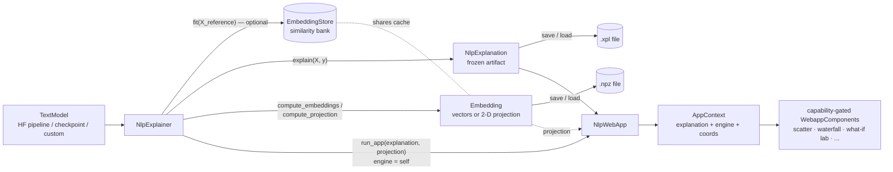

# Shapash NLP Explainer

A tool to inspect the behavior of a text classifier, not just attribution
(which words drove a prediction) but also error analysis: where the model gets things wrong, whether a
misprediction is a model error or a bad label, and what minimal edit flips
a prediction (counterfactuals).

> **Status: prototype, not yet unified with SmartExplainer** This is a standalone text-modality stack
> (`NlpExplainer` / `NlpExplanation` / `NlpWebApp`) built *alongside* `SmartExplainer`, not through it —
> it deliberately bypasses `SmartExplainer.compile()` rather than adding a `modality="text"` branch that
> would have to be written and then deleted once tabular and text explainers are unified behind one API.

## Contents
- [Installation](#installation)
- [Why a separate stack](#why-a-separate-stack)
- [Architecture at a glance](#architecture-at-a-glance)
- [Quickstart](#quickstart)
- [`NlpExplainer` — the entry point](#nlpexplainer--the-entry-point)
- [`NlpExplanation` — the frozen artifact](#nlpexplanation--the-frozen-artifact)
- [The `TextModel` layer](#the-textmodel-layer)
- [Model & framework support](#model--framework-support)
- [Backends: SHAP, LIME and Captum LIG](#backends-shap-lime-and-captum-lig)
- [Counterfactual generators](#counterfactual-generators)
- [Diagnostics: label noise & label probe](#diagnostics-label-noise--label-probe)
- [The webapp](#the-webapp)
- [Where to go next](#where-to-go-next)
- [Known limitations](#known-limitations)

## Installation

The `shap` backend is a core dependency already. Everything else (HF models, torch, captum, the
counterfactual/diagnostics stack) is behind the `nlp` extra:

```bash
uv sync --extra nlp       # contributors: dev + test tooling plus the nlp extra
```
or
```bash
pip install ".[nlp]"
```

which pulls in `torch`, `transformers`, `datasets`, `sentence-transformers`, `sentencepiece`,
`protobuf`, `captum`, `pacmap`.

The `nlp_lime` backend needs `lime`, which is its own extra rather than bundled into `nlp` (it's also
usable with tabular data, via `LimeBackend`).

## Why a separate stack

Rather than growing `compile()` to understand text, the NLP path was built as a **bridge prototype**
that:

- explains a black-box text classifier (HF pipeline, HF checkpoint, or hand-rolled PyTorch model) with
  SHAP or Captum Integrated Gradients — **classification only** (binary or multiclass),
- ships its own Dash webapp instead of extending the ~3000-line tabular `SmartApp`,
- and is explicitly modeled as a prototype of the target architecture — a capability-based
  `Model` / `Interpreter` / `Generator` split similar to Google PAIR's
  [LIT](https://pair-code.github.io/lit/) — so the pieces (`TextModel` capabilities, `Backend`,
  `CounterfactualGenerator`, `InteractiveEngine`, capability-gated `WebappComponent`s) are meant to
  generalize to tabular data later rather than being thrown away.

## Architecture at a glance



A loaded snapshot (`NlpExplanation.load()`) skips `NlpExplainer` entirely and reaches `NlpWebApp`
with `engine=None` — the diagram's "fit"/"compute_*" edges and the similarity bank are then absent,
and capability gating is what makes the What-if Lab panels self-disable rather than error.

The same picture as method signatures:

```
NlpExplainer.fit(X_reference, y)               # optional: enables similar-example retrieval + label probe
NlpExplainer.explain(X, y) -> NlpExplanation   # memoized on (texts, model identity, backend+config);
                                                # model-free, backend-free, frozen, save()/load()-able
NlpExplainer.run_app(explanation) -> NlpWebApp # Dash app; What-if Lab panels only if engine is live
```

...and as file paths:

| Path | What's there |
|---|---|
| `shapash/model/` | `TextModel` ABC + capability mixins (`SupportsTokenization`, `SupportsEmbeddings`, `SupportsGradients`, `SupportsCaptumIG`) + HF / torch adapters |
| `shapash/backend/` | `nlp_shap`, `nlp_lime`, `nlp_captum_lig` — self-register by `.name` |
| `shapash/compute/generators/` | `CounterfactualGenerator` ABC (`HotFlip`, `AblationFlip`) — shared minimal-perturbation search |
| `shapash/compute/diagnostics/` | `label_noise.py` (confident learning), `label_probe.py` (independent label-vs-model-error probe) |
| `shapash/compute/embeddings.py`, `embedding_store.py` | `Embedding` (raw vectors or a 2-D projection) + its on-disk cache, keyed by (model, space, corpus) |
| `shapash/compute/retrieval/` | Nearest-neighbour bank over the same cached embeddings — powers `find_similar` / `find_similar_threshold` |
| `shapash/explainer/nlp_explainer.py` | `NlpExplainer` — orchestrates the above, implements `InteractiveEngine` |
| `shapash/explainer/nlp_explanation.py` | `NlpExplanation` — the returned artifact, + `.plot` |
| `shapash/explainer/interactive.py` | `InteractiveEngine` — the "live compute" protocol |
| `shapash/webapp/nlp_app.py` + `nlp_components/` | `NlpWebApp` — capability-gated Dash panels |

A model only needs to satisfy the capabilities a given feature requires — e.g. `AblationFlipGenerator`
works on prediction-only models (`SupportsTokenization` only), while `HotFlipGenerator` and the Captum
LIG backend need gradient/embedding access (`SupportsGradients`, `SupportsEmbeddings`,
`SupportsCaptumIG`). `TextModel.has_capabilities(model, *caps)` is the single mechanism everything
(generators, backends, webapp panels) uses to check this — no isinstance-on-concrete-class checks.

## Quickstart

The same flow, worked through end to end, lives in `tutorial/nlp/overview.ipynb` (notebook
walkthrough) and `demo/serve_nlp.py` (a runnable script serving the webapp — see
`demo/nlp_cache/` for a pre-computed example run).

```python
from shapash.model import HFClassifierModel
from shapash.explainer.nlp_explainer import NlpExplainer

model = HFClassifierModel.from_pretrained(
    "bhadresh-savani/distilbert-base-uncased-emotion",
    trust_remote_code=False,  # never leave unset — unset makes transformers prompt interactively
)

xpl = NlpExplainer(model)  # backend defaults to NlpShapBackend
xpl = xpl.fit(X_reference=ref_texts, y=ref_labels)  # optional — enables similar-example retrieval
explanation = xpl.explain(texts, y=labels, cache_dir="demo/nlp_cache")

explanation.plot.word_importance()  # corpus-level view
explanation.save("emotion_run.xpl")  # zip of meta.json + parquet, no pickle

xpl.run_app(explanation, port=8050)  # live app, What-if Lab enabled (engine=xpl bound)
```

A snapshot reloaded later has no bound engine:

```python
from shapash.explainer.nlp_explanation import NlpExplanation

explanation = NlpExplanation.load("emotion_run.xpl")
# run_app(explanation) still works, but What-if Lab panels self-disable — no engine to call back into
```

The scatter travels separately, as its own `Embedding` file — a projection is a fact about the
embeddings, not about the explanation, and the two have different keys:

```python
from shapash.compute.embeddings import Embedding

embedding = Embedding.load("emotion.emb")  # raw vectors — needs no model to reduce
projection = embedding.project(TSNE(n_components=2))  # try as many as you like, seconds each
NlpWebApp(explanation, projection=projection).run()
```

## `NlpExplainer` — the entry point

`shapash/explainer/nlp_explainer.py`

```python
NlpExplainer(
    model,
    label_names=None,
    backend=None,
    cf_generator=None,
    explainer_args=None,
    explainer_compute_args=None,
)
```

- `model` — a HF `pipeline`, a `TextModel` instance, or any callable. A HF pipeline is auto-wrapped as
  `HFPipelineModel`; anything else that isn't a `TextModel` disables the model-layer-dependent features.
- `backend` — defaults to `NlpShapBackend` built from the model's `shap_callable`/`shap_masker`.
- `cf_generator` — explicit generator, or every built-in generator compatible with the model
  (`HotFlipGenerator` preferred over `AblationFlipGenerator`) is auto-registered.

**`fit(X_reference=None, y=None, cache_dir=None, precompute=True)`** — sklearn-style; optional. Builds a
similar-example retriever if `X_reference` is given and the model supports embeddings.

**`explain(X, y=None, cache_dir=None) -> NlpExplanation`** — the memoization core. The cache key is
`hash(texts, model_id, backend_name+config)` — same texts *and* same model identity *and* same backend
class+config hits the cache; anything else busts it. `cache_dir` persists results to
`<cache_dir>/<hash>.xpl`. Every call returns a fresh `NlpExplanation` (shares read-only arrays with the
cache, never mutated in place).

**`compute_embeddings(explanation, cache_dir=None, recompute=False)`** — embeds the batch with the
bound model (needs the model, the GPU and the compute lock) and returns an `Embedding`. The result is
model-free, so it can be saved and reduced later in a process that never loads the model.

**`compute_projection(explanation, reducer=None, cache_dir=None, ...)`** — thin wrapper over
`compute_embeddings(...).project(reducer)`, returning a 2-D `Embedding`. Only the embeddings are
cached; projections are cheap to recompute, and a layout worth keeping is saved with
`Embedding.save` (most reducers are stochastic).

**`run_app(explanation, port=8050, debug=False, host="127.0.0.1", projection=None, ...)`** — launches
`NlpWebApp(explanation, engine=self, projection=projection, ...)`.

**Live/interactive methods** (implement the `InteractiveEngine` protocol — see below):
`predict`, `explain_text`, `find_similar` / `find_similar_threshold`, `generate_counterfactuals`,
`detect_label_noise`, plus `can_edit()` / `can_counterfactual()` / `can_find_similar()` /
`can_probe_labels()` capability flags the webapp reads to decide what to mount.

## `NlpExplanation` — the frozen artifact

`shapash/explainer/nlp_explanation.py` — `@dataclass(frozen=True, eq=False, slots=True)`.

Holds only plain data: `texts`, `token_strings`, `values` (per-sample contributions), `base_values`,
`y_pred`/`y_prob`/`y_true`, `label_names`, `backend_name`, `is_additive`, `reference_kind`,
`output_space` (`"probability"` or `"logit"` — see below), `model_id`, `architecture`. **No model or
backend handle** — those are captured as plain strings/booleans at construction time, so the artifact
never needs the model to be reloaded. Arrays are set read-only (`setflags(write=False)`) on top of
`frozen=True`, so in-place mutation is blocked too, not just rebinding.

- `save(path)` / `NlpExplanation.load(path)` — a zip of `meta.json` + parquet tables
  (`contributions.parquet`, `base_values.parquet`, `samples.parquet`). No pickle, no format version
  (prototype: an unreadable `explain` cache entry is simply recomputed). The projection is saved
  separately as an `Embedding` (`shapash/compute/embeddings.py`).
- `corpus_id` — digest of the texts alone, so every artifact over one dataset agrees on it whatever
  model, backend or reducer produced it. This is what pairs a projection back to an explanation, and
  a property rather than a field so it cannot desync from `texts`.
- `.plot` — lazily builds an `NlpPlotter` (plotly/dash imports stay out of the persistence module).
  Methods: `tokens`, `waterfall` (raises if `is_additive=False`), `sentence`, `word_importance`,
  `word_profile`, `confusion`, `scatter`.

## The `TextModel` layer

`shapash/model/` — `base.py` defines the ABC + capability mixins consumed everywhere else:

| Mixin | Gives you | Needed by |
|---|---|---|
| `TextModel` | `predict()`, `model_id`, `shap_callable`/`shap_masker` | everything |
| `SupportsTokenization` | `tokenize`/`detokenize`, case-folding | AblationFlip, tokenization-aware webapp panels |
| `SupportsEmbeddings` | `get_embedding_table()`, `embed()` | HotFlip, similar-example retrieval |
| `SupportsGradients` | `token_gradients()` | HotFlip |
| `SupportsCaptumIG` | embedding layer / encode / word alignment | `nlp_captum_lig` backend |

Adapters (`hf.py`, `encoder.py`, `torch_models.py`):
- `HFPipelineModel` — thin, prediction-only wrapper over a `transformers.pipeline`.
- `HFClassifierModel.from_pretrained(name_or_path, *, tokenizer=None, label_names=None, device=None,
  max_length="auto", trust_remote_code=False, load_kwargs=None, **model_kwargs)` — full-capability
  adapter over `AutoModelForSequenceClassification`. `trust_remote_code` is forwarded to both the
  tokenizer and model loaders (needed for checkpoints with custom code, e.g. some embedding-model
  families); default `False`, and always passed explicitly so it never falls back to `transformers`'
  interactive prompt, which would hang a webapp/batch job.
- `TorchClassifierModel` / `SentenceTransformerModel` (`torch_models.py`) — for encoder+head models
  where the two are separate modules (hand-rolled PyTorch classifiers, sentence-transformers).

## Model & framework support

What the adapters above actually cover today, per architecture and per framework.

**Architectures** (columns = capabilities from the mixin table above)

| Family | Predict + SHAP/LIME | LIG + HotFlip | Embeddings |
|---|:-:|:-:|:-:|
| BERT, DistilBERT, RoBERTa, DeBERTa v1–v3 | ✅ | ✅ | ✅ |
| XLM-RoBERTa, CamemBERT v2, ALBERT | ✅ | ✅ | ✅ |
| PyTorch encoder + head | ✅ | ✅ | ✅ |
| sentence-transformers + head | ✅ | ✅ | ✅ |
| Encoder-decoder (T5, BART, mT5, FLAN-T5) | ✅ | ❌ | ❌ |
| Decoder-only / LLMs | ❌ | ❌ | ❌ |
| Long-context (Longformer, BigBird, ModernBERT) | ❌ | ❌ | ❌ |
| Cross-encoders / pairs, multi-label, regression heads | ❌ | ❌ | ❌ |

**Frameworks** (which adapter, if any, applies)

| Framework | Adapter | Status | What you get |
|---|---|:-:|---|
| PyTorch + `transformers` | `HFClassifierModel` | ✅ | Full capability surface — the reference path |
| `sentence-transformers` + torch head | `SentenceTransformerModel` | ✅ | Full |
| `transformers` pipeline | `HFPipelineModel` | ✅ | Predict-only: SHAP/LIME + ablation counterfactuals |
| Plain callable `f(texts) -> probs`, scikit-learn, ONNX/Optimum, TensorFlow/Keras/Flax/JAX, remote/API classifiers | — | ❌ | Blocked behind one seam (`NlpExplainer` leaves `_text_model=None` for a non-pipeline callable) |
| spaCy, fastText, gensim | — | ❌ | No route |

## Backends: SHAP, LIME and Captum LIG

Self-register by a `.name` class attribute, looked up via `get_backend_cls_from_name` — no manual
registry.

- **`nlp_shap`** (`NlpShapBackend`, default) — wraps `shap.Explainer` over the softmax
  text-classification pipeline. `output_space = "probability"`, `reference_kind = "none"`,
  `is_additive = True`. Core dependency — no extra install needed.
- **`nlp_lime`** (`NlpLimeBackend`) — wraps `LimeTextExplainer`, fitting a locally-weighted linear
  surrogate per sample. Word-level (bag-of-words by default), so `token_strings` is each sample's
  unique vocabulary words rather than subword tokens. `output_space = "probability"`,
  `reference_kind = "none"`, `is_additive = False` (a surrogate optimizes local fidelity, not exact
  reconstruction, so there's no guarantee the weights sum to `f(x) - f(baseline)` — this disables
  `.plot.waterfall`, which requires `is_additive = True`). Needs the `lime` extra, installed
  separately from `nlp` (see [Installation](#installation)).
- **`nlp_captum_lig`** (`NlpCaptumLigBackend`) — Captum `LayerIntegratedGradients` through the embedding
  layer, target-class **raw logit**. `output_space = "logit"`, `reference_kind = "point"` (a
  tokenizer-built pad/mask baseline), requires `SupportsCaptumIG`.

⚠️ **These are not directly comparable with each other.** SHAP and LIME both explain post-softmax
probability but via different mechanisms (exact game-theoretic attribution vs. a local linear
surrogate); LIG explains pre-softmax logit — a different space, where cross-class contributions don't
cancel the same way. This is tracked on the artifact (`output_space` field) but there is currently no
UI indicator or unit-conversion between spaces.

## Counterfactual generators

`shapash/compute/generators/` — `CounterfactualGenerator` ABC owns a shared
**minimal-perturbation search** (`search_minimal`): try perturbation sets of increasing size, keep the
smallest one that flips the prediction.

- **`HotFlipGenerator`** — port of Google PAIR LIT's HotFlip. Ranks tokens by embedding-gradient norm,
  shortlists candidate substitutions by a first-order linear estimate, then re-scores the shortlist
  against the real model (the linear estimate alone isn't reliable) before handing choices to the
  shared search. Needs `SupportsGradients + SupportsEmbeddings + SupportsTokenization`.
- **`AblationFlipGenerator`** — leave-one-out token removal instead of substitution; scores each token
  by the probability drop when removed. Needs only `SupportsTokenization`, so it also works on
  prediction-only models (e.g. a bare HF pipeline) that can't do HotFlip.

## Diagnostics: label noise & label probe

`shapash/compute/diagnostics/`

- **`label_noise.py`** — in-house **confident learning** (Northcutt, Jiang & Chuang, JAIR 2021; the
  algorithm behind `cleanlab`, reimplemented rather than adding a dependency). `detect_label_issues(...)
  -> LabelNoiseReport`. Requires **out-of-sample** probabilities — measured on training data it
  systematically under-reports.
- **`label_probe.py`** — `LabelProbe`: a small `TfidfVectorizer + LogisticRegression` fit on a labelled
  reference corpus, deliberately uncorrelated with the audited model. Confident learning alone can't
  tell "the model is wrong" from "the label is wrong" — both look like "the model confidently disagrees
  with the label." The probe asks a second, independent classifier whether it backs the given label
  (`verdicts(...)`), which tells the two apart. A nearest-neighbour-in-model-space alternative was
  rejected during development for being circular (98.6% agreement with the audited model's own
  predictions).

## The webapp

`NlpWebApp(explanation, engine=None, projection=None, ...)`, launched via `.run(...)` or (normally)
through `NlpExplainer.run_app(...)`. The constructor validates its inputs once (a projection over
different texts is refused, see `projection_coords`) and hands panels a private `AppContext`
(explanation, engine, coordinates). Layout: global Word Importance / Scatter panels → a full dataset
table → detail-on-demand local view (sentence highlight / waterfall) → an optional **What-if Lab**
(editable text, counterfactual generation, similar examples, label-noise ranking).

Panels in `shapash/webapp/nlp_components/`:

| Component | Shows |
|---|---|
| `word_importance.py` | corpus-level mean/total contribution per word, per class or aggregated |
| `scatter.py` | 2-D embedding projection, selectable, optional contribution-coloring |
| `word_profile.py` | one word's contribution across every class + ranked examples |
| `error_analysis.py` | confusion matrix + per-cell word importance, drives an error filter |
| `sentence_highlight.py` | inline per-token highlight for the current datapoint |
| `waterfall.py` | waterfall chart of the current datapoint's token contributions |
| `data_editor.py` | edit text, re-predict + re-explain live via the engine |
| `counterfactual.py` | generate what-if token flips, apply into the editor |
| `similar_examples.py` | reference-corpus neighbours (top-k or threshold) |
| `label_noise.py` | confident-learning ranking + the independent probe's verdict column |

**Capability gating**: each `WebappComponent` declares a `requires` set of capability tokens
(`engine:predict`, `engine:counterfactual`, `model:gradients`, `engine:similar`, `data:labels`,
`data:ground_truth`, ...). `available_capabilities(explanation, engine)` computes what's actually
satisfied — data-derived capabilities survive a reloaded snapshot, `engine:*` ones require a live
`engine`. This is why the What-if Lab disappears entirely on a `NlpExplanation.load()`-only snapshot
(`engine=None`), and why e.g. `AblationFlipGenerator`-only setups don't advertise `model:gradients`.

## Where to go next

- Notebook walkthrough: `tutorial/nlp/overview.ipynb`
- Demo server: `demo/serve_nlp.py` (see `demo/nlp_cache/` for a pre-computed example run on
  model `bhadresh-savani/distilbert-base-uncased-emotion` over dataset `dair-ai/emotion`)

## Known limitations

- **Classification only** (binary or multiclass, softmax output). `predict` softmaxes
  unconditionally, so sigmoid (multi-label) or regression heads are silently mis-normalized rather than
  refused — not just unsupported, but wrong if you point one at it. Sentence-pair / cross-encoder inputs
  aren't supported either (one string per sample). See the *Cross-encoders / pairs, multi-label,
  regression heads* row in [Model & framework support](#model--framework-support).
- `NlpExplainer` bypasses `SmartExplainer.compile()` entirely — there is no unified tabular+text entry
  point yet.
- SHAP and Captum-LIG attributions are in different spaces (probability vs. logit) with no in-UI
  indicator or conversion — see [Backends](#backends-shap-lime-and-captum-lig) above.
- T5-style encoder-decoder models and some sentence-transformer checkpoints don't fit the current
  encoder adapter's assumptions (need `inputs_embeds` support); prediction + SHAP highlighting work,
  gradient-based features (HotFlip, LIG) do not, for those architectures.